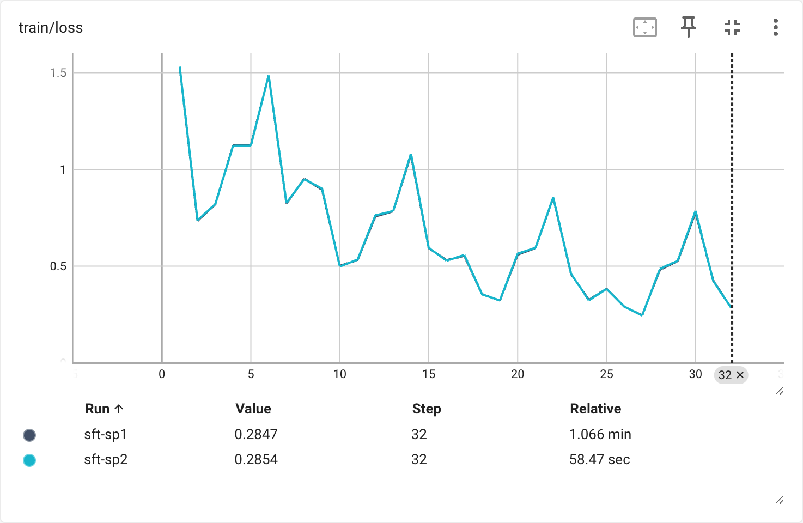
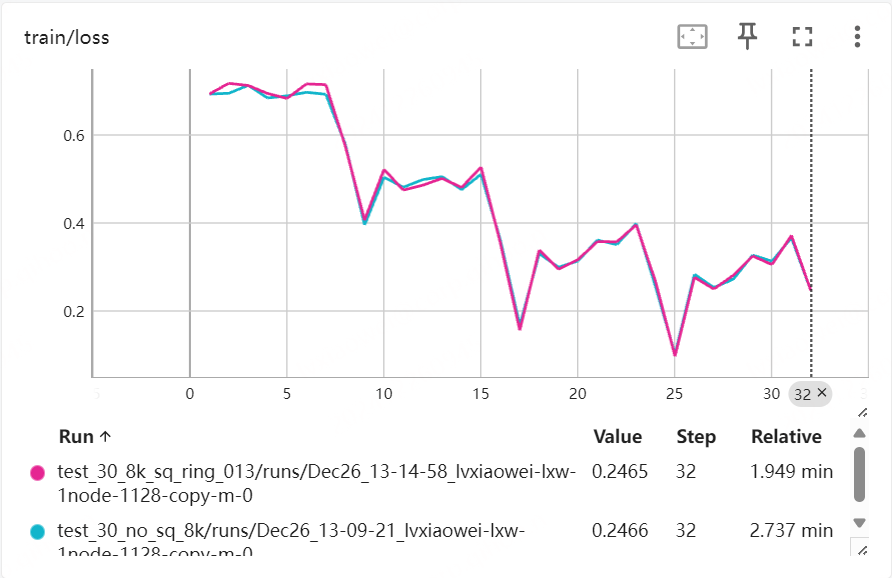

<div align="center">
<h1>
  360-LLaMA-Factory: Plug-and-Play Sequence Parallelism for Post-Training
  <!-- More User-Friendly Post-Training with Sequence Parallelism -->
</h1>
</div>

**Using [LLaMA-Factory](https://github.com/hiyouga/LLaMA-Factory) with Sequence Parallelism can be as easy as...**
```yaml
# in your .yaml file
sequence_parallel_size: 4
```
or if you prefer launching multi-node training with DeepSpeed:
```shell
deepspeed --hostfile=8nodes.host src/train.py \
    ...
    --sequence_parallel_size 4 \
    ...
```

Standing on the shoulders of giants ([LLaMA-Factory](https://github.com/hiyouga/LLaMA-Factory) & [ring-flash-attention](https://github.com/zhuzilin/ring-flash-attention)),
360-LLaMA-Factory adds Sequence Parallelism (SP), more specifically zigzag-ring-attention, into LLaMA-Factory, supporting most post-training methods including SFT and DPO (plus its variants).

With zero3-offload and gradient checkpointing **but no other optimization**, 8 x A800 SP extends training length of **full-parameter SFT** to 210k(7B) and 128k(72B), while **full-parameter DPO** to 84k(7B) and 46k(72B).
With more custom optimization tricks (e.g. commenting `logtis = logits.float()`, unsloth or liger kernel), life of long-context training would be much easier even with `sequence_parallel_size` of `2`.
<!-- Typical use cases of 32k could be covered with sequence_parallel_size of just 2. -->

We believe SP is of great significance as multi-modal LLMs process longer sequences of tokens, and 360-LLaMA-Factory patches this critical missing piece into the most widely-used LLM Post-Training framework.
Our SP implementation in 360-LLaMA-Factory introduces minimal code change, is highly modular and has its correctness verified.
While we first released it here,
we're looking to merge it into LLaMA-Factory and have submitted a PR.

<!-- Please refer to this README and the <a href="https://github.com/hiyouga/LLaMA-Factory/blob/main/README.md"> original LLaMA-Factory README</a>. -->


## Table of Contents

- [Getting Started](#getting-started)
    - [Installation](#installation)
    - [Quickstart](#quickstart)
- [Comparison with Existing SP Frameworks](#comparison-with-existing-sp-frameworks)
- [Benchmarking 360-LLaMA-Factory](#benchmarking-360-llama-factory)
    - [SFT Max Length](#sft-max-length)
    - [DPO Max Length](#dpo-max-length)
    - [Correctness](#correctness)
- [Developing Notes](#developing-notes)
    - [Modularity](#modularity)
    - [ToDos](#todos)
- [License](#license)
- [Citation](#citation)
- [Acknowledgement](#acknowledgement)


## Getting Started

Upon initial release of 360-LLaMA-Factory (Dec. 30, 2024),
we have developed 360-LLaMA-Factory based on the latest release v0.9.1 of LLaMA-Factory. 
We will keep up with LLaMA-Factory's major later releases.

### Installation
To run 360-LLaMA-Factory with SP, 
**this codebase should be used in place of the original LLaMA-Factory codebase**. This means that there are mainly two ways of installation: fresh-start or incremental.

#### Fresh-Start
We have updated `requirements.txt`, so you could simply create a new Python environment and install 360-LLaMA-Factory.

```shell
conda create -n 360-llama-factory python=3.11 -y  # LLaMA-Factory recommends Python 3.11
conda activate 360-llama-factory

git clone https://github.com/Qihoo360/360-LLaMA-Factory.git 
cd 360-LLaMA-Factory
pip install -e ".[torch,metrics,deepspeed]"
```

#### Incremental
If you already have a Python environment running recent versions of LLaMA-Factory, it is expected that you could simply install at most two more dependencies and make sure to switch to this codebase.

```shell
# in your current environment running LLaMA-Factory
pip install --no-deps ring-flash-attn
pip install flash-attn  # if you haven't already, as ring-flash-attn requires flash-attn
pip uninstall llamafactory  # if you have pip-installed the original LLaMA-Factory according to its README

git clone https://github.com/Qihoo360/360-LLaMA-Factory.git 
cd 360-LLaMA-Factory
pip install --no-deps -e .  # or no need to pip install if you only launch with `deepspeed src/train.py`
```

### Quickstart
The degree of Sequence Parallelism (SP) is controlled by the argument `sequence_parallel_size`, which means the number of GPUs to process one sequence of training data and defaults to `1` (no SP).

To train with SP, you only need to set `sequence_parallel_size` greater than `1`, often to `2`, `4`, `8` or `16` as long as it evenly divides your total number of GPUs.

The argument `cutoff_len` should also be noted as it is now strictly the sequence length you'd like to train on. Your data would be automatically padded and then preprocessed for SP.

You could simply set these two arguments in your config yaml file: 
```yaml
sequence_parallel_size: 4
cutoff_len: 128000
```

or set them in command line, depending on your way of launching LLaMA-Factory experiments:
```shell
deepspeed --hostfile=8nodes.host src/train.py \
    ...
    --sequence_parallel_size 4 \
    --cutoff_len 128000 \
    ...
```

You could also refer to [360-example.sh](360-example.sh) for example SFT and DPO scripts.


## Comparison with Existing SP Frameworks

| Framework             | SP-SFT | SP-DPO                                | SP mode                       | Use Scenarios                      | Notable Dependencies                         | progress-bar log & save                                               |
|-----------------------|--------|---------------------------------------|-------------------------------|------------------------------------|----------------------------------------------|----------------------------------------------------------------------|
| Swift                 | ✅     | wrong                                 | DeepSpeed Ulysses             | DPO without SP                     | XTuner, etc                                  | ✅ (inherits transformers)                                            |
| XTuner                | ✅     | buggy (at least on loss_mask)         | DeepSpeed Ulysses             | older models                       | mmengine, etc                                | didn't consider gradient accumulation; modularity too good to modify |
| Megatron-LM           | ✅     | ❌                                    | their own context parallelism | PreTraining                        | apex, transformers-engine, etc         | tedious model conversion - problems with newer models                |
| EasyContext           | ❌ (cpt✅) | ❌                                    | zigzag ring attention & others | continual PreTraining              | ring-flash-attn, yunchang, etc                | ✅ (customized)                                                       |
| OpenRLHF              | ✅     | ✅                                    | llama3-style SP               | more advanced & customizable       | ring-flash-attn, not much                           | didn't consider gradient accumulation                                |
| 360-LLaMA-Factory     | ✅     | ✅                                    | zigzag ring attention         | easier plug&play use, less customizable | ring-flash-attn, trl, etc                     | ✅ (inherits transformers)                                            |


To the best of our knowledge, 360-LLaMA-Factory is the first open-source project to systematically integrate Sequence Parallelism (SP) into LLaMA-Factory.

It is acknowledged that there are already a few open-source projects with SP for post-training. Among them, however,
- [Swift](https://github.com/modelscope/swift) is wrong in its DPO loss computation; 
- the SP backend Swift based on, [XTuner](https://github.com/modelscope/ms-swift), is no longer actively maintained and is tricky to run with recent versions of transformers and open-source LLMs; 
- [Megatron-LM](https://github.com/NVIDIA/Megatron-LM) supported SP (they call context-parallelism) in 2024, but it requires non-trivial efforts to run DPO with context-parallelism and it's not huggingface-native, requiring tedious model convertion;
- [EasyContext](https://github.com/jzhang38/EasyContext) is huggingface-native but has no data parallelism with SP and lacks SFT or DPO support;
- [OpenRLHF](https://github.com/OpenRLHF/OpenRLHF) is arguably the only alternative choice we would recommend besides 360-LLaMA-Factory as its implementation is also correct with active community support. In terms of software engineering, OpenRLHF is on the opposite end of 360-LLaMA-Factory: OpenRLHF has much fewer dependencies with self-written Trainer classes instead of inheriting `tansformers`'s Trainer, while 360-LLaMA-Factory, as LLaMA-Factory, inherits much from `trl`, `transformers` and other libraries. Generally OpenRLHF is more suitable for more advanced custom use and modification, while 360-LLaMA-Factory for general-purpose argument-specifiable use (e.g. easily combined with unsloth or liger-kernel).

We gratefully acknowledge these projects' pioneering work. In fact, we have been internally using our own bespoke version of EasyContext for SP post-training throughout the year, and have only recently decided to migrate our modification on EasyContext into LLaMA-Factory. The SP backend EasyContext and 360-LLaMA-Factory used, [ring-flash-attention](https://github.com/zhuzilin/ring-flash-attention), is also the same as OpenRLHF.
We also plan to add other SP modes such as DeepSpeed Ulysses as XTuner did.


## Benchmarking 360-LLaMA-Factory

As 360Zhinao's general Post-Training team, we mostly consider full-parameter post-training instead of LoRA variants, so we provide our coarse-grained full-parameter post-training length benchmarking results as belows.

### SFT Max Length

| **Device**     | **Model**         | **Sequence Parallel Size** | **Max Length** | **Full Parameter SFT** |
|----------------|-------------------|----------------------------|----------------|------------------------|
| **8 × A800**   | **Qwen2.5-7B**   | 8                          | 210k            | ✅                     |
| **8 × A800**   | **Qwen2.5-14B**  | 8                          | 175k            | ✅                     |
| **32 × A800**  | **Qwen2.5-72B**  | 8                          | 128k            | ✅                     |

<!-- For a typical use case of SFT 32k-length on 72B models,  -->

### DPO Max Length

| **Device**     | **Model**         | **Sequence Parallel Size** | **Max Length** | **Full Parameter DPO** |
|----------------|-------------------|----------------------------|----------------|------------------------|
| **8 × A800**   | **Qwen2.5-7B**   | 4                          | 32k            | ✅                     |
| **8 × A800**   | **Qwen2.5-7B**   | 8                          | 84k            | ✅                     |
| **8 × A800**   | **Qwen2.5-14B**  | 4                          | 32k            | ✅                     |
| **8 × A800**   | **Qwen2.5-14B**  | 8                          | 72k            | ✅                     |
| **32 × A800**  | **Qwen2.5-72B**  | 8                          | 46k            | ✅                     |
| **32 × A800**  | **Qwen2.5-72B**  | 16                         | 86k            | ✅                     |

### Correctness

We thoroughly validated the correctness of our SP implementation by comparing intermediate values and the loss curves on the same data turning SP on and off.
We compare SP=1 and SP=2, with SP=2 using twice as many GPUs so that all mini-batches of data and other hyper-parameters are the same.

We could see that the SFT and DPO loss curves overlap quite well.
While it has been pointed out that (zigzag) ring attention exhibits [certain numerical differences](https://github.com/zhuzilin/ring-flash-attention?tab=readme-ov-file#known-limitations), we have looked into intermediate values and observed numerical differences at the same scale as DeepSpeed Ulysses, possibly inherent to parallel computing.

We have been post-training SFT and DPO with SP without any notable issues on the resulting model's performance. We are confident 360-LLaMA-Factory *works and is correct*.





## Developing Notes

### Modularity
We believe our SP implementation in 360-LLaMA-Factory introduces minimal code change and is highly modular.
We have submitted a PR to LLaMA-Factory and will work cooperatively for it to be merged.

SP mainly changes three modules: data processing, model and loss computation.
We believe SP is in essence a change to model since all SP methods have to change the attention forward method somehow, otherwise no correct computation could be achieved given the split of sequences on multiple GPUs. Therefore, we add `sequence_parallel_size` in `model_args.py`.

SP is applied to the model in a way similar to liger kernels:
```python
apply_liger_kernel
sequence_parallel_group = apply_sequence_parallel(model_args)  # monkey patch to change the model's attention forward to SP
...
model.sequence_parallel_group = sequence_parallel_group  # register the model to be SP, otherwise None
return model
```

In accordance with SP, we processed data in advance so we don't have to split them in the zigzag way online during training. This is simply done with a decorator on the original `get_dataset` function, which by default first shuffles the data, then pads, shifts by 1 and splits the sequence and changes the dataset, and finally uses a `SequentialSampler` to ensure each GPU gets its correct data.

```python
# in src/llamafactory/data/loader.py
@sequence_parallel_decorator
def get_dataset(...)


# src/llamafactory/train/sft(or dpo)/trainer.py
@override
def _get_train_sampler(self):
    if self.model.sequence_parallel_group is not None:
        return SequentialSampler(self.train_dataset)
    else:
        return super()._get_train_sampler()
```

Loss computation in Trainer is also changed accordingly with SP, as per-sequence loss should be reduced within each SP group. Details could be found in `src/llamafactory/train/sft/trainer.py` and `src/llamafactory/train/dpo/trainer.py`, where we arrived at a minimal-code-change solution with clarity.
With zigzag ring attention, we also noticed numerical instability of the very first forward pass, resulting in the inital DPO loss not equal to `log(sigmoid(0))`. We therefore overrides the `Trainer.training_step()` to perform a *dummy forward* first without any effect on real training.


### ToDos
- [ ] **Precompute**: Precompute the logits of the reference model to reduce memory during DPO
- [ ] **logits.float()/contiguous()**: huge memory consumption on long sequences, could be optimized
- [ ] **Overall SP**: add SP to train/pt, rm, kto
- [ ] **Other SP modes**: DeepSpeed Ulysses and llama3-style SP

## License

Follow [LLaMA-Factory](https://github.com/hiyouga/LLaMA-Factory)'s and [ring-flash-attention](https://github.com/zhuzilin/ring-flash-attention')'s licenses.

## Citation

If you find our work helpful, please kindly cite as:

```bibtex
@software{360-llama-factory,
  author = {Haosheng Zou, Xiaowei Lv, Shousheng Jia and Xiangzheng Zhang},
  title = {360-LLaMA-Factory},
  url = {https://github.com/Qihoo360/360-LLaMA-Factory},
  year = {2024}
}
```

## Acknowledgement

This repo benefits from [LLaMA-Factory](https://github.com/hiyouga/LLaMA-Factory), [ring-flash-attention](https://github.com/zhuzilin/ring-flash-attention), [EasyContext](https://github.com/jzhang38/EasyContext) and all repos they benefited from. Thanks for their wonderful works.

We are also grateful for the 360Zhinao's internal support developing this repo, including but not limited to Fenrui Xiao and Junchen Liu for helpful discussion and pilot-using, and Xiaodong Sun for debugging help.

Contributions are more than welcome!
If you'd like to contribute, please submit issues and PRs in this repo.
