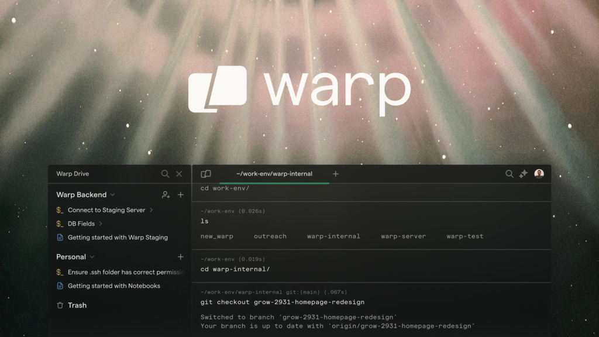

[](https://github.com/hiyouga/LLaMA-Factory/stargazers)
[](https://github.com/hiyouga/LLaMA-Factory/commits/main)
[](https://github.com/hiyouga/LLaMA-Factory/graphs/contributors)
[](https://github.com/hiyouga/LLaMA-Factory/actions/workflows/tests.yml)
[](https://pypi.org/project/llamafactory/)
[](https://scholar.google.com/scholar?cites=12620864006390196564)
[](https://hub.docker.com/r/hiyouga/llamafactory/tags)

[](https://twitter.com/llamafactory_ai)
[](https://discord.gg/rKfvV9r9FK)
[](https://gitcode.com/zhengyaowei/LLaMA-Factory)

[](https://colab.research.google.com/drive/1eRTPn37ltBbYsISy9Aw2NuI2Aq5CQrD9?usp=sharing)
[](https://gallery.pai-ml.com/#/preview/deepLearning/nlp/llama_factory)
[](https://docs.alayanew.com/docs/documents/newActivities/llamafactory/?utm_source=LLaMA-Factory)
[](https://huggingface.co/spaces/hiyouga/LLaMA-Board)
[](https://modelscope.cn/studios/hiyouga/LLaMA-Board)
[](https://novita.ai/templates-library/105981?sharer=88115474-394e-4bda-968e-b88e123d0c47)

### Used by [Amazon](https://aws.amazon.com/cn/blogs/machine-learning/how-apoidea-group-enhances-visual-information-extraction-from-banking-documents-with-multimodal-models-using-llama-factory-on-amazon-sagemaker-hyperpod/), [NVIDIA](https://developer.nvidia.com/rtx/ai-toolkit), [Aliyun](https://help.aliyun.com/zh/pai/use-cases/fine-tune-a-llama-3-model-with-llama-factory), etc.

<div align="center" markdown="1">

### Supporters ❤️

| <div style="text-align: center;"><a href="https://warp.dev/llama-factory"></a><br><a href="https://warp.dev/llama-factory" style="font-size:larger;">Warp, the agentic terminal for developers</a><br><a href="https://warp.dev/llama-factory">Available for MacOS, Linux, & Windows</a> | <a href="https://serpapi.com"> </a> |
| ---- | ---- |

----

### Easily fine-tune 100+ large language models with zero-code [CLI](#quickstart) and [Web UI](#fine-tuning-with-llama-board-gui-powered-by-gradio)


</div>

👋 Join our [WeChat group](assets/wechat.jpg), [NPU user group](assets/wechat_npu.jpg) or [Alaya NeW user group](assets/wechat_alaya.png).

\[ English | [中文](README_zh.md) \]

**Fine-tuning a large language model can be easy as...**

https://github.com/user-attachments/assets/3991a3a8-4276-4d30-9cab-4cb0c4b9b99e

Choose your path:

- **Documentation (WIP)**: https://llamafactory.readthedocs.io/en/latest/
- **Documentation (AMD GPU)**: https://rocm.docs.amd.com/projects/ai-developer-hub/en/latest/notebooks/fine_tune/llama_factory_llama3.html
- **Colab (free)**: https://colab.research.google.com/drive/1eRTPn37ltBbYsISy9Aw2NuI2Aq5CQrD9?usp=sharing
- **Local machine**: Please refer to [usage](#getting-started)
- **PAI-DSW (free trial)**: https://gallery.pai-ml.com/#/preview/deepLearning/nlp/llama_factory
- **Alaya NeW (cloud GPU deal)**: https://docs.alayanew.com/docs/documents/useGuide/LLaMAFactory/mutiple/?utm_source=LLaMA-Factory

> [!NOTE]
> Except for the above links, all other websites are unauthorized third-party websites. Please carefully use them.

## Table of Contents

- [Features](#features)
- [Blogs](#blogs)
- [Changelog](#changelog)
- [Supported Models](#supported-models)
- [Supported Training Approaches](#supported-training-approaches)
- [Provided Datasets](#provided-datasets)
- [Requirement](#requirement)
- [Getting Started](#getting-started)
  - [Installation](#installation)
  - [Data Preparation](#data-preparation)
  - [Quickstart](#quickstart)
  - [Fine-Tuning with LLaMA Board GUI](#fine-tuning-with-llama-board-gui-powered-by-gradio)
  - [Build Docker](#build-docker)
  - [Deploy with OpenAI-style API and vLLM](#deploy-with-openai-style-api-and-vllm)
  - [Download from ModelScope Hub](#download-from-modelscope-hub)
  - [Download from Modelers Hub](#download-from-modelers-hub)
  - [Use W&B Logger](#use-wb-logger)
  - [Use SwanLab Logger](#use-swanlab-logger)
- [Projects using LLaMA Factory](#projects-using-llama-factory)
- [License](#license)
- [Citation](#citation)
- [Acknowledgement](#acknowledgement)

## Features

- **Various models**: LLaMA, LLaVA, Mistral, Mixtral-MoE, Qwen, Qwen2-VL, DeepSeek, Yi, Gemma, ChatGLM, Phi, etc.
- **Integrated methods**: (Continuous) pre-training, (multimodal) supervised fine-tuning, reward modeling, PPO, DPO, KTO, ORPO, etc.
- **Scalable resources**: 16-bit full-tuning, freeze-tuning, LoRA and 2/3/4/5/6/8-bit QLoRA via AQLM/AWQ/GPTQ/LLM.int8/HQQ/EETQ.
- **Advanced algorithms**: [GaLore](https://github.com/jiaweizzhao/GaLore), [BAdam](https://github.com/Ledzy/BAdam), [APOLLO](https://github.com/zhuhanqing/APOLLO), [Adam-mini](https://github.com/zyushun/Adam-mini), [Muon](https://github.com/KellerJordan/Muon), DoRA, LongLoRA, LLaMA Pro, Mixture-of-Depths, LoRA+, LoftQ and PiSSA.
- **Practical tricks**: [FlashAttention-2](https://github.com/Dao-AILab/flash-attention), [Unsloth](https://github.com/unslothai/unsloth), [Liger Kernel](https://github.com/linkedin/Liger-Kernel), RoPE scaling, NEFTune and rsLoRA.
- **Wide tasks**: Multi-turn dialogue, tool using, image understanding, visual grounding, video recognition, audio understanding, etc.
- **Experiment monitors**: LlamaBoard, TensorBoard, Wandb, MLflow, [SwanLab](https://github.com/SwanHubX/SwanLab), etc.
- **Faster inference**: OpenAI-style API, Gradio UI and CLI with [vLLM worker](https://github.com/vllm-project/vllm) or [SGLang worker](https://github.com/sgl-project/sglang).

### Day-N Support for Fine-Tuning Cutting-Edge Models

| Support Date | Model Name                                                           |
| ------------ | -------------------------------------------------------------------- |
| Day 0        | Qwen3 / Qwen2.5-VL / Gemma 3 / GLM-4.1V / InternLM 3 / MiniCPM-o-2.6 |
| Day 1        | Llama 3 / GLM-4 / Mistral Small / PaliGemma2 / Llama 4               |

## Blogs

- [Fine-tune Llama3.1-70B for Medical Diagnosis using LLaMA-Factory](https://docs.alayanew.com/docs/documents/bestPractice/bigModel/llama70B/?utm_source=LLaMA-Factory) (Chinese)
- [A One-Stop Code-Free Model Reinforcement Learning and Deployment Platform based on LLaMA-Factory and EasyR1](https://aws.amazon.com/cn/blogs/china/building-llm-model-hub-based-on-llamafactory-and-easyr1/) (Chinese)
- [How Apoidea Group enhances visual information extraction from banking documents with multimodal models using LLaMA-Factory on Amazon SageMaker HyperPod](https://aws.amazon.com/cn/blogs/machine-learning/how-apoidea-group-enhances-visual-information-extraction-from-banking-documents-with-multimodal-models-using-llama-factory-on-amazon-sagemaker-hyperpod/) (English)
- [Easy Dataset × LLaMA Factory: Enabling LLMs to Efficiently Learn Domain Knowledge](https://buaa-act.feishu.cn/wiki/GVzlwYcRFiR8OLkHbL6cQpYin7g) (English)

<details><summary>All Blogs</summary>

- [Fine-tune Qwen2.5-VL for Autonomous Driving using LLaMA-Factory](https://docs.alayanew.com/docs/documents/useGuide/LLaMAFactory/mutiple/?utm_source=LLaMA-Factory) (Chinese)
- [LLaMA Factory: Fine-tuning the DeepSeek-R1-Distill-Qwen-7B Model for News Classifier](https://gallery.pai-ml.com/#/preview/deepLearning/nlp/llama_factory_deepseek_r1_distill_7b) (Chinese)
- [A One-Stop Code-Free Model Fine-Tuning \& Deployment Platform based on SageMaker and LLaMA-Factory](https://aws.amazon.com/cn/blogs/china/a-one-stop-code-free-model-fine-tuning-deployment-platform-based-on-sagemaker-and-llama-factory/) (Chinese)
- [LLaMA Factory Multi-Modal Fine-Tuning Practice: Fine-Tuning Qwen2-VL for Personal Tourist Guide](https://gallery.pai-ml.com/#/preview/deepLearning/nlp/llama_factory_qwen2vl) (Chinese)
- [LLaMA Factory: Fine-tuning Llama3 for Role-Playing](https://gallery.pai-ml.com/#/preview/deepLearning/nlp/llama_factory) (Chinese)

</details>

## Changelog

[25/08/06] We supported fine-tuning the **[GPT-OSS](https://github.com/openai/gpt-oss)** models. See [PR #8826](https://github.com/hiyouga/LLaMA-Factory/pull/8826) to get started.

[25/07/02] We supported fine-tuning the **[GLM-4.1V-9B-Thinking](https://github.com/THUDM/GLM-4.1V-Thinking)** model.

[25/04/28] We supported fine-tuning the **[Qwen3](https://qwenlm.github.io/blog/qwen3/)** model family.

<details><summary>Full Changelog</summary>

[25/04/21] We supported the **[Muon](https://github.com/KellerJordan/Muon)** optimizer. See [examples](examples/README.md) for usage. Thank [@tianshijing](https://github.com/tianshijing)'s PR.

[25/04/16] We supported fine-tuning the **[InternVL3](https://huggingface.co/OpenGVLab/InternVL3-8B)** model. See [PR #7258](https://github.com/hiyouga/LLaMA-Factory/pull/7258) to get started.

[25/04/14] We supported fine-tuning the **[GLM-Z1](https://huggingface.co/THUDM/GLM-Z1-9B-0414)** and **[Kimi-VL](https://huggingface.co/moonshotai/Kimi-VL-A3B-Instruct)** models.

[25/04/06] We supported fine-tuning the **[Llama 4](https://ai.meta.com/blog/llama-4-multimodal-intelligence/)** model. See [PR #7611](https://github.com/hiyouga/LLaMA-Factory/pull/7611) to get started.

[25/03/31] We supported fine-tuning the **[Qwen2.5 Omni](https://qwenlm.github.io/blog/qwen2.5-omni/)** model. See [PR #7537](https://github.com/hiyouga/LLaMA-Factory/pull/7537) to get started.

[25/03/15] We supported **[SGLang](https://github.com/sgl-project/sglang)** as inference backend. Try `infer_backend: sglang` to accelerate inference.

[25/03/12] We supported fine-tuning the **[Gemma 3](https://huggingface.co/blog/gemma3)** model.

[25/02/24] Announcing **[EasyR1](https://github.com/hiyouga/EasyR1)**, an efficient, scalable and multi-modality RL training framework for efficient GRPO training.

[25/02/11] We supported saving the **[Ollama](https://github.com/ollama/ollama)** modelfile when exporting the model checkpoints. See [examples](examples/README.md) for usage.

[25/02/05] We supported fine-tuning the **[Qwen2-Audio](Qwen/Qwen2-Audio-7B-Instruct)** and **[MiniCPM-o-2.6](https://huggingface.co/openbmb/MiniCPM-o-2_6)** on audio understanding tasks.

[25/01/31] We supported fine-tuning the **[DeepSeek-R1](https://huggingface.co/deepseek-ai/DeepSeek-R1)** and **[Qwen2.5-VL](https://huggingface.co/Qwen/Qwen2.5-VL-7B-Instruct)** models.

[25/01/15] We supported **[APOLLO](https://arxiv.org/abs/2412.05270)** optimizer. See [examples](examples/README.md) for usage.

[25/01/14] We supported fine-tuning the **[MiniCPM-o-2.6](https://huggingface.co/openbmb/MiniCPM-o-2_6)** and **[MiniCPM-V-2.6](https://huggingface.co/openbmb/MiniCPM-V-2_6)** models. Thank [@BUAADreamer](https://github.com/BUAADreamer)'s PR.

[25/01/14] We supported fine-tuning the **[InternLM 3](https://huggingface.co/collections/internlm/)** models. Thank [@hhaAndroid](https://github.com/hhaAndroid)'s PR.

[25/01/10] We supported fine-tuning the **[Phi-4](https://huggingface.co/microsoft/phi-4)** model.

[24/12/21] We supported using **[SwanLab](https://github.com/SwanHubX/SwanLab)** for experiment tracking and visualization. See [this section](#use-swanlab-logger) for details.

[24/11/27] We supported fine-tuning the **[Skywork-o1](https://huggingface.co/Skywork/Skywork-o1-Open-Llama-3.1-8B)** model and the **[OpenO1](https://huggingface.co/datasets/O1-OPEN/OpenO1-SFT)** dataset.

[24/10/09] We supported downloading pre-trained models and datasets from the **[Modelers Hub](https://modelers.cn/models)**. See [this tutorial](#download-from-modelers-hub) for usage.

[24/09/19] We supported fine-tuning the **[Qwen2.5](https://qwenlm.github.io/blog/qwen2.5/)** models.

[24/08/30] We supported fine-tuning the **[Qwen2-VL](https://qwenlm.github.io/blog/qwen2-vl/)** models. Thank [@simonJJJ](https://github.com/simonJJJ)'s PR.

[24/08/27] We supported **[Liger Kernel](https://github.com/linkedin/Liger-Kernel)**. Try `enable_liger_kernel: true` for efficient training.

[24/08/09] We supported **[Adam-mini](https://github.com/zyushun/Adam-mini)** optimizer. See [examples](examples/README.md) for usage. Thank [@relic-yuexi](https://github.com/relic-yuexi)'s PR.

[24/07/04] We supported [contamination-free packed training](https://github.com/MeetKai/functionary/tree/main/functionary/train/packing). Use `neat_packing: true` to activate it. Thank [@chuan298](https://github.com/chuan298)'s PR.

[24/06/16] We supported **[PiSSA](https://arxiv.org/abs/2404.02948)** algorithm. See [examples](examples/README.md) for usage.

[24/06/07] We supported fine-tuning the **[Qwen2](https://qwenlm.github.io/blog/qwen2/)** and **[GLM-4](https://github.com/THUDM/GLM-4)** models.

[24/05/26] We supported **[SimPO](https://arxiv.org/abs/2405.14734)** algorithm for preference learning. See [examples](examples/README.md) for usage.

[24/05/20] We supported fine-tuning the **PaliGemma** series models. Note that the PaliGemma models are pre-trained models, you need to fine-tune them with `paligemma` template for chat completion.

[24/05/18] We supported **[KTO](https://arxiv.org/abs/2402.01306)** algorithm for preference learning. See [examples](examples/README.md) for usage.

[24/05/14] We supported training and inference on the Ascend NPU devices. Check [installation](#installation) section for details.

[24/04/26] We supported fine-tuning the **LLaVA-1.5** multimodal LLMs. See [examples](examples/README.md) for usage.

[24/04/22] We provided a **[Colab notebook](https://colab.research.google.com/drive/1eRTPn37ltBbYsISy9Aw2NuI2Aq5CQrD9?usp=sharing)** for fine-tuning the Llama-3 model on a free T4 GPU. Two Llama-3-derived models fine-tuned using LLaMA Factory are available at Hugging Face, check [Llama3-8B-Chinese-Chat](https://huggingface.co/shenzhi-wang/Llama3-8B-Chinese-Chat) and [Llama3-Chinese](https://huggingface.co/zhichen/Llama3-Chinese) for details.

[24/04/21] We supported **[Mixture-of-Depths](https://arxiv.org/abs/2404.02258)** according to [AstraMindAI's implementation](https://github.com/astramind-ai/Mixture-of-depths). See [examples](examples/README.md) for usage.

[24/04/16] We supported **[BAdam](https://arxiv.org/abs/2404.02827)** optimizer. See [examples](examples/README.md) for usage.

[24/04/16] We supported **[unsloth](https://github.com/unslothai/unsloth)**'s long-sequence training (Llama-2-7B-56k within 24GB). It achieves **117%** speed and **50%** memory compared with FlashAttention-2, more benchmarks can be found in [this page](https://github.com/hiyouga/LLaMA-Factory/wiki/Performance-comparison).

[24/03/31] We supported **[ORPO](https://arxiv.org/abs/2403.07691)**. See [examples](examples/README.md) for usage.

[24/03/21] Our paper "[LlamaFactory: Unified Efficient Fine-Tuning of 100+ Language Models](https://arxiv.org/abs/2403.13372)" is available at arXiv!

[24/03/20] We supported **FSDP+QLoRA** that fine-tunes a 70B model on 2x24GB GPUs. See [examples](examples/README.md) for usage.

[24/03/13] We supported **[LoRA+](https://arxiv.org/abs/2402.12354)**. See [examples](examples/README.md) for usage.

[24/03/07] We supported **[GaLore](https://arxiv.org/abs/2403.03507)** optimizer. See [examples](examples/README.md) for usage.

[24/03/07] We integrated **[vLLM](https://github.com/vllm-project/vllm)** for faster and concurrent inference. Try `infer_backend: vllm` to enjoy **270%** inference speed.

[24/02/28] We supported weight-decomposed LoRA (**[DoRA](https://arxiv.org/abs/2402.09353)**). Try `use_dora: true` to activate DoRA training.

[24/02/15] We supported **block expansion** proposed by [LLaMA Pro](https://github.com/TencentARC/LLaMA-Pro). See [examples](examples/README.md) for usage.

[24/02/05] Qwen1.5 (Qwen2 beta version) series models are supported in LLaMA-Factory. Check this [blog post](https://qwenlm.github.io/blog/qwen1.5/) for details.

[24/01/18] We supported **agent tuning** for most models, equipping model with tool using abilities by fine-tuning with `dataset: glaive_toolcall_en`.

[23/12/23] We supported **[unsloth](https://github.com/unslothai/unsloth)**'s implementation to boost LoRA tuning for the LLaMA, Mistral and Yi models. Try `use_unsloth: true` argument to activate unsloth patch. It achieves **170%** speed in our benchmark, check [this page](https://github.com/hiyouga/LLaMA-Factory/wiki/Performance-comparison) for details.

[23/12/12] We supported fine-tuning the latest MoE model **[Mixtral 8x7B](https://huggingface.co/mistralai/Mixtral-8x7B-v0.1)** in our framework. See hardware requirement [here](#hardware-requirement).

[23/12/01] We supported downloading pre-trained models and datasets from the **[ModelScope Hub](https://modelscope.cn/models)**. See [this tutorial](#download-from-modelscope-hub) for usage.

[23/10/21] We supported **[NEFTune](https://arxiv.org/abs/2310.05914)** trick for fine-tuning. Try `neftune_noise_alpha: 5` argument to activate NEFTune.

[23/09/27] We supported **$S^2$-Attn** proposed by [LongLoRA](https://github.com/dvlab-research/LongLoRA) for the LLaMA models. Try `shift_attn: true` argument to enable shift short attention.

[23/09/23] We integrated MMLU, C-Eval and CMMLU benchmarks in this repo. See [examples](examples/README.md) for usage.

[23/09/10] We supported **[FlashAttention-2](https://github.com/Dao-AILab/flash-attention)**. Try `flash_attn: fa2` argument to enable FlashAttention-2 if you are using RTX4090, A100 or H100 GPUs.

[23/08/12] We supported **RoPE scaling** to extend the context length of the LLaMA models. Try `rope_scaling: linear` argument in training and `rope_scaling: dynamic` argument at inference to extrapolate the position embeddings.

[23/08/11] We supported **[DPO training](https://arxiv.org/abs/2305.18290)** for instruction-tuned models. See [examples](examples/README.md) for usage.

[23/07/31] We supported **dataset streaming**. Try `streaming: true` and `max_steps: 10000` arguments to load your dataset in streaming mode.

[23/07/29] We released two instruction-tuned 13B models at Hugging Face. See these Hugging Face Repos ([LLaMA-2](https://huggingface.co/hiyouga/Llama-2-Chinese-13b-chat) / [Baichuan](https://huggingface.co/hiyouga/Baichuan-13B-sft)) for details.

[23/07/18] We developed an **all-in-one Web UI** for training, evaluation and inference. Try `train_web.py` to fine-tune models in your Web browser. Thank [@KanadeSiina](https://github.com/KanadeSiina) and [@codemayq](https://github.com/codemayq) for their efforts in the development.

[23/07/09] We released **[FastEdit](https://github.com/hiyouga/FastEdit)** ⚡🩹, an easy-to-use package for editing the factual knowledge of large language models efficiently. Please follow [FastEdit](https://github.com/hiyouga/FastEdit) if you are interested.

[23/06/29] We provided a **reproducible example** of training a chat model using instruction-following datasets, see [Baichuan-7B-sft](https://huggingface.co/hiyouga/Baichuan-7B-sft) for details.

[23/06/22] We aligned the [demo API](src/api_demo.py) with the [OpenAI's](https://platform.openai.com/docs/api-reference/chat) format where you can insert the fine-tuned model in **arbitrary ChatGPT-based applications**.

[23/06/03] We supported quantized training and inference (aka **[QLoRA](https://github.com/artidoro/qlora)**). See [examples](examples/README.md) for usage.

</details>

> [!TIP]
> If you cannot use the latest feature, please pull the latest code and install LLaMA-Factory again.

## Supported Models

| Model                                                             | Model size                       | Template            |
| ----------------------------------------------------------------- | -------------------------------- | ------------------- |
| [Baichuan 2](https://huggingface.co/baichuan-inc)                 | 7B/13B                           | baichuan2           |
| [BLOOM/BLOOMZ](https://huggingface.co/bigscience)                 | 560M/1.1B/1.7B/3B/7.1B/176B      | -                   |
| [ChatGLM3](https://huggingface.co/THUDM)                          | 6B                               | chatglm3            |
| [Command R](https://huggingface.co/CohereForAI)                   | 35B/104B                         | cohere              |
| [DeepSeek (Code/MoE)](https://huggingface.co/deepseek-ai)         | 7B/16B/67B/236B                  | deepseek            |
| [DeepSeek 2.5/3](https://huggingface.co/deepseek-ai)              | 236B/671B                        | deepseek3           |
| [DeepSeek R1 (Distill)](https://huggingface.co/deepseek-ai)       | 1.5B/7B/8B/14B/32B/70B/671B      | deepseekr1          |
| [Falcon](https://huggingface.co/tiiuae)                           | 7B/11B/40B/180B                  | falcon              |
| [Falcon-H1](https://huggingface.co/tiiuae)                        | 0.5B/1.5B/3B/7B/34B              | falcon_h1           |
| [Gemma/Gemma 2/CodeGemma](https://huggingface.co/google)          | 2B/7B/9B/27B                     | gemma/gemma2        |
| [Gemma 3/Gemma 3n](https://huggingface.co/google)                 | 1B/4B/6B/8B/12B/27B              | gemma3/gemma3n      |
| [GLM-4/GLM-4-0414/GLM-Z1](https://huggingface.co/zai-org)         | 9B/32B                           | glm4/glmz1          |
| [GLM-4.1V](https://huggingface.co/zai-org)*                       | 9B                               | glm4v               |
| [GLM-4.5](https://huggingface.co/zai-org)*                        | 106B/355B                        | glm4_moe            |
| [GPT-2](https://huggingface.co/openai-community)                  | 0.1B/0.4B/0.8B/1.5B              | -                   |
| [GPT-OSS](https://huggingface.co/openai)                          | 20B/120B                         | gpt                 |
| [Granite 3.0-3.3](https://huggingface.co/ibm-granite)             | 1B/2B/3B/8B                      | granite3            |
| [Granite 4](https://huggingface.co/ibm-granite)                   | 7B                               | granite4            |
| [Hunyuan](https://huggingface.co/tencent/)                        | 7B                               | hunyuan             |
| [Index](https://huggingface.co/IndexTeam)                         | 1.9B                             | index               |
| [InternLM 2-3](https://huggingface.co/internlm)                   | 7B/8B/20B                        | intern2             |
| [InternVL 2.5-3](https://huggingface.co/OpenGVLab)                | 1B/2B/8B/14B/38B/78B             | intern_vl           |
| [Kimi-VL](https://huggingface.co/moonshotai)                      | 16B                              | kimi_vl             |
| [Llama](https://github.com/facebookresearch/llama)                | 7B/13B/33B/65B                   | -                   |
| [Llama 2](https://huggingface.co/meta-llama)                      | 7B/13B/70B                       | llama2              |
| [Llama 3-3.3](https://huggingface.co/meta-llama)                  | 1B/3B/8B/70B                     | llama3              |
| [Llama 4](https://huggingface.co/meta-llama)                      | 109B/402B                        | llama4              |
| [Llama 3.2 Vision](https://huggingface.co/meta-llama)             | 11B/90B                          | mllama              |
| [LLaVA-1.5](https://huggingface.co/llava-hf)                      | 7B/13B                           | llava               |
| [LLaVA-NeXT](https://huggingface.co/llava-hf)                     | 7B/8B/13B/34B/72B/110B           | llava_next          |
| [LLaVA-NeXT-Video](https://huggingface.co/llava-hf)               | 7B/34B                           | llava_next_video    |
| [MiMo](https://huggingface.co/XiaomiMiMo)                         | 7B                               | mimo                |
| [MiniCPM](https://huggingface.co/openbmb)                         | 0.5B/1B/2B/4B/8B                 | cpm/cpm3/cpm4       |
| [MiniCPM-o-2.6/MiniCPM-V-2.6](https://huggingface.co/openbmb)     | 8B                               | minicpm_o/minicpm_v |
| [Ministral/Mistral-Nemo](https://huggingface.co/mistralai)        | 8B/12B                           | ministral           |
| [Mistral/Mixtral](https://huggingface.co/mistralai)               | 7B/8x7B/8x22B                    | mistral             |
| [Mistral Small](https://huggingface.co/mistralai)                 | 24B                              | mistral_small       |
| [OLMo](https://huggingface.co/allenai)                            | 1B/7B                            | -                   |
| [PaliGemma/PaliGemma2](https://huggingface.co/google)             | 3B/10B/28B                       | paligemma           |
| [Phi-1.5/Phi-2](https://huggingface.co/microsoft)                 | 1.3B/2.7B                        | -                   |
| [Phi-3/Phi-3.5](https://huggingface.co/microsoft)                 | 4B/14B                           | phi                 |
| [Phi-3-small](https://huggingface.co/microsoft)                   | 7B                               | phi_small           |
| [Phi-4](https://huggingface.co/microsoft)                         | 14B                              | phi4                |
| [Pixtral](https://huggingface.co/mistralai)                       | 12B                              | pixtral             |
| [Qwen (1-2.5) (Code/Math/MoE/QwQ)](https://huggingface.co/Qwen)   | 0.5B/1.5B/3B/7B/14B/32B/72B/110B | qwen                |
| [Qwen3 (MoE)](https://huggingface.co/Qwen)                        | 0.6B/1.7B/4B/8B/14B/32B/235B     | qwen3               |
| [Qwen2-Audio](https://huggingface.co/Qwen)                        | 7B                               | qwen2_audio         |
| [Qwen2.5-Omni](https://huggingface.co/Qwen)                       | 3B/7B                            | qwen2_omni          |
| [Qwen2-VL/Qwen2.5-VL/QVQ](https://huggingface.co/Qwen)            | 2B/3B/7B/32B/72B                 | qwen2_vl            |
| [Seed Coder](https://huggingface.co/ByteDance-Seed)               | 8B                               | seed_coder          |
| [Skywork o1](https://huggingface.co/Skywork)                      | 8B                               | skywork_o1          |
| [StarCoder 2](https://huggingface.co/bigcode)                     | 3B/7B/15B                        | -                   |
| [TeleChat2](https://huggingface.co/Tele-AI)                       | 3B/7B/35B/115B                   | telechat2           |
| [XVERSE](https://huggingface.co/xverse)                           | 7B/13B/65B                       | xverse              |
| [Yi/Yi-1.5 (Code)](https://huggingface.co/01-ai)                  | 1.5B/6B/9B/34B                   | yi                  |
| [Yi-VL](https://huggingface.co/01-ai)                             | 6B/34B                           | yi_vl               |
| [Yuan 2](https://huggingface.co/IEITYuan)                         | 2B/51B/102B                      | yuan                |

> [!NOTE]
> For the "base" models, the `template` argument can be chosen from `default`, `alpaca`, `vicuna` etc. But make sure to use the **corresponding template** for the "instruct/chat" models.
>
> Remember to use the **SAME** template in training and inference.
>
> \*: You should install the `transformers` from main branch and use `DISABLE_VERSION_CHECK=1` to skip version check.
>
> \*\*: You need to install a specific version of `transformers` to use the corresponding model.

Please refer to [constants.py](src/llamafactory/extras/constants.py) for a full list of models we supported.

You also can add a custom chat template to [template.py](src/llamafactory/data/template.py).

## Supported Training Approaches

| Approach               |     Full-tuning    |    Freeze-tuning   |       LoRA         |       QLoRA        |
| ---------------------- | ------------------ | ------------------ | ------------------ | ------------------ |
| Pre-Training           | :white_check_mark: | :white_check_mark: | :white_check_mark: | :white_check_mark: |
| Supervised Fine-Tuning | :white_check_mark: | :white_check_mark: | :white_check_mark: | :white_check_mark: |
| Reward Modeling        | :white_check_mark: | :white_check_mark: | :white_check_mark: | :white_check_mark: |
| PPO Training           | :white_check_mark: | :white_check_mark: | :white_check_mark: | :white_check_mark: |
| DPO Training           | :white_check_mark: | :white_check_mark: | :white_check_mark: | :white_check_mark: |
| KTO Training           | :white_check_mark: | :white_check_mark: | :white_check_mark: | :white_check_mark: |
| ORPO Training          | :white_check_mark: | :white_check_mark: | :white_check_mark: | :white_check_mark: |
| SimPO Training         | :white_check_mark: | :white_check_mark: | :white_check_mark: | :white_check_mark: |

> [!TIP]
> The implementation details of PPO can be found in [this blog](https://newfacade.github.io/notes-on-reinforcement-learning/17-ppo-trl.html).

## Provided Datasets

<details><summary>Pre-training datasets</summary>

- [Wiki Demo (en)](data/wiki_demo.txt)
- [RefinedWeb (en)](https://huggingface.co/datasets/tiiuae/falcon-refinedweb)
- [RedPajama V2 (en)](https://huggingface.co/datasets/togethercomputer/RedPajama-Data-V2)
- [Wikipedia (en)](https://huggingface.co/datasets/olm/olm-wikipedia-20221220)
- [Wikipedia (zh)](https://huggingface.co/datasets/pleisto/wikipedia-cn-20230720-filtered)
- [Pile (en)](https://huggingface.co/datasets/EleutherAI/pile)
- [SkyPile (zh)](https://huggingface.co/datasets/Skywork/SkyPile-150B)
- [FineWeb (en)](https://huggingface.co/datasets/HuggingFaceFW/fineweb)
- [FineWeb-Edu (en)](https://huggingface.co/datasets/HuggingFaceFW/fineweb-edu)
- [The Stack (en)](https://huggingface.co/datasets/bigcode/the-stack)
- [StarCoder (en)](https://huggingface.co/datasets/bigcode/starcoderdata)

</details>

<details><summary>Supervised fine-tuning datasets</summary>

- [Identity (en&zh)](data/identity.json)
- [Stanford Alpaca (en)](https://github.com/tatsu-lab/stanford_alpaca)
- [Stanford Alpaca (zh)](https://github.com/ymcui/Chinese-LLaMA-Alpaca-3)
- [Alpaca GPT4 (en&zh)](https://github.com/Instruction-Tuning-with-GPT-4/GPT-4-LLM)
- [Glaive Function Calling V2 (en&zh)](https://huggingface.co/datasets/glaiveai/glaive-function-calling-v2)
- [LIMA (en)](https://huggingface.co/datasets/GAIR/lima)
- [Guanaco Dataset (multilingual)](https://huggingface.co/datasets/JosephusCheung/GuanacoDataset)
- [BELLE 2M (zh)](https://huggingface.co/datasets/BelleGroup/train_2M_CN)
- [BELLE 1M (zh)](https://huggingface.co/datasets/BelleGroup/train_1M_CN)
- [BELLE 0.5M (zh)](https://huggingface.co/datasets/BelleGroup/train_0.5M_CN)
- [BELLE Dialogue 0.4M (zh)](https://huggingface.co/datasets/BelleGroup/generated_chat_0.4M)
- [BELLE School Math 0.25M (zh)](https://huggingface.co/datasets/BelleGroup/school_math_0.25M)
- [BELLE Multiturn Chat 0.8M (zh)](https://huggingface.co/datasets/BelleGroup/multiturn_chat_0.8M)
- [UltraChat (en)](https://github.com/thunlp/UltraChat)
- [OpenPlatypus (en)](https://huggingface.co/datasets/garage-bAInd/Open-Platypus)
- [CodeAlpaca 20k (en)](https://huggingface.co/datasets/sahil2801/CodeAlpaca-20k)
- [Alpaca CoT (multilingual)](https://huggingface.co/datasets/QingyiSi/Alpaca-CoT)
- [OpenOrca (en)](https://huggingface.co/datasets/Open-Orca/OpenOrca)
- [SlimOrca (en)](https://huggingface.co/datasets/Open-Orca/SlimOrca)
- [MathInstruct (en)](https://huggingface.co/datasets/TIGER-Lab/MathInstruct)
- [Firefly 1.1M (zh)](https://huggingface.co/datasets/YeungNLP/firefly-train-1.1M)
- [Wiki QA (en)](https://huggingface.co/datasets/wiki_qa)
- [Web QA (zh)](https://huggingface.co/datasets/suolyer/webqa)
- [WebNovel (zh)](https://huggingface.co/datasets/zxbsmk/webnovel_cn)
- [Nectar (en)](https://huggingface.co/datasets/berkeley-nest/Nectar)
- [deepctrl (en&zh)](https://www.modelscope.cn/datasets/deepctrl/deepctrl-sft-data)
- [Advertise Generating (zh)](https://huggingface.co/datasets/HasturOfficial/adgen)
- [ShareGPT Hyperfiltered (en)](https://huggingface.co/datasets/totally-not-an-llm/sharegpt-hyperfiltered-3k)
- [ShareGPT4 (en&zh)](https://huggingface.co/datasets/shibing624/sharegpt_gpt4)
- [UltraChat 200k (en)](https://huggingface.co/datasets/HuggingFaceH4/ultrachat_200k)
- [AgentInstruct (en)](https://huggingface.co/datasets/THUDM/AgentInstruct)
- [LMSYS Chat 1M (en)](https://huggingface.co/datasets/lmsys/lmsys-chat-1m)
- [Evol Instruct V2 (en)](https://huggingface.co/datasets/WizardLM/WizardLM_evol_instruct_V2_196k)
- [Cosmopedia (en)](https://huggingface.co/datasets/HuggingFaceTB/cosmopedia)
- [STEM (zh)](https://huggingface.co/datasets/hfl/stem_zh_instruction)
- [Ruozhiba (zh)](https://huggingface.co/datasets/hfl/ruozhiba_gpt4_turbo)
- [Neo-sft (zh)](https://huggingface.co/datasets/m-a-p/neo_sft_phase2)
- [Magpie-Pro-300K-Filtered (en)](https://huggingface.co/datasets/Magpie-Align/Magpie-Pro-300K-Filtered)
- [Magpie-ultra-v0.1 (en)](https://huggingface.co/datasets/argilla/magpie-ultra-v0.1)
- [WebInstructSub (en)](https://huggingface.co/datasets/TIGER-Lab/WebInstructSub)
- [OpenO1-SFT (en&zh)](https://huggingface.co/datasets/O1-OPEN/OpenO1-SFT)
- [Open-Thoughts (en)](https://huggingface.co/datasets/open-thoughts/OpenThoughts-114k)
- [Open-R1-Math (en)](https://huggingface.co/datasets/open-r1/OpenR1-Math-220k)
- [Chinese-DeepSeek-R1-Distill (zh)](https://huggingface.co/datasets/Congliu/Chinese-DeepSeek-R1-Distill-data-110k-SFT)
- [LLaVA mixed (en&zh)](https://huggingface.co/datasets/BUAADreamer/llava-en-zh-300k)
- [Pokemon-gpt4o-captions (en&zh)](https://huggingface.co/datasets/jugg1024/pokemon-gpt4o-captions)
- [Open Assistant (de)](https://huggingface.co/datasets/mayflowergmbh/oasst_de)
- [Dolly 15k (de)](https://huggingface.co/datasets/mayflowergmbh/dolly-15k_de)
- [Alpaca GPT4 (de)](https://huggingface.co/datasets/mayflowergmbh/alpaca-gpt4_de)
- [OpenSchnabeltier (de)](https://huggingface.co/datasets/mayflowergmbh/openschnabeltier_de)
- [Evol Instruct (de)](https://huggingface.co/datasets/mayflowergmbh/evol-instruct_de)
- [Dolphin (de)](https://huggingface.co/datasets/mayflowergmbh/dolphin_de)
- [Booksum (de)](https://huggingface.co/datasets/mayflowergmbh/booksum_de)
- [Airoboros (de)](https://huggingface.co/datasets/mayflowergmbh/airoboros-3.0_de)
- [Ultrachat (de)](https://huggingface.co/datasets/mayflowergmbh/ultra-chat_de)

</details>

<details><summary>Preference datasets</summary>

- [DPO mixed (en&zh)](https://huggingface.co/datasets/hiyouga/DPO-En-Zh-20k)
- [UltraFeedback (en)](https://huggingface.co/datasets/HuggingFaceH4/ultrafeedback_binarized)
- [COIG-P (zh)](https://huggingface.co/datasets/m-a-p/COIG-P)
- [RLHF-V (en)](https://huggingface.co/datasets/openbmb/RLHF-V-Dataset)
- [VLFeedback (en)](https://huggingface.co/datasets/Zhihui/VLFeedback)
- [RLAIF-V (en)](https://huggingface.co/datasets/openbmb/RLAIF-V-Dataset)
- [Orca DPO Pairs (en)](https://huggingface.co/datasets/Intel/orca_dpo_pairs)
- [HH-RLHF (en)](https://huggingface.co/datasets/Anthropic/hh-rlhf)
- [Nectar (en)](https://huggingface.co/datasets/berkeley-nest/Nectar)
- [Orca DPO (de)](https://huggingface.co/datasets/mayflowergmbh/intel_orca_dpo_pairs_de)
- [KTO mixed (en)](https://huggingface.co/datasets/argilla/kto-mix-15k)

</details>

Some datasets require confirmation before using them, so we recommend logging in with your Hugging Face account using these commands.

```bash
pip install --upgrade huggingface_hub
huggingface-cli login
```

## Requirement

| Mandatory    | Minimum | Recommend |
| ------------ | ------- | --------- |
| python       | 3.9     | 3.10      |
| torch        | 2.0.0   | 2.6.0     |
| torchvision  | 0.15.0  | 0.21.0    |
| transformers | 4.49.0  | 4.50.0    |
| datasets     | 2.16.0  | 3.2.0     |
| accelerate   | 0.34.0  | 1.2.1     |
| peft         | 0.14.0  | 0.15.1    |
| trl          | 0.8.6   | 0.9.6     |

| Optional     | Minimum | Recommend |
| ------------ | ------- | --------- |
| CUDA         | 11.6    | 12.2      |
| deepspeed    | 0.10.0  | 0.16.4    |
| bitsandbytes | 0.39.0  | 0.43.1    |
| vllm         | 0.4.3   | 0.8.2     |
| flash-attn   | 2.5.6   | 2.7.2     |

### Hardware Requirement

\* *estimated*

| Method                          | Bits |   7B  |  14B  |  30B  |   70B  |   `x`B  |
| ------------------------------- | ---- | ----- | ----- | ----- | ------ | ------- |
| Full (`bf16` or `fp16`)         |  32  | 120GB | 240GB | 600GB | 1200GB | `18x`GB |
| Full (`pure_bf16`)              |  16  |  60GB | 120GB | 300GB |  600GB |  `8x`GB |
| Freeze/LoRA/GaLore/APOLLO/BAdam |  16  |  16GB |  32GB |  64GB |  160GB |  `2x`GB |
| QLoRA                           |   8  |  10GB |  20GB |  40GB |   80GB |   `x`GB |
| QLoRA                           |   4  |   6GB |  12GB |  24GB |   48GB | `x/2`GB |
| QLoRA                           |   2  |   4GB |   8GB |  16GB |   24GB | `x/4`GB |

## Getting Started

### Installation

> [!IMPORTANT]
> Installation is mandatory.

#### Install from Source

```bash
git clone --depth 1 https://github.com/hiyouga/LLaMA-Factory.git
cd LLaMA-Factory
pip install -e ".[torch,metrics]" --no-build-isolation
```

Extra dependencies available: torch, torch-npu, metrics, deepspeed, liger-kernel, bitsandbytes, hqq, eetq, gptq, aqlm, vllm, sglang, galore, apollo, badam, adam-mini, qwen, minicpm_v, openmind, swanlab, dev

#### Install from Docker Image

```bash
docker run -it --rm --gpus=all --ipc=host hiyouga/llamafactory:latest
```

This image is built on Ubuntu 22.04 (x86\_64), CUDA 12.4, Python 3.11, PyTorch 2.6.0, and Flash-attn 2.7.4.

Find the pre-built images: https://hub.docker.com/r/hiyouga/llamafactory/tags

Please refer to [build docker](#build-docker) to build the image yourself.

<details><summary>Setting up a virtual environment with <b>uv</b></summary>

Create an isolated Python environment with [uv](https://github.com/astral-sh/uv):

```bash
uv sync --extra torch --extra metrics --prerelease=allow
```

Run LLaMA-Factory in the isolated environment:

```bash
uv run --prerelease=allow llamafactory-cli train examples/train_lora/llama3_lora_pretrain.yaml
```

</details>

<details><summary>For Windows users</summary>

#### Install PyTorch

You need to manually install the GPU version of PyTorch on the Windows platform. Please refer to the [official website](https://pytorch.org/get-started/locally/) and the following command to install PyTorch with CUDA support:

```bash
pip uninstall torch torchvision torchaudio
pip install torch torchvision torchaudio --index-url https://download.pytorch.org/whl/cu126
python -c "import torch; print(torch.cuda.is_available())"
```

If you see `True` then you have successfully installed PyTorch with CUDA support.

Try `dataloader_num_workers: 0` if you encounter `Can't pickle local object` error.

#### Install BitsAndBytes

If you want to enable the quantized LoRA (QLoRA) on the Windows platform, you need to install a pre-built version of `bitsandbytes` library, which supports CUDA 11.1 to 12.2, please select the appropriate [release version](https://github.com/jllllll/bitsandbytes-windows-webui/releases/tag/wheels) based on your CUDA version.

```bash
pip install https://github.com/jllllll/bitsandbytes-windows-webui/releases/download/wheels/bitsandbytes-0.41.2.post2-py3-none-win_amd64.whl
```

#### Install Flash Attention-2

To enable FlashAttention-2 on the Windows platform, please use the script from [flash-attention-windows-wheel](https://huggingface.co/lldacing/flash-attention-windows-wheel) to compile and install it by yourself.

</details>

<details><summary>For Ascend NPU users</summary>

To install LLaMA Factory on Ascend NPU devices, please upgrade Python to version 3.10 or higher and specify extra dependencies: `pip install -e ".[torch-npu,metrics]"`. Additionally, you need to install the **[Ascend CANN Toolkit and Kernels](https://www.hiascend.com/developer/download/community/result?module=cann)**. Please follow the [installation tutorial](https://www.hiascend.com/document/detail/en/CANNCommunityEdition/600alphaX/softwareinstall/instg/atlasdeploy_03_0031.html) or use the following commands:

```bash
# replace the url according to your CANN version and devices
# install CANN Toolkit
wget https://ascend-repo.obs.cn-east-2.myhuaweicloud.com/Milan-ASL/Milan-ASL%20V100R001C20SPC702/Ascend-cann-toolkit_8.0.0.alpha002_linux-"$(uname -i)".run
bash Ascend-cann-toolkit_8.0.0.alpha002_linux-"$(uname -i)".run --install

# install CANN Kernels
wget https://ascend-repo.obs.cn-east-2.myhuaweicloud.com/Milan-ASL/Milan-ASL%20V100R001C20SPC702/Ascend-cann-kernels-910b_8.0.0.alpha002_linux-"$(uname -i)".run
bash Ascend-cann-kernels-910b_8.0.0.alpha002_linux-"$(uname -i)".run --install

# set env variables
source /usr/local/Ascend/ascend-toolkit/set_env.sh
```

| Requirement  | Minimum | Recommend      |
| ------------ | ------- | -------------- |
| CANN         | 8.0.RC1 | 8.0.0.alpha002 |
| torch        | 2.1.0   | 2.4.0          |
| torch-npu    | 2.1.0   | 2.4.0.post2    |
| deepspeed    | 0.13.2  | 0.13.2         |
| vllm-ascend  | -       | 0.7.3          |

Remember to use `ASCEND_RT_VISIBLE_DEVICES` instead of `CUDA_VISIBLE_DEVICES` to specify the device to use.

If you cannot infer model on NPU devices, try setting `do_sample: false` in the configurations.

Download the pre-built Docker images: [32GB](http://mirrors.cn-central-221.ovaijisuan.com/detail/130.html) | [64GB](http://mirrors.cn-central-221.ovaijisuan.com/detail/131.html)

#### Install BitsAndBytes

To use QLoRA based on bitsandbytes on Ascend NPU, please follow these 3 steps:

1. Manually compile bitsandbytes: Refer to [the installation documentation](https://huggingface.co/docs/bitsandbytes/installation?backend=Ascend+NPU&platform=Ascend+NPU) for the NPU version of bitsandbytes to complete the compilation and installation. The compilation requires a cmake version of at least 3.22.1 and a g++ version of at least 12.x.

```bash
# Install bitsandbytes from source
# Clone bitsandbytes repo, Ascend NPU backend is currently enabled on multi-backend-refactor branch
git clone -b multi-backend-refactor https://github.com/bitsandbytes-foundation/bitsandbytes.git
cd bitsandbytes/

# Install dependencies
pip install -r requirements-dev.txt

# Install the dependencies for the compilation tools. Note that the commands for this step may vary depending on the operating system. The following are provided for reference
apt-get install -y build-essential cmake

# Compile & install  
cmake -DCOMPUTE_BACKEND=npu -S .
make
pip install .
```

2. Install transformers from the main branch.

```bash
git clone -b main https://github.com/huggingface/transformers.git
cd transformers
pip install .
```

3. Set `double_quantization: false` in the configuration. You can refer to the [example](examples/train_qlora/llama3_lora_sft_bnb_npu.yaml).

</details>

### Data Preparation

Please refer to [data/README.md](data/README.md) for checking the details about the format of dataset files. You can use datasets on HuggingFace / ModelScope / Modelers hub, load the dataset in local disk, or specify a path to s3/gcs cloud storage.

> [!NOTE]
> Please update `data/dataset_info.json` to use your custom dataset.

You can also use **[Easy Dataset](https://github.com/ConardLi/easy-dataset)**, **[DataFlow](https://github.com/OpenDCAI/DataFlow)** and **[GraphGen](https://github.com/open-sciencelab/GraphGen)** to create synthetic data for fine-tuning.

### Quickstart

Use the following 3 commands to run LoRA **fine-tuning**, **inference** and **merging** of the Llama3-8B-Instruct model, respectively.

```bash
llamafactory-cli train examples/train_lora/llama3_lora_sft.yaml
llamafactory-cli chat examples/inference/llama3_lora_sft.yaml
llamafactory-cli export examples/merge_lora/llama3_lora_sft.yaml
```

See [examples/README.md](examples/README.md) for advanced usage (including distributed training).

> [!TIP]
> Use `llamafactory-cli help` to show help information.
>
> Read [FAQs](https://github.com/hiyouga/LLaMA-Factory/issues/4614) first if you encounter any problems.

### Fine-Tuning with LLaMA Board GUI (powered by [Gradio](https://github.com/gradio-app/gradio))

```bash
llamafactory-cli webui
```

### Build Docker

For CUDA users:

```bash
cd docker/docker-cuda/
docker compose up -d
docker compose exec llamafactory bash
```

For Ascend NPU users:

```bash
cd docker/docker-npu/
docker compose up -d
docker compose exec llamafactory bash
```

For AMD ROCm users:

```bash
cd docker/docker-rocm/
docker compose up -d
docker compose exec llamafactory bash
```

<details><summary>Build without Docker Compose</summary>

For CUDA users:

```bash
docker build -f ./docker/docker-cuda/Dockerfile \
    --build-arg PIP_INDEX=https://pypi.org/simple \
    --build-arg EXTRAS=metrics \
    -t llamafactory:latest .

docker run -dit --ipc=host --gpus=all \
    -p 7860:7860 \
    -p 8000:8000 \
    --name llamafactory \
    llamafactory:latest

docker exec -it llamafactory bash
```

For Ascend NPU users:

```bash
docker build -f ./docker/docker-npu/Dockerfile \
    --build-arg PIP_INDEX=https://pypi.org/simple \
    --build-arg EXTRAS=torch-npu,metrics \
    -t llamafactory:latest .

docker run -dit --ipc=host \
    -v /usr/local/dcmi:/usr/local/dcmi \
    -v /usr/local/bin/npu-smi:/usr/local/bin/npu-smi \
    -v /usr/local/Ascend/driver:/usr/local/Ascend/driver \
    -v /etc/ascend_install.info:/etc/ascend_install.info \
    -p 7860:7860 \
    -p 8000:8000 \
    --device /dev/davinci0 \
    --device /dev/davinci_manager \
    --device /dev/devmm_svm \
    --device /dev/hisi_hdc \
    --name llamafactory \
    llamafactory:latest

docker exec -it llamafactory bash
```

For AMD ROCm users:

```bash
docker build -f ./docker/docker-rocm/Dockerfile \
    --build-arg PIP_INDEX=https://pypi.org/simple \
    --build-arg EXTRAS=metrics \
    -t llamafactory:latest .

docker run -dit --ipc=host \
    -p 7860:7860 \
    -p 8000:8000 \
    --device /dev/kfd \
    --device /dev/dri \
    --name llamafactory \
    llamafactory:latest

docker exec -it llamafactory bash
```

</details>

<details><summary>Use Docker volumes</summary>

You can uncomment `VOLUME [ "/root/.cache/huggingface", "/app/shared_data", "/app/output" ]` in the Dockerfile to use data volumes.

When building the Docker image, use `-v ./hf_cache:/root/.cache/huggingface` argument to mount the local directory to the container. The following data volumes are available.

- `hf_cache`: Utilize Hugging Face cache on the host machine.
- `shared_data`: The directionary to store datasets on the host machine.
- `output`: Set export dir to this location so that the merged result can be accessed directly on the host machine.

</details>

### Deploy with OpenAI-style API and vLLM

```bash
API_PORT=8000 llamafactory-cli api examples/inference/llama3.yaml infer_backend=vllm vllm_enforce_eager=true
```

> [!TIP]
> Visit [this page](https://platform.openai.com/docs/api-reference/chat/create) for API document.
>
> Examples: [Image understanding](scripts/api_example/test_image.py) | [Function calling](scripts/api_example/test_toolcall.py)

### Download from ModelScope Hub

If you have trouble with downloading models and datasets from Hugging Face, you can use ModelScope.

```bash
export USE_MODELSCOPE_HUB=1 # `set USE_MODELSCOPE_HUB=1` for Windows
```

Train the model by specifying a model ID of the ModelScope Hub as the `model_name_or_path`. You can find a full list of model IDs at [ModelScope Hub](https://modelscope.cn/models), e.g., `LLM-Research/Meta-Llama-3-8B-Instruct`.

### Download from Modelers Hub

You can also use Modelers Hub to download models and datasets.

```bash
export USE_OPENMIND_HUB=1 # `set USE_OPENMIND_HUB=1` for Windows
```

Train the model by specifying a model ID of the Modelers Hub as the `model_name_or_path`. You can find a full list of model IDs at [Modelers Hub](https://modelers.cn/models), e.g., `TeleAI/TeleChat-7B-pt`.

### Use W&B Logger

To use [Weights & Biases](https://wandb.ai) for logging experimental results, you need to add the following arguments to yaml files.

```yaml
report_to: wandb
run_name: test_run # optional
```

Set `WANDB_API_KEY` to [your key](https://wandb.ai/authorize) when launching training tasks to log in with your W&B account.

### Use SwanLab Logger

To use [SwanLab](https://github.com/SwanHubX/SwanLab) for logging experimental results, you need to add the following arguments to yaml files.

```yaml
use_swanlab: true
swanlab_run_name: test_run # optional
```

When launching training tasks, you can log in to SwanLab in three ways:

1. Add `swanlab_api_key=<your_api_key>` to the yaml file, and set it to your [API key](https://swanlab.cn/settings).
2. Set the environment variable `SWANLAB_API_KEY` to your [API key](https://swanlab.cn/settings).
3. Use the `swanlab login` command to complete the login.

## Projects using LLaMA Factory

If you have a project that should be incorporated, please contact via email or create a pull request.

<details><summary>Click to show</summary>

1. Wang et al. ESRL: Efficient Sampling-based Reinforcement Learning for Sequence Generation. 2023. [[arxiv]](https://arxiv.org/abs/2308.02223)
1. Yu et al. Open, Closed, or Small Language Models for Text Classification? 2023. [[arxiv]](https://arxiv.org/abs/2308.10092)
1. Wang et al. UbiPhysio: Support Daily Functioning, Fitness, and Rehabilitation with Action Understanding and Feedback in Natural Language. 2023. [[arxiv]](https://arxiv.org/abs/2308.10526)
1. Luceri et al. Leveraging Large Language Models to Detect Influence Campaigns in Social Media. 2023. [[arxiv]](https://arxiv.org/abs/2311.07816)
1. Zhang et al. Alleviating Hallucinations of Large Language Models through Induced Hallucinations. 2023. [[arxiv]](https://arxiv.org/abs/2312.15710)
1. Wang et al. Know Your Needs Better: Towards Structured Understanding of Marketer Demands with Analogical Reasoning Augmented LLMs. KDD 2024. [[arxiv]](https://arxiv.org/abs/2401.04319)
1. Wang et al. CANDLE: Iterative Conceptualization and Instantiation Distillation from Large Language Models for Commonsense Reasoning. ACL 2024. [[arxiv]](https://arxiv.org/abs/2401.07286)
1. Choi et al. FACT-GPT: Fact-Checking Augmentation via Claim Matching with LLMs. 2024. [[arxiv]](https://arxiv.org/abs/2402.05904)
1. Zhang et al. AutoMathText: Autonomous Data Selection with Language Models for Mathematical Texts. 2024. [[arxiv]](https://arxiv.org/abs/2402.07625)
1. Lyu et al. KnowTuning: Knowledge-aware Fine-tuning for Large Language Models. 2024. [[arxiv]](https://arxiv.org/abs/2402.11176)
1. Yang et al. LaCo: Large Language Model Pruning via Layer Collaps. 2024. [[arxiv]](https://arxiv.org/abs/2402.11187)
1. Bhardwaj et al. Language Models are Homer Simpson! Safety Re-Alignment of Fine-tuned Language Models through Task Arithmetic. 2024. [[arxiv]](https://arxiv.org/abs/2402.11746)
1. Yang et al. Enhancing Empathetic Response Generation by Augmenting LLMs with Small-scale Empathetic Models. 2024. [[arxiv]](https://arxiv.org/abs/2402.11801)
1. Yi et al. Generation Meets Verification: Accelerating Large Language Model Inference with Smart Parallel Auto-Correct Decoding. ACL 2024 Findings. [[arxiv]](https://arxiv.org/abs/2402.11809)
1. Cao et al. Head-wise Shareable Attention for Large Language Models. 2024. [[arxiv]](https://arxiv.org/abs/2402.11819)
1. Zhang et al. Enhancing Multilingual Capabilities of Large Language Models through Self-Distillation from Resource-Rich Languages. 2024. [[arxiv]](https://arxiv.org/abs/2402.12204)
1. Kim et al. Efficient and Effective Vocabulary Expansion Towards Multilingual Large Language Models. 2024. [[arxiv]](https://arxiv.org/abs/2402.14714)
1. Yu et al. KIEval: A Knowledge-grounded Interactive Evaluation Framework for Large Language Models. ACL 2024. [[arxiv]](https://arxiv.org/abs/2402.15043)
1. Huang et al. Key-Point-Driven Data Synthesis with its Enhancement on Mathematical Reasoning. 2024. [[arxiv]](https://arxiv.org/abs/2403.02333)
1. Duan et al. Negating Negatives: Alignment without Human Positive Samples via Distributional Dispreference Optimization. 2024. [[arxiv]](https://arxiv.org/abs/2403.03419)
1. Xie and Schwertfeger. Empowering Robotics with Large Language Models: osmAG Map Comprehension with LLMs. 2024. [[arxiv]](https://arxiv.org/abs/2403.08228)
1. Wu et al. Large Language Models are Parallel Multilingual Learners. 2024. [[arxiv]](https://arxiv.org/abs/2403.09073)
1. Zhang et al. EDT: Improving Large Language Models' Generation by Entropy-based Dynamic Temperature Sampling. 2024. [[arxiv]](https://arxiv.org/abs/2403.14541)
1. Weller et al. FollowIR: Evaluating and Teaching Information Retrieval Models to Follow Instructions. 2024. [[arxiv]](https://arxiv.org/abs/2403.15246)
1. Hongbin Na. CBT-LLM: A Chinese Large Language Model for Cognitive Behavioral Therapy-based Mental Health Question Answering. COLING 2024. [[arxiv]](https://arxiv.org/abs/2403.16008)
1. Zan et al. CodeS: Natural Language to Code Repository via Multi-Layer Sketch. 2024. [[arxiv]](https://arxiv.org/abs/2403.16443)
1. Liu et al. Extensive Self-Contrast Enables Feedback-Free Language Model Alignment. 2024. [[arxiv]](https://arxiv.org/abs/2404.00604)
1. Luo et al. BAdam: A Memory Efficient Full Parameter Training Method for Large Language Models. 2024. [[arxiv]](https://arxiv.org/abs/2404.02827)
1. Du et al. Chinese Tiny LLM: Pretraining a Chinese-Centric Large Language Model. 2024. [[arxiv]](https://arxiv.org/abs/2404.04167)
1. Ma et al. Parameter Efficient Quasi-Orthogonal Fine-Tuning via Givens Rotation. ICML 2024. [[arxiv]](https://arxiv.org/abs/2404.04316)
1. Liu et al. Dynamic Generation of Personalities with Large Language Models. 2024. [[arxiv]](https://arxiv.org/abs/2404.07084)
1. Shang et al. How Far Have We Gone in Stripped Binary Code Understanding Using Large Language Models. 2024. [[arxiv]](https://arxiv.org/abs/2404.09836)
1. Huang et al. LLMTune: Accelerate Database Knob Tuning with Large Language Models. 2024. [[arxiv]](https://arxiv.org/abs/2404.11581)
1. Deng et al. Text-Tuple-Table: Towards Information Integration in Text-to-Table Generation via Global Tuple Extraction. 2024. [[arxiv]](https://arxiv.org/abs/2404.14215)
1. Acikgoz et al. Hippocrates: An Open-Source Framework for Advancing Large Language Models in Healthcare. 2024. [[arxiv]](https://arxiv.org/abs/2404.16621)
1. Zhang et al. Small Language Models Need Strong Verifiers to Self-Correct Reasoning. ACL 2024 Findings. [[arxiv]](https://arxiv.org/abs/2404.17140)
1. Zhou et al. FREB-TQA: A Fine-Grained Robustness Evaluation Benchmark for Table Question Answering. NAACL 2024. [[arxiv]](https://arxiv.org/abs/2404.18585)
1. Xu et al. Large Language Models for Cyber Security: A Systematic Literature Review. 2024. [[arxiv]](https://arxiv.org/abs/2405.04760)
1. Dammu et al. "They are uncultured": Unveiling Covert Harms and Social Threats in LLM Generated Conversations. 2024. [[arxiv]](https://arxiv.org/abs/2405.05378)
1. Yi et al. A safety realignment framework via subspace-oriented model fusion for large language models. 2024. [[arxiv]](https://arxiv.org/abs/2405.09055)
1. Lou et al. SPO: Multi-Dimensional Preference Sequential Alignment With Implicit Reward Modeling. 2024. [[arxiv]](https://arxiv.org/abs/2405.12739)
1. Zhang et al. Getting More from Less: Large Language Models are Good Spontaneous Multilingual Learners. 2024. [[arxiv]](https://arxiv.org/abs/2405.13816)
1. Zhang et al. TS-Align: A Teacher-Student Collaborative Framework for Scalable Iterative Finetuning of Large Language Models. 2024. [[arxiv]](https://arxiv.org/abs/2405.20215)
1. Zihong Chen. Sentence Segmentation and Sentence Punctuation Based on XunziALLM. 2024. [[paper]](https://aclanthology.org/2024.lt4hala-1.30)
1. Gao et al. The Best of Both Worlds: Toward an Honest and Helpful Large Language Model. 2024. [[arxiv]](https://arxiv.org/abs/2406.00380)
1. Wang and Song. MARS: Benchmarking the Metaphysical Reasoning Abilities of Language Models with a Multi-task Evaluation Dataset. 2024. [[arxiv]](https://arxiv.org/abs/2406.02106)
1. Hu et al. Computational Limits of Low-Rank Adaptation (LoRA) for Transformer-Based Models. 2024. [[arxiv]](https://arxiv.org/abs/2406.03136)
1. Ge et al. Time Sensitive Knowledge Editing through Efficient Finetuning. ACL 2024. [[arxiv]](https://arxiv.org/abs/2406.04496)
1. Tan et al. Peer Review as A Multi-Turn and Long-Context Dialogue with Role-Based Interactions. 2024. [[arxiv]](https://arxiv.org/abs/2406.05688)
1. Song et al. Turbo Sparse: Achieving LLM SOTA Performance with Minimal Activated Parameters. 2024. [[arxiv]](https://arxiv.org/abs/2406.05955)
1. Gu et al. RWKV-CLIP: A Robust Vision-Language Representation Learner. 2024. [[arxiv]](https://arxiv.org/abs/2406.06973)
1. Chen et al. Advancing Tool-Augmented Large Language Models: Integrating Insights from Errors in Inference Trees. 2024. [[arxiv]](https://arxiv.org/abs/2406.07115)
1. Zhu et al. Are Large Language Models Good Statisticians?. 2024. [[arxiv]](https://arxiv.org/abs/2406.07815)
1. Li et al. Know the Unknown: An Uncertainty-Sensitive Method for LLM Instruction Tuning. 2024. [[arxiv]](https://arxiv.org/abs/2406.10099)
1. Ding et al. IntentionQA: A Benchmark for Evaluating Purchase Intention Comprehension Abilities of Language Models in E-commerce. 2024. [[arxiv]](https://arxiv.org/abs/2406.10173)
1. He et al. COMMUNITY-CROSS-INSTRUCT: Unsupervised Instruction Generation for Aligning Large Language Models to Online Communities. 2024. [[arxiv]](https://arxiv.org/abs/2406.12074)
1. Lin et al. FVEL: Interactive Formal Verification Environment with Large Language Models via Theorem Proving. 2024. [[arxiv]](https://arxiv.org/abs/2406.14408)
1. Treutlein et al. Connecting the Dots: LLMs can Infer and Verbalize Latent Structure from Disparate Training Data. 2024. [[arxiv]](https://arxiv.org/abs/2406.14546)
1. Feng et al. SS-Bench: A Benchmark for Social Story Generation and Evaluation. 2024. [[arxiv]](https://arxiv.org/abs/2406.15695)
1. Feng et al. Self-Constructed Context Decompilation with Fined-grained Alignment Enhancement. 2024. [[arxiv]](https://arxiv.org/abs/2406.17233)
1. Liu et al. Large Language Models for Cuffless Blood Pressure Measurement From Wearable Biosignals. 2024. [[arxiv]](https://arxiv.org/abs/2406.18069)
1. Iyer et al. Exploring Very Low-Resource Translation with LLMs: The University of Edinburgh's Submission to AmericasNLP 2024 Translation Task. AmericasNLP 2024. [[paper]](https://aclanthology.org/2024.americasnlp-1.25)
1. Li et al. Calibrating LLMs with Preference Optimization on Thought Trees for Generating Rationale in Science Question Scoring. 2024. [[arxiv]](https://arxiv.org/abs/2406.19949)
1. Yang et al. Financial Knowledge Large Language Model. 2024. [[arxiv]](https://arxiv.org/abs/2407.00365)
1. Lin et al. DogeRM: Equipping Reward Models with Domain Knowledge through Model Merging. 2024. [[arxiv]](https://arxiv.org/abs/2407.01470)
1. Bako et al. Evaluating the Semantic Profiling Abilities of LLMs for Natural Language Utterances in Data Visualization. 2024. [[arxiv]](https://arxiv.org/abs/2407.06129)
1. Huang et al. RoLoRA: Fine-tuning Rotated Outlier-free LLMs for Effective Weight-Activation Quantization. 2024. [[arxiv]](https://arxiv.org/abs/2407.08044)
1. Jiang et al. LLM-Collaboration on Automatic Science Journalism for the General Audience. 2024. [[arxiv]](https://arxiv.org/abs/2407.09756)
1. Inouye et al. Applied Auto-tuning on LoRA Hyperparameters. 2024. [[paper]](https://scholarcommons.scu.edu/cseng_senior/272/)
1. Qi et al. Research on Tibetan Tourism Viewpoints information generation system based on LLM. 2024. [[arxiv]](https://arxiv.org/abs/2407.13561)
1. Xu et al. Course-Correction: Safety Alignment Using Synthetic Preferences. 2024. [[arxiv]](https://arxiv.org/abs/2407.16637)
1. Sun et al. LAMBDA: A Large Model Based Data Agent. 2024. [[arxiv]](https://arxiv.org/abs/2407.17535)
1. Zhu et al. CollectiveSFT: Scaling Large Language Models for Chinese Medical Benchmark with Collective Instructions in Healthcare. 2024. [[arxiv]](https://arxiv.org/abs/2407.19705)
1. Yu et al. Correcting Negative Bias in Large Language Models through Negative Attention Score Alignment. 2024. [[arxiv]](https://arxiv.org/abs/2408.00137)
1. Xie et al. The Power of Personalized Datasets: Advancing Chinese Composition Writing for Elementary School through Targeted Model Fine-Tuning. IALP 2024. [[paper]](https://www.asianlp.sg/conferences/ialp2024/proceedings/papers/IALP2024_P055.pdf)
1. Liu et al. Instruct-Code-Llama: Improving Capabilities of Language Model in Competition Level Code Generation by Online Judge Feedback. ICIC 2024. [[paper]](https://link.springer.com/chapter/10.1007/978-981-97-5669-8_11)
1. Wang et al. Cybernetic Sentinels: Unveiling the Impact of Safety Data Selection on Model Security in Supervised Fine-Tuning. ICIC 2024. [[paper]](https://link.springer.com/chapter/10.1007/978-981-97-5669-8_23)
1. Xia et al. Understanding the Performance and Estimating the Cost of LLM Fine-Tuning. 2024. [[arxiv]](https://arxiv.org/abs/2408.04693)
1. Zeng et al. Perceive, Reflect, and Plan: Designing LLM Agent for Goal-Directed City Navigation without Instructions. 2024. [[arxiv]](https://arxiv.org/abs/2408.04168)
1. Xia et al. Using Pre-trained Language Model for Accurate ESG Prediction. FinNLP 2024. [[paper]](https://aclanthology.org/2024.finnlp-2.1/)
1. Liang et al. I-SHEEP: Self-Alignment of LLM from Scratch through an Iterative Self-Enhancement Paradigm. 2024. [[arxiv]](https://arxiv.org/abs/2408.08072)
1. Bai et al. Aligning Large Language Model with Direct Multi-Preference Optimization for Recommendation. CIKM 2024. [[paper]](https://dl.acm.org/doi/10.1145/3627673.3679611)
1. Zhang et al. CPsyCoun: A Report-based Multi-turn Dialogue Reconstruction and Evaluation Framework for Chinese Psychological Counseling. ACL 2024. [[paper]](https://aclanthology.org/2024.findings-acl.830.pdf)
1. **[StarWhisper](https://github.com/Yu-Yang-Li/StarWhisper)**: A large language model for Astronomy, based on ChatGLM2-6B and Qwen-14B.
1. **[DISC-LawLLM](https://github.com/FudanDISC/DISC-LawLLM)**: A large language model specialized in Chinese legal domain, based on Baichuan-13B, is capable of retrieving and reasoning on legal knowledge.
1. **[Sunsimiao](https://github.com/X-D-Lab/Sunsimiao)**: A large language model specialized in Chinese medical domain, based on Baichuan-7B and ChatGLM-6B.
1. **[CareGPT](https://github.com/WangRongsheng/CareGPT)**: A series of large language models for Chinese medical domain, based on LLaMA2-7B and Baichuan-13B.
1. **[MachineMindset](https://github.com/PKU-YuanGroup/Machine-Mindset/)**: A series of MBTI Personality large language models, capable of giving any LLM 16 different personality types based on different datasets and training methods.
1. **[Luminia-13B-v3](https://huggingface.co/Nekochu/Luminia-13B-v3)**: A large language model specialized in generate metadata for stable diffusion. [[demo]](https://huggingface.co/spaces/Nekochu/Luminia-13B_SD_Prompt)
1. **[Chinese-LLaVA-Med](https://github.com/BUAADreamer/Chinese-LLaVA-Med)**: A multimodal large language model specialized in Chinese medical domain, based on LLaVA-1.5-7B.
1. **[AutoRE](https://github.com/THUDM/AutoRE)**: A document-level relation extraction system based on large language models.
1. **[NVIDIA RTX AI Toolkit](https://github.com/NVIDIA/RTX-AI-Toolkit)**: SDKs for fine-tuning LLMs on Windows PC for NVIDIA RTX.
1. **[LazyLLM](https://github.com/LazyAGI/LazyLLM)**: An easy and lazy way for building multi-agent LLMs applications and supports model fine-tuning via LLaMA Factory.
1. **[RAG-Retrieval](https://github.com/NLPJCL/RAG-Retrieval)**: A full pipeline for RAG retrieval model fine-tuning, inference, and distillation. [[blog]](https://zhuanlan.zhihu.com/p/987727357)
1. **[360-LLaMA-Factory](https://github.com/Qihoo360/360-LLaMA-Factory)**: A modified library that supports long sequence SFT & DPO using ring attention.
1. **[Sky-T1](https://novasky-ai.github.io/posts/sky-t1/)**: An o1-like model fine-tuned by NovaSky AI with very small cost.
1. **[WeClone](https://github.com/xming521/WeClone)**: One-stop solution for creating your digital avatar from chat logs.
1. **[EmoLLM](https://github.com/SmartFlowAI/EmoLLM)**: A project about large language models (LLMs) and mental health.
</details>

## License

This repository is licensed under the [Apache-2.0 License](LICENSE).

Please follow the model licenses to use the corresponding model weights: [Baichuan 2](https://huggingface.co/baichuan-inc/Baichuan2-7B-Base/blob/main/Community%20License%20for%20Baichuan%202%20Model.pdf) / [BLOOM](https://huggingface.co/spaces/bigscience/license) / [ChatGLM3](https://github.com/THUDM/ChatGLM3/blob/main/MODEL_LICENSE) / [Command R](https://cohere.com/c4ai-cc-by-nc-license) / [DeepSeek](https://github.com/deepseek-ai/DeepSeek-LLM/blob/main/LICENSE-MODEL) / [Falcon](https://huggingface.co/tiiuae/falcon-180B/blob/main/LICENSE.txt) / [Gemma](https://ai.google.dev/gemma/terms) / [GLM-4](https://huggingface.co/THUDM/glm-4-9b/blob/main/LICENSE) / [GPT-2](https://github.com/openai/gpt-2/blob/master/LICENSE) / [Granite](LICENSE) / [Index](https://huggingface.co/IndexTeam/Index-1.9B/blob/main/LICENSE) / [InternLM](https://github.com/InternLM/InternLM#license) / [Llama](https://github.com/facebookresearch/llama/blob/main/MODEL_CARD.md) / [Llama 2](https://ai.meta.com/llama/license/) / [Llama 3](https://llama.meta.com/llama3/license/) / [Llama 4](https://github.com/meta-llama/llama-models/blob/main/models/llama4/LICENSE) / [MiniCPM](https://github.com/OpenBMB/MiniCPM/blob/main/MiniCPM%20Model%20License.md) / [Mistral/Mixtral/Pixtral](LICENSE) / [OLMo](LICENSE) / [Phi-1.5/Phi-2](https://huggingface.co/microsoft/phi-1_5/resolve/main/Research%20License.docx) / [Phi-3/Phi-4](https://huggingface.co/microsoft/Phi-3-mini-4k-instruct/blob/main/LICENSE) / [Qwen](https://github.com/QwenLM/Qwen/blob/main/Tongyi%20Qianwen%20LICENSE%20AGREEMENT) / [Skywork](https://huggingface.co/Skywork/Skywork-13B-base/blob/main/Skywork%20Community%20License.pdf) / [StarCoder 2](https://huggingface.co/spaces/bigcode/bigcode-model-license-agreement) / [TeleChat2](https://huggingface.co/Tele-AI/telechat-7B/blob/main/TeleChat%E6%A8%A1%E5%9E%8B%E7%A4%BE%E5%8C%BA%E8%AE%B8%E5%8F%AF%E5%8D%8F%E8%AE%AE.pdf) / [XVERSE](https://github.com/xverse-ai/XVERSE-13B/blob/main/MODEL_LICENSE.pdf) / [Yi](https://huggingface.co/01-ai/Yi-6B/blob/main/LICENSE) / [Yi-1.5](LICENSE) / [Yuan 2](https://github.com/IEIT-Yuan/Yuan-2.0/blob/main/LICENSE-Yuan)

## Citation

If this work is helpful, please kindly cite as:

```bibtex
@inproceedings{zheng2024llamafactory,
  title={LlamaFactory: Unified Efficient Fine-Tuning of 100+ Language Models},
  author={Yaowei Zheng and Richong Zhang and Junhao Zhang and Yanhan Ye and Zheyan Luo and Zhangchi Feng and Yongqiang Ma},
  booktitle={Proceedings of the 62nd Annual Meeting of the Association for Computational Linguistics (Volume 3: System Demonstrations)},
  address={Bangkok, Thailand},
  publisher={Association for Computational Linguistics},
  year={2024},
  url={http://arxiv.org/abs/2403.13372}
}
```

## Acknowledgement

This repo benefits from [PEFT](https://github.com/huggingface/peft), [TRL](https://github.com/huggingface/trl), [QLoRA](https://github.com/artidoro/qlora) and [FastChat](https://github.com/lm-sys/FastChat). Thanks for their wonderful works.

## Star History


