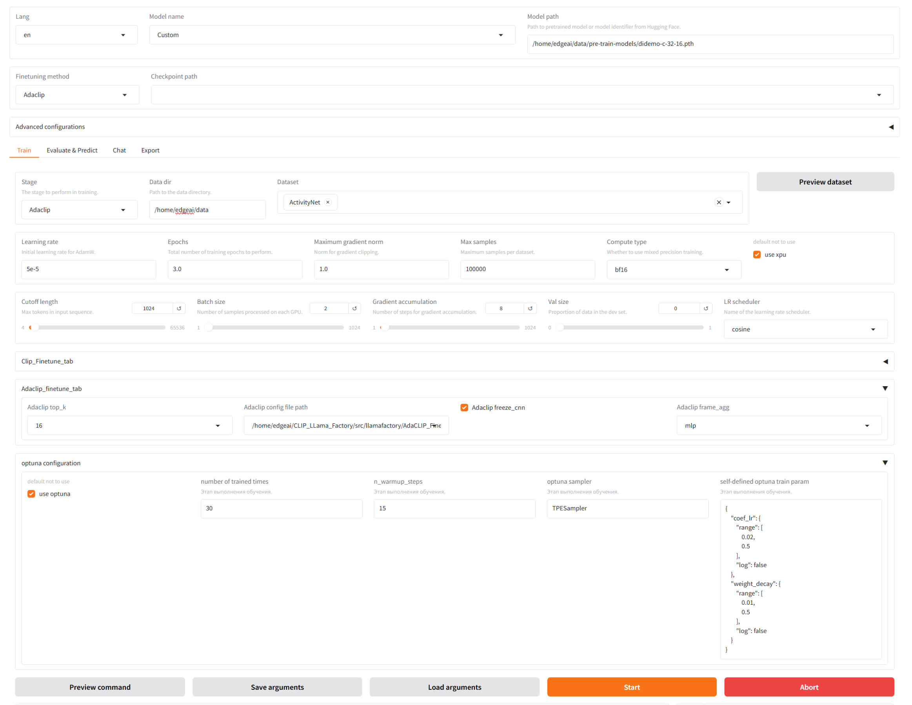

# XTune - Model finetune tool for Intel GPU

**`Xtune`** is an model finetune tool for Intel GPU(Intel Arc 770)

> [!NOTE]
>
> - _`Xtune`_ provides UI with fine-tuning tool for [CLIP](src/llamafactory/clip_finetune/README.md) and [AdaCLIP](./src/llamafactory/adaclip_finetune/README.md). It makes easier to choose the method and to set fine-tuning parameters.

The core features include:

- Four finetune method for CLIP, details in [CLIP](./doc/key_features_for_clip_finetune_tool.md)
- Three finetune method for AdaCLIP, details in [AdaCLIP](./src/llamafactory/adaclip_finetune/README.md)
- Combined [Optuna](https://github.com/optuna/optuna) to automatic get the best param

You can use this UI to easily access basic functions(merge two tool into one UI),

or use the command line to use tools separately which is easier to customize parameters and has more comprehensive functionality.

## Installation

please fololow [install_dependency](./doc/install_dependency.md) to install Driver for Arc 770

> [!IMPORTANT]
> Installation is mandatory.

```bash
conda create -n xtune python=3.10 -y
conda activate xtune
pip install -r requirements.txt
# if you want to run on NVIDIA GPU
    conda install pytorch torchvision cudatoolkit=10.2 -c pytorch
# else run on A770
# You can refer to https://github.com/intel/intel-extension-for-pytorch for latest command
    python -m pip install torch==2.5.1+cxx11.abi torchvision==0.20.1+cxx11.abi torchaudio==2.5.1+cxx11.abi intel-extension-for-pytorch==2.5.10+xpu oneccl_bind_pt==2.5.0+xpu --extra-index-url https://pytorch-extension.intel.com/release-whl/stable/xpu/us/

cd src/llamafactory/clip_finetune/dassl
python setup.py develop
cd ../../../..
pip install matplotlib
pip install -e ".[metrics]"
```

## Data Preparation

Please refer to [data/Prepare_dataset.md](./data/Prepare_dataset.md) for checking the details about the dataset files.

> [!NOTE]
> Please update `dataset_info.json` to use your custom dataset.

Prepare dataset info for caltech101
make `caltech101.json` in your dataset directory

```json
[]
```

then make `dataset_info.json` in your dataset directory

```json
{
  "caltech101": {
    "file_name": "caltech101.json"
  }
}
```

## Fine-Tuning with LLaMA Board GUI (powered by [Gradio](https://github.com/gradio-app/gradio))

```bash
 Run with A100:
 CUDA_VISIBLE_DEVICES=0 llamafactory-cli webui
 Run with ARC770:
 export HF_ENDPOINT=https://hf-mirror.com
 export TOKENIZERS_PARALLELISM=false
 ZE_AFFINITY_MASK=0 llamafactory-cli webui
```

## `Xtune` Examples

See screenshot of running CLIP and AdaCLIP finetune on Intel Arc A770 below.

UI component details can be seen [here](./doc/ui_component.md).

<table width="100%">
  <tr>
    <td align="center" colspan="1"><strong>CLIP finetune</strong></td>
    <td align="center" colspan="1"><strong>AdaCLIP finetune</strong></td>
  <tr>
  <tr>
    <td align="center" target="_blank"><strong></strong></td>
    <td align="center" target="_blank"><strong></strong></td>
  <tr>
</table>

## Citation

```bibtex
@inproceedings{zheng2024llamafactory,
  title={LlamaFactory: Unified Efficient Fine-Tuning of 100+ Language Models},
  author={Yaowei Zheng and Richong Zhang and Junhao Zhang and Yanhan Ye and Zheyan Luo and Zhangchi Feng and Yongqiang Ma},
  booktitle={Proceedings of the 62nd Annual Meeting of the Association for Computational Linguistics (Volume 3: System Demonstrations)},
  address={Bangkok, Thailand},
  publisher={Association for Computational Linguistics},
  year={2024},
  url={http://arxiv.org/abs/2403.13372}
}
```

## Acknowledgement

This repo benefits from [LLaMA-Factory](https://github.com/hiyouga/LLaMA-Factory), [CLIP-Adapter](https://github.com/gaopengcuhk/CLIP-Adapter) and [CoOp](https://github.com/KaiyangZhou/Dassl.pytorch). Thanks for their wonderful works.
