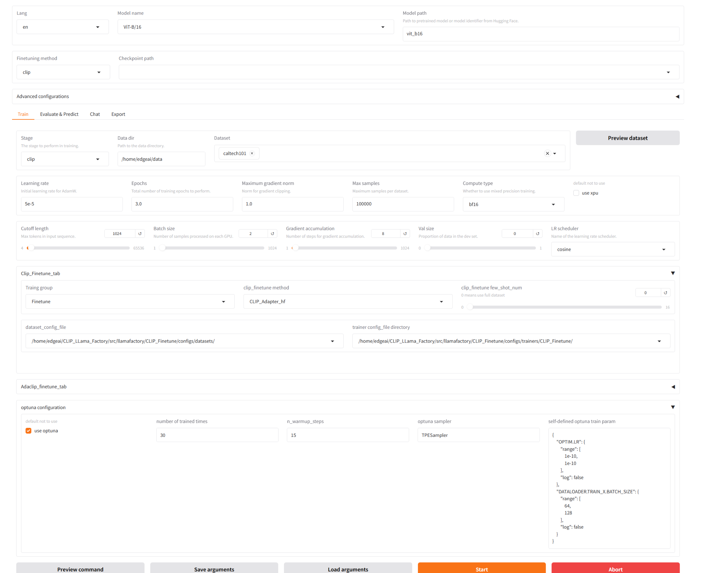

## `Xtune` Examples

See screenshot of running CLIP and AdaCLIP finetune on Intel Arc A770 below.

UI component details can be seen [here](./doc/ui_component.md).

<table width="100%">
  <tr>
    <td align="center" colspan="1"><strong>CLIP finetune</strong></td>
    <td align="center" colspan="1"><strong>AdaCLIP finetune</strong></td>
  <tr>
  <tr>
    <td align="center" target="_blank"><strong></strong></td>
    <td align="center" target="_blank"><strong></strong></td>
  <tr>
</table>