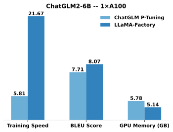

[](https://github.com/hiyouga/LLaMA-Factory/stargazers)
[](https://github.com/hiyouga/LLaMA-Factory/commits/main)
[](https://github.com/hiyouga/LLaMA-Factory/graphs/contributors)
[](https://github.com/hiyouga/LLaMA-Factory/actions/workflows/tests.yml)
[](https://pypi.org/project/llamafactory/)
[](https://scholar.google.com/scholar?cites=12620864006390196564)
[](https://github.com/hiyouga/LLaMA-Factory/pulls)

[](https://twitter.com/llamafactory_ai)
[](https://discord.gg/rKfvV9r9FK)
[](https://gitcode.com/zhengyaowei/LLaMA-Factory)

[](https://colab.research.google.com/drive/1d5KQtbemerlSDSxZIfAaWXhKr30QypiK?usp=sharing)
[](https://gallery.pai-ml.com/#/preview/deepLearning/nlp/llama_factory)
[](https://huggingface.co/spaces/hiyouga/LLaMA-Board)
[](https://modelscope.cn/studios/hiyouga/LLaMA-Board)
[](https://aws.amazon.com/cn/blogs/china/a-one-stop-code-free-model-fine-tuning-deployment-platform-based-on-sagemaker-and-llama-factory/)

<h3 align="center">
    使用零代码<a href="#快速开始">命令行</a>与 <a href="#llama-board-可视化微调由-gradio-驱动">Web UI</a> 轻松微调百余种大模型
</h3>
<p align="center">
    <picture>
        
    </picture>
</p>


👋 加入我们的[微信群](assets/wechat.jpg)或 [NPU 用户群](assets/wechat_npu.jpg)。

\[ [English](README.md) | 中文 \]

**微调大模型可以像这样轻松…**

https://github.com/user-attachments/assets/e6ce34b0-52d5-4f3e-a830-592106c4c272

选择你的打开方式：

- **入门教程**：https://zhuanlan.zhihu.com/p/695287607
- **框架文档**：https://llamafactory.readthedocs.io/zh-cn/latest/
- **Colab**：https://colab.research.google.com/drive/1d5KQtbemerlSDSxZIfAaWXhKr30QypiK?usp=sharing
- **本地机器**：请见[如何使用](#如何使用)
- **PAI-DSW**：[Llama3 案例](https://gallery.pai-ml.com/#/preview/deepLearning/nlp/llama_factory) | [Qwen2-VL 案例](https://gallery.pai-ml.com/#/preview/deepLearning/nlp/llama_factory_qwen2vl)
- **Amazon SageMaker**：[博客](https://aws.amazon.com/cn/blogs/china/a-one-stop-code-free-model-fine-tuning-deployment-platform-based-on-sagemaker-and-llama-factory/)

> [!NOTE]
> 除上述链接以外的其他网站均为未经许可的第三方网站，请小心甄别。

## 目录

- [项目特色](#项目特色)
- [性能指标](#性能指标)
- [更新日志](#更新日志)
- [模型](#模型)
- [训练方法](#训练方法)
- [数据集](#数据集)
- [软硬件依赖](#软硬件依赖)
- [如何使用](#如何使用)
  - [安装 LLaMA Factory](#安装-llama-factory)
  - [数据准备](#数据准备)
  - [快速开始](#快速开始)
  - [LLaMA Board 可视化微调](#llama-board-可视化微调由-gradio-驱动)
  - [构建 Docker](#构建-docker)
  - [利用 vLLM 部署 OpenAI API](#利用-vllm-部署-openai-api)
  - [从魔搭社区下载](#从魔搭社区下载)
  - [从魔乐社区下载](#从魔乐社区下载)
  - [使用 W&B 面板](#使用-wb-面板)
  - [使用 SwanLab 面板](#使用-swanlab-面板)
- [使用了 LLaMA Factory 的项目](#使用了-llama-factory-的项目)
- [协议](#协议)
- [引用](#引用)
- [致谢](#致谢)

## 项目特色

- **多种模型**：LLaMA、LLaVA、Mistral、Mixtral-MoE、Qwen、Qwen2-VL、DeepSeek、Yi、Gemma、ChatGLM、Phi 等等。
- **集成方法**：（增量）预训练、（多模态）指令监督微调、奖励模型训练、PPO 训练、DPO 训练、KTO 训练、ORPO 训练等等。
- **多种精度**：16 比特全参数微调、冻结微调、LoRA 微调和基于 AQLM/AWQ/GPTQ/LLM.int8/HQQ/EETQ 的 2/3/4/5/6/8 比特 QLoRA 微调。
- **先进算法**：[GaLore](https://github.com/jiaweizzhao/GaLore)、[BAdam](https://github.com/Ledzy/BAdam)、[APOLLO](https://github.com/zhuhanqing/APOLLO)、[Adam-mini](https://github.com/zyushun/Adam-mini)、DoRA、LongLoRA、LLaMA Pro、Mixture-of-Depths、LoRA+、LoftQ 和 PiSSA。
- **实用技巧**：[FlashAttention-2](https://github.com/Dao-AILab/flash-attention)、[Unsloth](https://github.com/unslothai/unsloth)、[Liger Kernel](https://github.com/linkedin/Liger-Kernel)、RoPE scaling、NEFTune 和 rsLoRA。
- **广泛任务**：多轮对话、工具调用、图像理解、视觉定位、视频识别和语音理解等等。
- **实验监控**：LlamaBoard、TensorBoard、Wandb、MLflow、SwanLab 等等。
- **极速推理**：基于 vLLM 的 OpenAI 风格 API、浏览器界面和命令行接口。

### 最新模型的 Day-N 微调适配

| 适配时间      | 模型名称                                                    |
| ------------ | ---------------------------------------------------------- |
| Day 0        | Qwen2.5 / Qwen2-VL / QwQ / QvQ / InternLM3 / MiniCPM-o-2.6 |
| Day 1        | Llama 3 / GLM-4 / Mistral Small / PaliGemma2               |

## 性能指标

与 ChatGLM 官方的 [P-Tuning](https://github.com/THUDM/ChatGLM2-6B/tree/main/ptuning) 微调相比，LLaMA Factory 的 LoRA 微调提供了 **3.7 倍**的加速比，同时在广告文案生成任务上取得了更高的 Rouge 分数。结合 4 比特量化技术，LLaMA Factory 的 QLoRA 微调进一步降低了 GPU 显存消耗。



<details><summary>变量定义</summary>

- **Training Speed**: 训练阶段每秒处理的样本数量。（批处理大小=4，截断长度=1024）
- **Rouge Score**: [广告文案生成](https://aclanthology.org/D19-1321.pdf)任务验证集上的 Rouge-2 分数。（批处理大小=4，截断长度=1024）
- **GPU Memory**: 4 比特量化训练的 GPU 显存峰值。（批处理大小=1，截断长度=1024）
- 我们在 ChatGLM 的 P-Tuning 中采用 `pre_seq_len=128`，在 LLaMA Factory 的 LoRA 微调中采用 `lora_rank=32`。

</details>

## 更新日志

[25/02/11] 我们支持了在导出模型时保存 **[Ollama](https://github.com/ollama/ollama)** 配置文件。详细用法请参照 [examples](examples/README_zh.md)。

[25/02/05] 我们支持了在语音理解任务上微调 **[Qwen2-Audio](Qwen/Qwen2-Audio-7B-Instruct)** 和 **[MiniCPM-o-2.6](https://huggingface.co/openbmb/MiniCPM-o-2_6)** 模型。

[25/01/31] 我们支持了 **[DeepSeek-R1](https://huggingface.co/deepseek-ai/DeepSeek-R1)** 和 **[Qwen2.5-VL](https://huggingface.co/Qwen/Qwen2.5-VL-7B-Instruct)** 模型的微调。

<details><summary>展开日志</summary>

[25/01/15] 我们支持了 **[APOLLO](https://arxiv.org/abs/2412.05270)** 优化器。详细用法请参照 [examples](examples/README_zh.md)。

[25/01/14] 我们支持了 **[MiniCPM-o-2.6](https://huggingface.co/openbmb/MiniCPM-o-2_6)** 和 **[MiniCPM-V-2.6](https://huggingface.co/openbmb/MiniCPM-V-2_6)** 模型的微调。 感谢 [@BUAADreamer](https://github.com/BUAADreamer) 的 PR.

[25/01/14] 我们支持了 **[InternLM3](https://huggingface.co/collections/internlm/)** 模型的微调。感谢 [@hhaAndroid](https://github.com/hhaAndroid) 的 PR。

[25/01/10] 我们支持了 **[Phi-4](https://huggingface.co/microsoft/phi-4)** 模型的微调。

[24/12/21] 我们支持了使用 **[SwanLab](https://github.com/SwanHubX/SwanLab)** 跟踪与可视化实验。详细用法请参考 [此部分](#使用-swanlab-面板)。

[24/11/27] 我们支持了 **[Skywork-o1](https://huggingface.co/Skywork/Skywork-o1-Open-Llama-3.1-8B)** 模型的微调和 **[OpenO1](https://huggingface.co/datasets/O1-OPEN/OpenO1-SFT)** 数据集。

[24/10/09] 我们支持了从 **[魔乐社区](https://modelers.cn/models)** 下载预训练模型和数据集。详细用法请参照 [此教程](#从魔乐社区下载)。

[24/09/19] 我们支持了 **[Qwen2.5](https://qwenlm.github.io/blog/qwen2.5/)** 模型的微调。

[24/08/30] 我们支持了 **[Qwen2-VL](https://qwenlm.github.io/blog/qwen2-vl/)** 模型的微调。感谢 [@simonJJJ](https://github.com/simonJJJ) 的 PR。

[24/08/27] 我们支持了 **[Liger Kernel](https://github.com/linkedin/Liger-Kernel)**。请使用 `enable_liger_kernel: true` 来加速训练。

[24/08/09] 我们支持了 **[Adam-mini](https://github.com/zyushun/Adam-mini)** 优化器。详细用法请参照 [examples](examples/README_zh.md)。感谢 [@relic-yuexi](https://github.com/relic-yuexi) 的 PR。

[24/07/04] 我们支持了[无污染打包训练](https://github.com/MeetKai/functionary/tree/main/functionary/train/packing)。请使用 `neat_packing: true` 参数。感谢 [@chuan298](https://github.com/chuan298) 的 PR。

[24/06/16] 我们支持了 **[PiSSA](https://arxiv.org/abs/2404.02948)** 算法。详细用法请参照 [examples](examples/README_zh.md)。

[24/06/07] 我们支持了 **[Qwen2](https://qwenlm.github.io/blog/qwen2/)** 和 **[GLM-4](https://github.com/THUDM/GLM-4)** 模型的微调。

[24/05/26] 我们支持了 **[SimPO](https://arxiv.org/abs/2405.14734)** 偏好对齐算法。详细用法请参照 [examples](examples/README_zh.md)。

[24/05/20] 我们支持了 **PaliGemma** 系列模型的微调。注意 PaliGemma 是预训练模型，你需要使用 `paligemma` 模板进行微调使其获得对话能力。

[24/05/18] 我们支持了 **[KTO](https://arxiv.org/abs/2402.01306)** 偏好对齐算法。详细用法请参照 [examples](examples/README_zh.md)。

[24/05/14] 我们支持了昇腾 NPU 设备的训练和推理。详情请查阅[安装](#安装-llama-factory)部分。

[24/04/26] 我们支持了多模态模型 **LLaVA-1.5** 的微调。详细用法请参照 [examples](examples/README_zh.md)。

[24/04/22] 我们提供了在免费 T4 GPU 上微调 Llama-3 模型的 **[Colab 笔记本](https://colab.research.google.com/drive/1d5KQtbemerlSDSxZIfAaWXhKr30QypiK?usp=sharing)**。Hugging Face 社区公开了两个利用 LLaMA Factory 微调的 Llama-3 模型，详情请见 [Llama3-8B-Chinese-Chat](https://huggingface.co/shenzhi-wang/Llama3-8B-Chinese-Chat) 和 [Llama3-Chinese](https://huggingface.co/zhichen/Llama3-Chinese)。

[24/04/21] 我们基于 [AstraMindAI 的仓库](https://github.com/astramind-ai/Mixture-of-depths)支持了 **[混合深度训练](https://arxiv.org/abs/2404.02258)**。详细用法请参照 [examples](examples/README_zh.md)。

[24/04/16] 我们支持了 **[BAdam](https://arxiv.org/abs/2404.02827)** 优化器。详细用法请参照 [examples](examples/README_zh.md)。

[24/04/16] 我们支持了 **[unsloth](https://github.com/unslothai/unsloth)** 的长序列训练（24GB 可训练 Llama-2-7B-56k）。该方法相比 FlashAttention-2 提供了 **117%** 的训练速度和 **50%** 的显存节约。更多数据请见[此页面](https://github.com/hiyouga/LLaMA-Factory/wiki/Performance-comparison)。

[24/03/31] 我们支持了 **[ORPO](https://arxiv.org/abs/2403.07691)**。详细用法请参照 [examples](examples/README_zh.md)。

[24/03/21] 我们的论文 "[LlamaFactory: Unified Efficient Fine-Tuning of 100+ Language Models](https://arxiv.org/abs/2403.13372)" 可在 arXiv 上查看！

[24/03/20] 我们支持了能在 2x24GB GPU 上微调 70B 模型的 **FSDP+QLoRA**。详细用法请参照 [examples](examples/README_zh.md)。

[24/03/13] 我们支持了 **[LoRA+](https://arxiv.org/abs/2402.12354)**。详细用法请参照 [examples](examples/README_zh.md)。

[24/03/07] 我们支持了 **[GaLore](https://arxiv.org/abs/2403.03507)** 优化器。详细用法请参照 [examples](examples/README_zh.md)。

[24/03/07] 我们集成了 **[vLLM](https://github.com/vllm-project/vllm)** 以实现极速并发推理。请使用 `infer_backend: vllm` 来获得 **270%** 的推理速度。

[24/02/28] 我们支持了 **[DoRA](https://arxiv.org/abs/2402.09353)** 微调。请使用 `use_dora: true` 参数进行 DoRA 微调。

[24/02/15] 我们支持了 [LLaMA Pro](https://github.com/TencentARC/LLaMA-Pro) 提出的**块扩展**方法。详细用法请参照 [examples](examples/README_zh.md)。

[24/02/05] Qwen1.5（Qwen2 测试版）系列模型已在 LLaMA-Factory 中实现微调支持。详情请查阅该[博客页面](https://qwenlm.github.io/zh/blog/qwen1.5/)。

[24/01/18] 我们针对绝大多数模型实现了 **Agent 微调**，微调时指定 `dataset: glaive_toolcall_zh` 即可使模型获得工具调用能力。

[23/12/23] 我们针对 LLaMA, Mistral 和 Yi 模型支持了 **[unsloth](https://github.com/unslothai/unsloth)** 的 LoRA 训练加速。请使用 `use_unsloth: true` 参数启用 unsloth 优化。该方法可提供 **170%** 的训练速度，详情请查阅[此页面](https://github.com/hiyouga/LLaMA-Factory/wiki/Performance-comparison)。

[23/12/12] 我们支持了微调最新的混合专家模型 **[Mixtral 8x7B](https://huggingface.co/mistralai/Mixtral-8x7B-v0.1)**。硬件需求请查阅[此处](#硬件依赖)。

[23/12/01] 我们支持了从 **[魔搭社区](https://modelscope.cn/models)** 下载预训练模型和数据集。详细用法请参照 [此教程](#从魔搭社区下载)。

[23/10/21] 我们支持了 **[NEFTune](https://arxiv.org/abs/2310.05914)** 训练技巧。请使用 `neftune_noise_alpha: 5` 参数启用 NEFTune。

[23/09/27] 我们针对 LLaMA 模型支持了 [LongLoRA](https://github.com/dvlab-research/LongLoRA) 提出的 **$S^2$-Attn**。请使用 `shift_attn: true` 参数以启用该功能。

[23/09/23] 我们在项目中集成了 MMLU、C-Eval 和 CMMLU 评估集。详细用法请参照 [examples](examples/README_zh.md)。

[23/09/10] 我们支持了 **[FlashAttention-2](https://github.com/Dao-AILab/flash-attention)**。如果您使用的是 RTX4090、A100 或 H100 GPU，请使用 `flash_attn: fa2` 参数以启用 FlashAttention-2。

[23/08/12] 我们支持了 **RoPE 插值**来扩展 LLaMA 模型的上下文长度。请使用 `rope_scaling: linear` 参数训练模型或使用 `rope_scaling: dynamic` 参数评估模型。

[23/08/11] 我们支持了指令模型的 **[DPO 训练](https://arxiv.org/abs/2305.18290)**。详细用法请参照 [examples](examples/README_zh.md)。

[23/07/31] 我们支持了**数据流式加载**。请使用 `streaming: true` 和 `max_steps: 10000` 参数来流式加载数据集。

[23/07/29] 我们在 Hugging Face 发布了两个 13B 指令微调模型。详细内容请查阅我们的 Hugging Face 项目（[LLaMA-2](https://huggingface.co/hiyouga/Llama-2-Chinese-13b-chat) / [Baichuan](https://huggingface.co/hiyouga/Baichuan-13B-sft)）。

[23/07/18] 我们开发了支持训练和测试的**浏览器一体化界面**。请使用 `train_web.py` 在您的浏览器中微调模型。感谢 [@KanadeSiina](https://github.com/KanadeSiina) 和 [@codemayq](https://github.com/codemayq) 在该功能开发中付出的努力。

[23/07/09] 我们开源了 **[FastEdit](https://github.com/hiyouga/FastEdit)** ⚡🩹，一个简单易用的、能迅速编辑大模型事实记忆的工具包。如果您感兴趣请关注我们的 [FastEdit](https://github.com/hiyouga/FastEdit) 项目。

[23/06/29] 我们提供了一个**可复现的**指令模型微调示例，详细内容请查阅 [Baichuan-7B-sft](https://huggingface.co/hiyouga/Baichuan-7B-sft)。

[23/06/22] 我们对齐了[示例 API](src/api_demo.py) 与 [OpenAI API](https://platform.openai.com/docs/api-reference/chat) 的格式，您可以将微调模型接入**任意基于 ChatGPT 的应用**中。

[23/06/03] 我们实现了 4 比特的 LoRA 训练（也称 **[QLoRA](https://github.com/artidoro/qlora)**）。详细用法请参照 [examples](examples/README_zh.md)。

</details>

## 模型

| 模型名                                                             | 参数量                            | Template            |
| ----------------------------------------------------------------- | -------------------------------- | ------------------- |
| [Baichuan 2](https://huggingface.co/baichuan-inc)                 | 7B/13B                           | baichuan2           |
| [BLOOM/BLOOMZ](https://huggingface.co/bigscience)                 | 560M/1.1B/1.7B/3B/7.1B/176B      | -                   |
| [ChatGLM3](https://huggingface.co/THUDM)                          | 6B                               | chatglm3            |
| [Command R](https://huggingface.co/CohereForAI)                   | 35B/104B                         | cohere              |
| [DeepSeek (Code/MoE)](https://huggingface.co/deepseek-ai)         | 7B/16B/67B/236B                  | deepseek            |
| [DeepSeek 2.5/3](https://huggingface.co/deepseek-ai)              | 236B/671B                        | deepseek3           |
| [DeepSeek R1 (Distill)](https://huggingface.co/deepseek-ai)       | 1.5B/7B/8B/14B/32B/70B/671B      | deepseek3           |
| [Falcon](https://huggingface.co/tiiuae)                           | 7B/11B/40B/180B                  | falcon              |
| [Gemma/Gemma 2/CodeGemma](https://huggingface.co/google)          | 2B/7B/9B/27B                     | gemma               |
| [GLM-4](https://huggingface.co/THUDM)                             | 9B                               | glm4                |
| [GPT-2](https://huggingface.co/openai-community)                  | 0.1B/0.4B/0.8B/1.5B              | -                   |
| [Granite 3.0-3.1](https://huggingface.co/ibm-granite)             | 1B/2B/3B/8B                      | granite3            |
| [Index](https://huggingface.co/IndexTeam)                         | 1.9B                             | index               |
| [InternLM 2-3](https://huggingface.co/internlm)                   | 7B/8B/20B                        | intern2             |
| [Llama](https://github.com/facebookresearch/llama)                | 7B/13B/33B/65B                   | -                   |
| [Llama 2](https://huggingface.co/meta-llama)                      | 7B/13B/70B                       | llama2              |
| [Llama 3-3.3](https://huggingface.co/meta-llama)                  | 1B/3B/8B/70B                     | llama3              |
| [Llama 3.2 Vision](https://huggingface.co/meta-llama)             | 11B/90B                          | mllama              |
| [LLaVA-1.5](https://huggingface.co/llava-hf)                      | 7B/13B                           | llava               |
| [LLaVA-NeXT](https://huggingface.co/llava-hf)                     | 7B/8B/13B/34B/72B/110B           | llava_next          |
| [LLaVA-NeXT-Video](https://huggingface.co/llava-hf)               | 7B/34B                           | llava_next_video    |
| [MiniCPM](https://huggingface.co/openbmb)                         | 1B/2B/4B                         | cpm/cpm3            |
| [MiniCPM-o-2.6/MiniCPM-V-2.6](https://huggingface.co/openbmb)     | 8B                               | minicpm_o/minicpm_v |
| [Ministral/Mistral-Nemo](https://huggingface.co/mistralai)        | 8B/12B                           | ministral           |
| [Mistral/Mixtral](https://huggingface.co/mistralai)               | 7B/8x7B/8x22B                    | mistral             |
| [Mistral Small](https://huggingface.co/mistralai)                 | 24B                              | mistral_small       |
| [OLMo](https://huggingface.co/allenai)                            | 1B/7B                            | -                   |
| [PaliGemma/PaliGemma2](https://huggingface.co/google)             | 3B/10B/28B                       | paligemma           |
| [Phi-1.5/Phi-2](https://huggingface.co/microsoft)                 | 1.3B/2.7B                        | -                   |
| [Phi-3/Phi-3.5](https://huggingface.co/microsoft)                 | 4B/14B                           | phi                 |
| [Phi-3-small](https://huggingface.co/microsoft)                   | 7B                               | phi_small           |
| [Phi-4](https://huggingface.co/microsoft)                         | 14B                              | phi4                |
| [Pixtral](https://huggingface.co/mistralai)                       | 12B                              | pixtral             |
| [Qwen/QwQ (1-2.5) (Code/Math/MoE)](https://huggingface.co/Qwen)   | 0.5B/1.5B/3B/7B/14B/32B/72B/110B | qwen                |
| [Qwen2-Audio](https://huggingface.co/Qwen)                        | 7B                               | qwen2_audio         |
| [Qwen2-VL/Qwen2.5-VL/QVQ](https://huggingface.co/Qwen)            | 2B/3B/7B/72B                     | qwen2_vl            |
| [Skywork o1](https://huggingface.co/Skywork)                      | 8B                               | skywork_o1          |
| [StarCoder 2](https://huggingface.co/bigcode)                     | 3B/7B/15B                        | -                   |
| [TeleChat2](https://huggingface.co/Tele-AI)                       | 3B/7B/35B/115B                   | telechat2           |
| [XVERSE](https://huggingface.co/xverse)                           | 7B/13B/65B                       | xverse              |
| [Yi/Yi-1.5 (Code)](https://huggingface.co/01-ai)                  | 1.5B/6B/9B/34B                   | yi                  |
| [Yi-VL](https://huggingface.co/01-ai)                             | 6B/34B                           | yi_vl               |
| [Yuan 2](https://huggingface.co/IEITYuan)                         | 2B/51B/102B                      | yuan                |

> [!NOTE]
> 对于所有“基座”（Base）模型，`template` 参数可以是 `default`, `alpaca`, `vicuna` 等任意值。但“对话”（Instruct/Chat）模型请务必使用**对应的模板**。
>
> 请务必在训练和推理时采用**完全一致**的模板。

项目所支持模型的完整列表请参阅 [constants.py](src/llamafactory/extras/constants.py)。

您也可以在 [template.py](src/llamafactory/data/template.py) 中添加自己的对话模板。

## 训练方法

| 方法                   |     全参数训练      |    部分参数训练     |       LoRA         |       QLoRA        |
| --------------------- | ------------------ | ------------------ | ------------------ | ------------------ |
| 预训练                 | :white_check_mark: | :white_check_mark: | :white_check_mark: | :white_check_mark: |
| 指令监督微调            | :white_check_mark: | :white_check_mark: | :white_check_mark: | :white_check_mark: |
| 奖励模型训练            | :white_check_mark: | :white_check_mark: | :white_check_mark: | :white_check_mark: |
| PPO 训练               | :white_check_mark: | :white_check_mark: | :white_check_mark: | :white_check_mark: |
| DPO 训练               | :white_check_mark: | :white_check_mark: | :white_check_mark: | :white_check_mark: |
| KTO 训练               | :white_check_mark: | :white_check_mark: | :white_check_mark: | :white_check_mark: |
| ORPO 训练              | :white_check_mark: | :white_check_mark: | :white_check_mark: | :white_check_mark: |
| SimPO 训练             | :white_check_mark: | :white_check_mark: | :white_check_mark: | :white_check_mark: |

> [!TIP]
> 有关 PPO 的实现细节，请参考[此博客](https://newfacade.github.io/notes-on-reinforcement-learning/17-ppo-trl.html)。

## 数据集

<details><summary>预训练数据集</summary>

- [Wiki Demo (en)](data/wiki_demo.txt)
- [RefinedWeb (en)](https://huggingface.co/datasets/tiiuae/falcon-refinedweb)
- [RedPajama V2 (en)](https://huggingface.co/datasets/togethercomputer/RedPajama-Data-V2)
- [Wikipedia (en)](https://huggingface.co/datasets/olm/olm-wikipedia-20221220)
- [Wikipedia (zh)](https://huggingface.co/datasets/pleisto/wikipedia-cn-20230720-filtered)
- [Pile (en)](https://huggingface.co/datasets/EleutherAI/pile)
- [SkyPile (zh)](https://huggingface.co/datasets/Skywork/SkyPile-150B)
- [FineWeb (en)](https://huggingface.co/datasets/HuggingFaceFW/fineweb)
- [FineWeb-Edu (en)](https://huggingface.co/datasets/HuggingFaceFW/fineweb-edu)
- [The Stack (en)](https://huggingface.co/datasets/bigcode/the-stack)
- [StarCoder (en)](https://huggingface.co/datasets/bigcode/starcoderdata)

</details>

<details><summary>指令微调数据集</summary>

- [Identity (en&zh)](data/identity.json)
- [Stanford Alpaca (en)](https://github.com/tatsu-lab/stanford_alpaca)
- [Stanford Alpaca (zh)](https://github.com/ymcui/Chinese-LLaMA-Alpaca-3)
- [Alpaca GPT4 (en&zh)](https://github.com/Instruction-Tuning-with-GPT-4/GPT-4-LLM)
- [Glaive Function Calling V2 (en&zh)](https://huggingface.co/datasets/glaiveai/glaive-function-calling-v2)
- [LIMA (en)](https://huggingface.co/datasets/GAIR/lima)
- [Guanaco Dataset (multilingual)](https://huggingface.co/datasets/JosephusCheung/GuanacoDataset)
- [BELLE 2M (zh)](https://huggingface.co/datasets/BelleGroup/train_2M_CN)
- [BELLE 1M (zh)](https://huggingface.co/datasets/BelleGroup/train_1M_CN)
- [BELLE 0.5M (zh)](https://huggingface.co/datasets/BelleGroup/train_0.5M_CN)
- [BELLE Dialogue 0.4M (zh)](https://huggingface.co/datasets/BelleGroup/generated_chat_0.4M)
- [BELLE School Math 0.25M (zh)](https://huggingface.co/datasets/BelleGroup/school_math_0.25M)
- [BELLE Multiturn Chat 0.8M (zh)](https://huggingface.co/datasets/BelleGroup/multiturn_chat_0.8M)
- [UltraChat (en)](https://github.com/thunlp/UltraChat)
- [OpenPlatypus (en)](https://huggingface.co/datasets/garage-bAInd/Open-Platypus)
- [CodeAlpaca 20k (en)](https://huggingface.co/datasets/sahil2801/CodeAlpaca-20k)
- [Alpaca CoT (multilingual)](https://huggingface.co/datasets/QingyiSi/Alpaca-CoT)
- [OpenOrca (en)](https://huggingface.co/datasets/Open-Orca/OpenOrca)
- [SlimOrca (en)](https://huggingface.co/datasets/Open-Orca/SlimOrca)
- [MathInstruct (en)](https://huggingface.co/datasets/TIGER-Lab/MathInstruct)
- [Firefly 1.1M (zh)](https://huggingface.co/datasets/YeungNLP/firefly-train-1.1M)
- [Wiki QA (en)](https://huggingface.co/datasets/wiki_qa)
- [Web QA (zh)](https://huggingface.co/datasets/suolyer/webqa)
- [WebNovel (zh)](https://huggingface.co/datasets/zxbsmk/webnovel_cn)
- [Nectar (en)](https://huggingface.co/datasets/berkeley-nest/Nectar)
- [deepctrl (en&zh)](https://www.modelscope.cn/datasets/deepctrl/deepctrl-sft-data)
- [Advertise Generating (zh)](https://huggingface.co/datasets/HasturOfficial/adgen)
- [ShareGPT Hyperfiltered (en)](https://huggingface.co/datasets/totally-not-an-llm/sharegpt-hyperfiltered-3k)
- [ShareGPT4 (en&zh)](https://huggingface.co/datasets/shibing624/sharegpt_gpt4)
- [UltraChat 200k (en)](https://huggingface.co/datasets/HuggingFaceH4/ultrachat_200k)
- [AgentInstruct (en)](https://huggingface.co/datasets/THUDM/AgentInstruct)
- [LMSYS Chat 1M (en)](https://huggingface.co/datasets/lmsys/lmsys-chat-1m)
- [Evol Instruct V2 (en)](https://huggingface.co/datasets/WizardLM/WizardLM_evol_instruct_V2_196k)
- [Cosmopedia (en)](https://huggingface.co/datasets/HuggingFaceTB/cosmopedia)
- [STEM (zh)](https://huggingface.co/datasets/hfl/stem_zh_instruction)
- [Ruozhiba (zh)](https://huggingface.co/datasets/hfl/ruozhiba_gpt4_turbo)
- [Neo-sft (zh)](https://huggingface.co/datasets/m-a-p/neo_sft_phase2)
- [Magpie-Pro-300K-Filtered (en)](https://huggingface.co/datasets/Magpie-Align/Magpie-Pro-300K-Filtered)
- [Magpie-ultra-v0.1 (en)](https://huggingface.co/datasets/argilla/magpie-ultra-v0.1)
- [WebInstructSub (en)](https://huggingface.co/datasets/TIGER-Lab/WebInstructSub)
- [OpenO1-SFT (en&zh)](https://huggingface.co/datasets/O1-OPEN/OpenO1-SFT)
- [Open-Thoughts (en)](https://huggingface.co/datasets/open-thoughts/OpenThoughts-114k)
- [Open-R1-Math (en)](https://huggingface.co/datasets/open-r1/OpenR1-Math-220k)
- [Chinese-DeepSeek-R1-Distill (zh)](https://huggingface.co/datasets/Congliu/Chinese-DeepSeek-R1-Distill-data-110k-SFT)
- [LLaVA mixed (en&zh)](https://huggingface.co/datasets/BUAADreamer/llava-en-zh-300k)
- [Pokemon-gpt4o-captions (en&zh)](https://huggingface.co/datasets/jugg1024/pokemon-gpt4o-captions)
- [Open Assistant (de)](https://huggingface.co/datasets/mayflowergmbh/oasst_de)
- [Dolly 15k (de)](https://huggingface.co/datasets/mayflowergmbh/dolly-15k_de)
- [Alpaca GPT4 (de)](https://huggingface.co/datasets/mayflowergmbh/alpaca-gpt4_de)
- [OpenSchnabeltier (de)](https://huggingface.co/datasets/mayflowergmbh/openschnabeltier_de)
- [Evol Instruct (de)](https://huggingface.co/datasets/mayflowergmbh/evol-instruct_de)
- [Dolphin (de)](https://huggingface.co/datasets/mayflowergmbh/dolphin_de)
- [Booksum (de)](https://huggingface.co/datasets/mayflowergmbh/booksum_de)
- [Airoboros (de)](https://huggingface.co/datasets/mayflowergmbh/airoboros-3.0_de)
- [Ultrachat (de)](https://huggingface.co/datasets/mayflowergmbh/ultra-chat_de)

</details>

<details><summary>偏好数据集</summary>

- [DPO mixed (en&zh)](https://huggingface.co/datasets/hiyouga/DPO-En-Zh-20k)
- [UltraFeedback (en)](https://huggingface.co/datasets/HuggingFaceH4/ultrafeedback_binarized)
- [RLHF-V (en)](https://huggingface.co/datasets/openbmb/RLHF-V-Dataset)
- [VLFeedback (en)](https://huggingface.co/datasets/Zhihui/VLFeedback)
- [Orca DPO Pairs (en)](https://huggingface.co/datasets/Intel/orca_dpo_pairs)
- [HH-RLHF (en)](https://huggingface.co/datasets/Anthropic/hh-rlhf)
- [Nectar (en)](https://huggingface.co/datasets/berkeley-nest/Nectar)
- [Orca DPO (de)](https://huggingface.co/datasets/mayflowergmbh/intel_orca_dpo_pairs_de)
- [KTO mixed (en)](https://huggingface.co/datasets/argilla/kto-mix-15k)

</details>

部分数据集的使用需要确认，我们推荐使用下述命令登录您的 Hugging Face 账户。

```bash
pip install --upgrade huggingface_hub
huggingface-cli login
```

## 软硬件依赖

| 必需项       | 至少     | 推荐      |
| ------------ | ------- | --------- |
| python       | 3.9     | 3.10      |
| torch        | 1.13.1  | 2.4.0     |
| transformers | 4.41.2  | 4.49.0    |
| datasets     | 2.16.0  | 3.2.0     |
| accelerate   | 0.34.0  | 1.2.1     |
| peft         | 0.11.1  | 0.12.0    |
| trl          | 0.8.6   | 0.9.6     |

| 可选项       | 至少     | 推荐      |
| ------------ | ------- | --------- |
| CUDA         | 11.6    | 12.2      |
| deepspeed    | 0.10.0  | 0.16.2    |
| bitsandbytes | 0.39.0  | 0.43.1    |
| vllm         | 0.4.3   | 0.7.2     |
| flash-attn   | 2.3.0   | 2.7.2     |

### 硬件依赖

\* *估算值*

| 方法                      | 精度 |   7B  |  13B  |  30B  |   70B  |  110B  |  8x7B |  8x22B |
| ------------------------ | ---- | ----- | ----- | ----- | ------ | ------ | ----- | ------ |
| Full                     |  32  | 120GB | 240GB | 600GB | 1200GB | 2000GB | 900GB | 2400GB |
| Full                     |  16  |  60GB | 120GB | 300GB |  600GB |  900GB | 400GB | 1200GB |
| Freeze                   |  16  |  20GB |  40GB |  80GB |  200GB |  360GB | 160GB |  400GB |
| LoRA/GaLore/APOLLO/BAdam |  16  |  16GB |  32GB |  64GB |  160GB |  240GB | 120GB |  320GB |
| QLoRA                    |   8  |  10GB |  20GB |  40GB |   80GB |  140GB |  60GB |  160GB |
| QLoRA                    |   4  |   6GB |  12GB |  24GB |   48GB |   72GB |  30GB |   96GB |
| QLoRA                    |   2  |   4GB |   8GB |  16GB |   24GB |   48GB |  18GB |   48GB |

## 如何使用

### 安装 LLaMA Factory

> [!IMPORTANT]
> 此步骤为必需。

```bash
git clone --depth 1 https://github.com/hiyouga/LLaMA-Factory.git
cd LLaMA-Factory
pip install -e ".[torch,metrics]"
```

可选的额外依赖项：torch、torch-npu、metrics、deepspeed、liger-kernel、bitsandbytes、hqq、eetq、gptq、awq、aqlm、vllm、galore、apollo、badam、adam-mini、qwen、minicpm_v、modelscope、openmind、swanlab、quality

> [!TIP]
> 遇到包冲突时，可使用 `pip install --no-deps -e .` 解决。

<details><summary>使用 <b>uv</b> 构建虚拟环境</summary>

使用 [uv](https://github.com/astral-sh/uv) 创建隔离的 Python 环境：

```bash
uv sync --extra torch --extra metrics --prerelease=allow
```

在环境中运行 LLaMA-Factory：

```bash
uv run --prerelease=allow llamafactory-cli train examples/train_lora/llama3_lora_pretrain.yaml
```

</details>


<details><summary>Windows 用户指南</summary>

#### 安装 BitsAndBytes

如果要在 Windows 平台上开启量化 LoRA（QLoRA），需要安装预编译的 `bitsandbytes` 库, 支持 CUDA 11.1 到 12.2, 请根据您的 CUDA 版本情况选择适合的[发布版本](https://github.com/jllllll/bitsandbytes-windows-webui/releases/tag/wheels)。

```bash
pip install https://github.com/jllllll/bitsandbytes-windows-webui/releases/download/wheels/bitsandbytes-0.41.2.post2-py3-none-win_amd64.whl
```

#### 安装 Flash Attention-2

如果要在 Windows 平台上开启 FlashAttention-2，请使用 [flash-attention-windows-wheel](https://huggingface.co/lldacing/flash-attention-windows-wheel) 中的脚本自行编译与安装。

</details>

<details><summary>昇腾 NPU 用户指南</summary>

在昇腾 NPU 设备上安装 LLaMA Factory 时，请升级 Python 到 3.10 及以上，并需要指定额外依赖项，使用 `pip install -e ".[torch-npu,metrics]"` 命令安装。此外，还需要安装 **[Ascend CANN Toolkit 与 Kernels](https://www.hiascend.com/developer/download/community/result?module=cann)**，安装方法请参考[安装教程](https://www.hiascend.com/document/detail/zh/CANNCommunityEdition/80RC2alpha002/quickstart/quickstart/quickstart_18_0004.html)或使用以下命令：

```bash
# 请替换 URL 为 CANN 版本和设备型号对应的 URL
# 安装 CANN Toolkit
wget https://ascend-repo.obs.cn-east-2.myhuaweicloud.com/Milan-ASL/Milan-ASL%20V100R001C17SPC701/Ascend-cann-toolkit_8.0.RC1.alpha001_linux-"$(uname -i)".run
bash Ascend-cann-toolkit_8.0.RC1.alpha001_linux-"$(uname -i)".run --install

# 安装 CANN Kernels
wget https://ascend-repo.obs.cn-east-2.myhuaweicloud.com/Milan-ASL/Milan-ASL%20V100R001C17SPC701/Ascend-cann-kernels-910b_8.0.RC1.alpha001_linux.run
bash Ascend-cann-kernels-910b_8.0.RC1.alpha001_linux.run --install

# 设置环境变量
source /usr/local/Ascend/ascend-toolkit/set_env.sh
```

| 依赖项       | 至少     | 推荐        |
| ------------ | ------- | ----------- |
| CANN         | 8.0.RC1 | 8.0.RC1     |
| torch        | 2.1.0   | 2.1.0       |
| torch-npu    | 2.1.0   | 2.1.0.post3 |
| deepspeed    | 0.13.2  | 0.13.2      |

请使用 `ASCEND_RT_VISIBLE_DEVICES` 而非 `CUDA_VISIBLE_DEVICES` 来指定运算设备。

如果遇到无法正常推理的情况，请尝试设置 `do_sample: false`。

下载预构建 Docker 镜像：[32GB](http://mirrors.cn-central-221.ovaijisuan.com/detail/130.html) | [64GB](http://mirrors.cn-central-221.ovaijisuan.com/detail/131.html)

#### 安装 BitsAndBytes

如果要在 Ascend NPU 上进行基于 bitsandbytes 的 QLoRA 量化微调，请执行如下步骤：

1. 手动编译 bitsandbytes：请参考[安装文档](https://huggingface.co/docs/bitsandbytes/installation?backend=Ascend+NPU&platform=Ascend+NPU)完成 NPU 版的 bitsandbytes 安装，编译要求环境 cmake 版本不低于 3.22.1，g++ 版本不低于 12.x。

```bash
# 从源码安装 bitsandbytes
# 克隆 bitsandbytes 仓库, Ascend NPU 目前在 multi-backend-refactor 中支持
git clone -b multi-backend-refactor https://github.com/bitsandbytes-foundation/bitsandbytes.git
cd bitsandbytes/

# 安装依赖
pip install -r requirements-dev.txt

# 安装编译工具依赖，该步骤在不同系统上命令有所不同，供参考
apt-get install -y build-essential cmake

# 编译 & 安装
cmake -DCOMPUTE_BACKEND=npu -S .
make
pip install .
```

2. 安装 transformers 的 main 分支版本。

```bash
git clone -b main https://github.com/huggingface/transformers.git
cd transformers
pip install .
```

3. 在训练参数中设置 `double_quantization: false`，可参考[示例](examples/train_qlora/llama3_lora_sft_bnb_npu.yaml)。

</details>

### 数据准备

关于数据集文件的格式，请参考 [data/README_zh.md](data/README_zh.md) 的内容。你可以使用 HuggingFace / ModelScope / Modelers 上的数据集或加载本地数据集。

> [!NOTE]
> 使用自定义数据集时，请更新 `data/dataset_info.json` 文件。

### 快速开始

下面三行命令分别对 Llama3-8B-Instruct 模型进行 LoRA **微调**、**推理**和**合并**。

```bash
llamafactory-cli train examples/train_lora/llama3_lora_sft.yaml
llamafactory-cli chat examples/inference/llama3_lora_sft.yaml
llamafactory-cli export examples/merge_lora/llama3_lora_sft.yaml
```

高级用法请参考 [examples/README_zh.md](examples/README_zh.md)（包括多 GPU 微调）。

> [!TIP]
> 使用 `llamafactory-cli help` 显示帮助信息。

### LLaMA Board 可视化微调（由 [Gradio](https://github.com/gradio-app/gradio) 驱动）

```bash
llamafactory-cli webui
```

### 构建 Docker

CUDA 用户：

```bash
cd docker/docker-cuda/
docker compose up -d
docker compose exec llamafactory bash
```

昇腾 NPU 用户：

```bash
cd docker/docker-npu/
docker compose up -d
docker compose exec llamafactory bash
```

AMD ROCm 用户：

```bash
cd docker/docker-rocm/
docker compose up -d
docker compose exec llamafactory bash
```

<details><summary>不使用 Docker Compose 构建</summary>

CUDA 用户：

```bash
docker build -f ./docker/docker-cuda/Dockerfile \
    --build-arg INSTALL_BNB=false \
    --build-arg INSTALL_VLLM=false \
    --build-arg INSTALL_DEEPSPEED=false \
    --build-arg INSTALL_FLASHATTN=false \
    --build-arg PIP_INDEX=https://pypi.org/simple \
    -t llamafactory:latest .

docker run -dit --gpus=all \
    -v ./hf_cache:/root/.cache/huggingface \
    -v ./ms_cache:/root/.cache/modelscope \
    -v ./om_cache:/root/.cache/openmind \
    -v ./data:/app/data \
    -v ./output:/app/output \
    -p 7860:7860 \
    -p 8000:8000 \
    --shm-size 16G \
    --name llamafactory \
    llamafactory:latest

docker exec -it llamafactory bash
```

昇腾 NPU 用户：

```bash
# 根据您的环境选择镜像
docker build -f ./docker/docker-npu/Dockerfile \
    --build-arg INSTALL_DEEPSPEED=false \
    --build-arg PIP_INDEX=https://pypi.org/simple \
    -t llamafactory:latest .

# 根据您的资源更改 `device`
docker run -dit \
    -v ./hf_cache:/root/.cache/huggingface \
    -v ./ms_cache:/root/.cache/modelscope \
    -v ./om_cache:/root/.cache/openmind \
    -v ./data:/app/data \
    -v ./output:/app/output \
    -v /usr/local/dcmi:/usr/local/dcmi \
    -v /usr/local/bin/npu-smi:/usr/local/bin/npu-smi \
    -v /usr/local/Ascend/driver:/usr/local/Ascend/driver \
    -v /etc/ascend_install.info:/etc/ascend_install.info \
    -p 7860:7860 \
    -p 8000:8000 \
    --device /dev/davinci0 \
    --device /dev/davinci_manager \
    --device /dev/devmm_svm \
    --device /dev/hisi_hdc \
    --shm-size 16G \
    --name llamafactory \
    llamafactory:latest

docker exec -it llamafactory bash
```

AMD ROCm 用户：

```bash
docker build -f ./docker/docker-rocm/Dockerfile \
    --build-arg INSTALL_BNB=false \
    --build-arg INSTALL_VLLM=false \
    --build-arg INSTALL_DEEPSPEED=false \
    --build-arg INSTALL_FLASHATTN=false \
    --build-arg PIP_INDEX=https://pypi.org/simple \
    -t llamafactory:latest .

docker run -dit \
    -v ./hf_cache:/root/.cache/huggingface \
    -v ./ms_cache:/root/.cache/modelscope \
    -v ./om_cache:/root/.cache/openmind \
    -v ./data:/app/data \
    -v ./output:/app/output \
    -v ./saves:/app/saves \
    -p 7860:7860 \
    -p 8000:8000 \
    --device /dev/kfd \
    --device /dev/dri \
    --shm-size 16G \
    --name llamafactory \
    llamafactory:latest

docker exec -it llamafactory bash
```

</details>

<details><summary>数据卷详情</summary>

- `hf_cache`：使用宿主机的 Hugging Face 缓存文件夹，允许更改为新的目录。
- `ms_cache`：类似 Hugging Face 缓存文件夹，为 ModelScope 用户提供。
- `om_cache`：类似 Hugging Face 缓存文件夹，为 Modelers 用户提供。
- `data`：宿主机中存放数据集的文件夹路径。
- `output`：将导出目录设置为该路径后，即可在宿主机中访问导出后的模型。

</details>

### 利用 vLLM 部署 OpenAI API

```bash
API_PORT=8000 llamafactory-cli api examples/inference/llama3_vllm.yaml
```

> [!TIP]
> API 文档请查阅[这里](https://platform.openai.com/docs/api-reference/chat/create)。
>
> 示例：[图像理解](scripts/api_example/test_image.py) | [工具调用](scripts/api_example/test_toolcall.py)

### 从魔搭社区下载

如果您在 Hugging Face 模型和数据集的下载中遇到了问题，可以通过下述方法使用魔搭社区。

```bash
export USE_MODELSCOPE_HUB=1 # Windows 使用 `set USE_MODELSCOPE_HUB=1`
```

将 `model_name_or_path` 设置为模型 ID 来加载对应的模型。在[魔搭社区](https://modelscope.cn/models)查看所有可用的模型，例如 `LLM-Research/Meta-Llama-3-8B-Instruct`。

### 从魔乐社区下载

您也可以通过下述方法，使用魔乐社区下载数据集和模型。

```bash
export USE_OPENMIND_HUB=1 # Windows 使用 `set USE_OPENMIND_HUB=1`
```

将 `model_name_or_path` 设置为模型 ID 来加载对应的模型。在[魔乐社区](https://modelers.cn/models)查看所有可用的模型，例如 `TeleAI/TeleChat-7B-pt`。

### 使用 W&B 面板

若要使用 [Weights & Biases](https://wandb.ai) 记录实验数据，请在 yaml 文件中添加下面的参数。

```yaml
report_to: wandb
run_name: test_run # 可选
```

在启动训练任务时，将 `WANDB_API_KEY` 设置为[密钥](https://wandb.ai/authorize)来登录 W&B 账户。

### 使用 SwanLab 面板

若要使用 [SwanLab](https://github.com/SwanHubX/SwanLab) 记录实验数据，请在 yaml 文件中添加下面的参数。

```yaml
use_swanlab: true
swanlab_run_name: test_run # 可选
```

在启动训练任务时，登录SwanLab账户有以下三种方式：

方式一：在 yaml 文件中添加 `swanlab_api_key=<your_api_key>` ，并设置为你的 [API 密钥](https://swanlab.cn/settings)。
方式二：将环境变量 `SWANLAB_API_KEY` 设置为你的 [API 密钥](https://swanlab.cn/settings)。
方式三：启动前使用 `swanlab login` 命令完成登录。

## 使用了 LLaMA Factory 的项目

如果您有项目希望添加至下述列表，请通过邮件联系或者创建一个 PR。

<details><summary>点击显示</summary>

1. Wang et al. ESRL: Efficient Sampling-based Reinforcement Learning for Sequence Generation. 2023. [[arxiv]](https://arxiv.org/abs/2308.02223)
1. Yu et al. Open, Closed, or Small Language Models for Text Classification? 2023. [[arxiv]](https://arxiv.org/abs/2308.10092)
1. Wang et al. UbiPhysio: Support Daily Functioning, Fitness, and Rehabilitation with Action Understanding and Feedback in Natural Language. 2023. [[arxiv]](https://arxiv.org/abs/2308.10526)
1. Luceri et al. Leveraging Large Language Models to Detect Influence Campaigns in Social Media. 2023. [[arxiv]](https://arxiv.org/abs/2311.07816)
1. Zhang et al. Alleviating Hallucinations of Large Language Models through Induced Hallucinations. 2023. [[arxiv]](https://arxiv.org/abs/2312.15710)
1. Wang et al. Know Your Needs Better: Towards Structured Understanding of Marketer Demands with Analogical Reasoning Augmented LLMs. KDD 2024. [[arxiv]](https://arxiv.org/abs/2401.04319)
1. Wang et al. CANDLE: Iterative Conceptualization and Instantiation Distillation from Large Language Models for Commonsense Reasoning. ACL 2024. [[arxiv]](https://arxiv.org/abs/2401.07286)
1. Choi et al. FACT-GPT: Fact-Checking Augmentation via Claim Matching with LLMs. 2024. [[arxiv]](https://arxiv.org/abs/2402.05904)
1. Zhang et al. AutoMathText: Autonomous Data Selection with Language Models for Mathematical Texts. 2024. [[arxiv]](https://arxiv.org/abs/2402.07625)
1. Lyu et al. KnowTuning: Knowledge-aware Fine-tuning for Large Language Models. 2024. [[arxiv]](https://arxiv.org/abs/2402.11176)
1. Yang et al. LaCo: Large Language Model Pruning via Layer Collaps. 2024. [[arxiv]](https://arxiv.org/abs/2402.11187)
1. Bhardwaj et al. Language Models are Homer Simpson! Safety Re-Alignment of Fine-tuned Language Models through Task Arithmetic. 2024. [[arxiv]](https://arxiv.org/abs/2402.11746)
1. Yang et al. Enhancing Empathetic Response Generation by Augmenting LLMs with Small-scale Empathetic Models. 2024. [[arxiv]](https://arxiv.org/abs/2402.11801)
1. Yi et al. Generation Meets Verification: Accelerating Large Language Model Inference with Smart Parallel Auto-Correct Decoding. ACL 2024 Findings. [[arxiv]](https://arxiv.org/abs/2402.11809)
1. Cao et al. Head-wise Shareable Attention for Large Language Models. 2024. [[arxiv]](https://arxiv.org/abs/2402.11819)
1. Zhang et al. Enhancing Multilingual Capabilities of Large Language Models through Self-Distillation from Resource-Rich Languages. 2024. [[arxiv]](https://arxiv.org/abs/2402.12204)
1. Kim et al. Efficient and Effective Vocabulary Expansion Towards Multilingual Large Language Models. 2024. [[arxiv]](https://arxiv.org/abs/2402.14714)
1. Yu et al. KIEval: A Knowledge-grounded Interactive Evaluation Framework for Large Language Models. ACL 2024. [[arxiv]](https://arxiv.org/abs/2402.15043)
1. Huang et al. Key-Point-Driven Data Synthesis with its Enhancement on Mathematical Reasoning. 2024. [[arxiv]](https://arxiv.org/abs/2403.02333)
1. Duan et al. Negating Negatives: Alignment without Human Positive Samples via Distributional Dispreference Optimization. 2024. [[arxiv]](https://arxiv.org/abs/2403.03419)
1. Xie and Schwertfeger. Empowering Robotics with Large Language Models: osmAG Map Comprehension with LLMs. 2024. [[arxiv]](https://arxiv.org/abs/2403.08228)
1. Wu et al. Large Language Models are Parallel Multilingual Learners. 2024. [[arxiv]](https://arxiv.org/abs/2403.09073)
1. Zhang et al. EDT: Improving Large Language Models' Generation by Entropy-based Dynamic Temperature Sampling. 2024. [[arxiv]](https://arxiv.org/abs/2403.14541)
1. Weller et al. FollowIR: Evaluating and Teaching Information Retrieval Models to Follow Instructions. 2024. [[arxiv]](https://arxiv.org/abs/2403.15246)
1. Hongbin Na. CBT-LLM: A Chinese Large Language Model for Cognitive Behavioral Therapy-based Mental Health Question Answering. COLING 2024. [[arxiv]](https://arxiv.org/abs/2403.16008)
1. Zan et al. CodeS: Natural Language to Code Repository via Multi-Layer Sketch. 2024. [[arxiv]](https://arxiv.org/abs/2403.16443)
1. Liu et al. Extensive Self-Contrast Enables Feedback-Free Language Model Alignment. 2024. [[arxiv]](https://arxiv.org/abs/2404.00604)
1. Luo et al. BAdam: A Memory Efficient Full Parameter Training Method for Large Language Models. 2024. [[arxiv]](https://arxiv.org/abs/2404.02827)
1. Du et al. Chinese Tiny LLM: Pretraining a Chinese-Centric Large Language Model. 2024. [[arxiv]](https://arxiv.org/abs/2404.04167)
1. Ma et al. Parameter Efficient Quasi-Orthogonal Fine-Tuning via Givens Rotation. ICML 2024. [[arxiv]](https://arxiv.org/abs/2404.04316)
1. Liu et al. Dynamic Generation of Personalities with Large Language Models. 2024. [[arxiv]](https://arxiv.org/abs/2404.07084)
1. Shang et al. How Far Have We Gone in Stripped Binary Code Understanding Using Large Language Models. 2024. [[arxiv]](https://arxiv.org/abs/2404.09836)
1. Huang et al. LLMTune: Accelerate Database Knob Tuning with Large Language Models. 2024. [[arxiv]](https://arxiv.org/abs/2404.11581)
1. Deng et al. Text-Tuple-Table: Towards Information Integration in Text-to-Table Generation via Global Tuple Extraction. 2024. [[arxiv]](https://arxiv.org/abs/2404.14215)
1. Acikgoz et al. Hippocrates: An Open-Source Framework for Advancing Large Language Models in Healthcare. 2024. [[arxiv]](https://arxiv.org/abs/2404.16621)
1. Zhang et al. Small Language Models Need Strong Verifiers to Self-Correct Reasoning. ACL 2024 Findings. [[arxiv]](https://arxiv.org/abs/2404.17140)
1. Zhou et al. FREB-TQA: A Fine-Grained Robustness Evaluation Benchmark for Table Question Answering. NAACL 2024. [[arxiv]](https://arxiv.org/abs/2404.18585)
1. Xu et al. Large Language Models for Cyber Security: A Systematic Literature Review. 2024. [[arxiv]](https://arxiv.org/abs/2405.04760)
1. Dammu et al. "They are uncultured": Unveiling Covert Harms and Social Threats in LLM Generated Conversations. 2024. [[arxiv]](https://arxiv.org/abs/2405.05378)
1. Yi et al. A safety realignment framework via subspace-oriented model fusion for large language models. 2024. [[arxiv]](https://arxiv.org/abs/2405.09055)
1. Lou et al. SPO: Multi-Dimensional Preference Sequential Alignment With Implicit Reward Modeling. 2024. [[arxiv]](https://arxiv.org/abs/2405.12739)
1. Zhang et al. Getting More from Less: Large Language Models are Good Spontaneous Multilingual Learners. 2024. [[arxiv]](https://arxiv.org/abs/2405.13816)
1. Zhang et al. TS-Align: A Teacher-Student Collaborative Framework for Scalable Iterative Finetuning of Large Language Models. 2024. [[arxiv]](https://arxiv.org/abs/2405.20215)
1. Zihong Chen. Sentence Segmentation and Sentence Punctuation Based on XunziALLM. 2024. [[paper]](https://aclanthology.org/2024.lt4hala-1.30)
1. Gao et al. The Best of Both Worlds: Toward an Honest and Helpful Large Language Model. 2024. [[arxiv]](https://arxiv.org/abs/2406.00380)
1. Wang and Song. MARS: Benchmarking the Metaphysical Reasoning Abilities of Language Models with a Multi-task Evaluation Dataset. 2024. [[arxiv]](https://arxiv.org/abs/2406.02106)
1. Hu et al. Computational Limits of Low-Rank Adaptation (LoRA) for Transformer-Based Models. 2024. [[arxiv]](https://arxiv.org/abs/2406.03136)
1. Ge et al. Time Sensitive Knowledge Editing through Efficient Finetuning. ACL 2024. [[arxiv]](https://arxiv.org/abs/2406.04496)
1. Tan et al. Peer Review as A Multi-Turn and Long-Context Dialogue with Role-Based Interactions. 2024. [[arxiv]](https://arxiv.org/abs/2406.05688)
1. Song et al. Turbo Sparse: Achieving LLM SOTA Performance with Minimal Activated Parameters. 2024. [[arxiv]](https://arxiv.org/abs/2406.05955)
1. Gu et al. RWKV-CLIP: A Robust Vision-Language Representation Learner. 2024. [[arxiv]](https://arxiv.org/abs/2406.06973)
1. Chen et al. Advancing Tool-Augmented Large Language Models: Integrating Insights from Errors in Inference Trees. 2024. [[arxiv]](https://arxiv.org/abs/2406.07115)
1. Zhu et al. Are Large Language Models Good Statisticians?. 2024. [[arxiv]](https://arxiv.org/abs/2406.07815)
1. Li et al. Know the Unknown: An Uncertainty-Sensitive Method for LLM Instruction Tuning. 2024. [[arxiv]](https://arxiv.org/abs/2406.10099)
1. Ding et al. IntentionQA: A Benchmark for Evaluating Purchase Intention Comprehension Abilities of Language Models in E-commerce. 2024. [[arxiv]](https://arxiv.org/abs/2406.10173)
1. He et al. COMMUNITY-CROSS-INSTRUCT: Unsupervised Instruction Generation for Aligning Large Language Models to Online Communities. 2024. [[arxiv]](https://arxiv.org/abs/2406.12074)
1. Lin et al. FVEL: Interactive Formal Verification Environment with Large Language Models via Theorem Proving. 2024. [[arxiv]](https://arxiv.org/abs/2406.14408)
1. Treutlein et al. Connecting the Dots: LLMs can Infer and Verbalize Latent Structure from Disparate Training Data. 2024. [[arxiv]](https://arxiv.org/abs/2406.14546)
1. Feng et al. SS-Bench: A Benchmark for Social Story Generation and Evaluation. 2024. [[arxiv]](https://arxiv.org/abs/2406.15695)
1. Feng et al. Self-Constructed Context Decompilation with Fined-grained Alignment Enhancement. 2024. [[arxiv]](https://arxiv.org/abs/2406.17233)
1. Liu et al. Large Language Models for Cuffless Blood Pressure Measurement From Wearable Biosignals. 2024. [[arxiv]](https://arxiv.org/abs/2406.18069)
1. Iyer et al. Exploring Very Low-Resource Translation with LLMs: The University of Edinburgh's Submission to AmericasNLP 2024 Translation Task. AmericasNLP 2024. [[paper]](https://aclanthology.org/2024.americasnlp-1.25)
1. Li et al. Calibrating LLMs with Preference Optimization on Thought Trees for Generating Rationale in Science Question Scoring. 2024. [[arxiv]](https://arxiv.org/abs/2406.19949)
1. Yang et al. Financial Knowledge Large Language Model. 2024. [[arxiv]](https://arxiv.org/abs/2407.00365)
1. Lin et al. DogeRM: Equipping Reward Models with Domain Knowledge through Model Merging. 2024. [[arxiv]](https://arxiv.org/abs/2407.01470)
1. Bako et al. Evaluating the Semantic Profiling Abilities of LLMs for Natural Language Utterances in Data Visualization. 2024. [[arxiv]](https://arxiv.org/abs/2407.06129)
1. Huang et al. RoLoRA: Fine-tuning Rotated Outlier-free LLMs for Effective Weight-Activation Quantization. 2024. [[arxiv]](https://arxiv.org/abs/2407.08044)
1. Jiang et al. LLM-Collaboration on Automatic Science Journalism for the General Audience. 2024. [[arxiv]](https://arxiv.org/abs/2407.09756)
1. Inouye et al. Applied Auto-tuning on LoRA Hyperparameters. 2024. [[paper]](https://scholarcommons.scu.edu/cseng_senior/272/)
1. Qi et al. Research on Tibetan Tourism Viewpoints information generation system based on LLM. 2024. [[arxiv]](https://arxiv.org/abs/2407.13561)
1. Xu et al. Course-Correction: Safety Alignment Using Synthetic Preferences. 2024. [[arxiv]](https://arxiv.org/abs/2407.16637)
1. Sun et al. LAMBDA: A Large Model Based Data Agent. 2024. [[arxiv]](https://arxiv.org/abs/2407.17535)
1. Zhu et al. CollectiveSFT: Scaling Large Language Models for Chinese Medical Benchmark with Collective Instructions in Healthcare. 2024. [[arxiv]](https://arxiv.org/abs/2407.19705)
1. Yu et al. Correcting Negative Bias in Large Language Models through Negative Attention Score Alignment. 2024. [[arxiv]](https://arxiv.org/abs/2408.00137)
1. Xie et al. The Power of Personalized Datasets: Advancing Chinese Composition Writing for Elementary School through Targeted Model Fine-Tuning. IALP 2024. [[paper]](https://www.asianlp.sg/conferences/ialp2024/proceedings/papers/IALP2024_P055.pdf)
1. Liu et al. Instruct-Code-Llama: Improving Capabilities of Language Model in Competition Level Code Generation by Online Judge Feedback. ICIC 2024. [[paper]](https://link.springer.com/chapter/10.1007/978-981-97-5669-8_11)
1. Wang et al. Cybernetic Sentinels: Unveiling the Impact of Safety Data Selection on Model Security in Supervised Fine-Tuning. ICIC 2024. [[paper]](https://link.springer.com/chapter/10.1007/978-981-97-5669-8_23)
1. Xia et al. Understanding the Performance and Estimating the Cost of LLM Fine-Tuning. 2024. [[arxiv]](https://arxiv.org/abs/2408.04693)
1. Zeng et al. Perceive, Reflect, and Plan: Designing LLM Agent for Goal-Directed City Navigation without Instructions. 2024. [[arxiv]](https://arxiv.org/abs/2408.04168)
1. Xia et al. Using Pre-trained Language Model for Accurate ESG Prediction. FinNLP 2024. [[paper]](https://aclanthology.org/2024.finnlp-2.1/)
1. Liang et al. I-SHEEP: Self-Alignment of LLM from Scratch through an Iterative Self-Enhancement Paradigm. 2024. [[arxiv]](https://arxiv.org/abs/2408.08072)
1. Bai et al. Aligning Large Language Model with Direct Multi-Preference Optimization for Recommendation. CIKM 2024. [[paper]](https://dl.acm.org/doi/10.1145/3627673.3679611)
1. **[StarWhisper](https://github.com/Yu-Yang-Li/StarWhisper)**: 天文大模型 StarWhisper，基于 ChatGLM2-6B 和 Qwen-14B 在天文数据上微调而得。
1. **[DISC-LawLLM](https://github.com/FudanDISC/DISC-LawLLM)**: 中文法律领域大模型 DISC-LawLLM，基于 Baichuan-13B 微调而得，具有法律推理和知识检索能力。
1. **[Sunsimiao](https://github.com/X-D-Lab/Sunsimiao)**: 孙思邈中文医疗大模型 Sumsimiao，基于 Baichuan-7B 和 ChatGLM-6B 在中文医疗数据上微调而得。
1. **[CareGPT](https://github.com/WangRongsheng/CareGPT)**: 医疗大模型项目 CareGPT，基于 LLaMA2-7B 和 Baichuan-13B 在中文医疗数据上微调而得。
1. **[MachineMindset](https://github.com/PKU-YuanGroup/Machine-Mindset/)**：MBTI性格大模型项目，根据数据集与训练方式让任意 LLM 拥有 16 个不同的性格类型。
1. **[Luminia-13B-v3](https://huggingface.co/Nekochu/Luminia-13B-v3)**：一个用于生成 Stable Diffusion 提示词的大型语言模型。[[demo]](https://huggingface.co/spaces/Nekochu/Luminia-13B_SD_Prompt)
1. **[Chinese-LLaVA-Med](https://github.com/BUAADreamer/Chinese-LLaVA-Med)**：中文多模态医学大模型，基于 LLaVA-1.5-7B 在中文多模态医疗数据上微调而得。
1. **[AutoRE](https://github.com/THUDM/AutoRE)**：基于大语言模型的文档级关系抽取系统。
1. **[NVIDIA RTX AI Toolkit](https://github.com/NVIDIA/RTX-AI-Toolkit)**：在 Windows 主机上利用英伟达 RTX 设备进行大型语言模型微调的开发包。
1. **[LazyLLM](https://github.com/LazyAGI/LazyLLM)**：一个低代码构建多 Agent 大模型应用的开发工具，支持基于 LLaMA Factory 的模型微调.
1. **[RAG-Retrieval](https://github.com/NLPJCL/RAG-Retrieval)**：一个全链路 RAG 检索模型微调、推理和蒸馏代码库。[[blog]](https://zhuanlan.zhihu.com/p/987727357)
1. **[360-LLaMA-Factory](https://github.com/Qihoo360/360-LLaMA-Factory)**：一个魔改后的代码库，通过 Ring Attention 支持长序列的 SFT 和 DPO 训练。
1. **[Sky-T1](https://novasky-ai.github.io/posts/sky-t1/)**：由 NovaSky AI 微调的低成本类 o1 长推理模型。

</details>

## 协议

本仓库的代码依照 [Apache-2.0](LICENSE) 协议开源。

使用模型权重时，请遵循对应的模型协议：[Baichuan 2](https://huggingface.co/baichuan-inc/Baichuan2-7B-Base/blob/main/Community%20License%20for%20Baichuan%202%20Model.pdf) / [BLOOM](https://huggingface.co/spaces/bigscience/license) / [ChatGLM3](https://github.com/THUDM/ChatGLM3/blob/main/MODEL_LICENSE) / [Command R](https://cohere.com/c4ai-cc-by-nc-license) / [DeepSeek](https://github.com/deepseek-ai/DeepSeek-LLM/blob/main/LICENSE-MODEL) / [Falcon](https://huggingface.co/tiiuae/falcon-180B/blob/main/LICENSE.txt) / [Gemma](https://ai.google.dev/gemma/terms) / [GLM-4](https://huggingface.co/THUDM/glm-4-9b/blob/main/LICENSE) / [GPT-2](https://github.com/openai/gpt-2/blob/master/LICENSE) / [Granite](LICENSE) / [Index](https://huggingface.co/IndexTeam/Index-1.9B/blob/main/LICENSE) / [InternLM](https://github.com/InternLM/InternLM#license) / [Llama](https://github.com/facebookresearch/llama/blob/main/MODEL_CARD.md) / [Llama 2 (LLaVA-1.5)](https://ai.meta.com/llama/license/) / [Llama 3](https://llama.meta.com/llama3/license/) / [MiniCPM](https://github.com/OpenBMB/MiniCPM/blob/main/MiniCPM%20Model%20License.md) / [Mistral/Mixtral/Pixtral](LICENSE) / [OLMo](LICENSE) / [Phi-1.5/Phi-2](https://huggingface.co/microsoft/phi-1_5/resolve/main/Research%20License.docx) / [Phi-3/Phi-4](https://huggingface.co/microsoft/Phi-3-mini-4k-instruct/blob/main/LICENSE) / [Qwen](https://github.com/QwenLM/Qwen/blob/main/Tongyi%20Qianwen%20LICENSE%20AGREEMENT) / [Skywork](https://huggingface.co/Skywork/Skywork-13B-base/blob/main/Skywork%20Community%20License.pdf) / [StarCoder 2](https://huggingface.co/spaces/bigcode/bigcode-model-license-agreement) / [TeleChat2](https://huggingface.co/Tele-AI/telechat-7B/blob/main/TeleChat%E6%A8%A1%E5%9E%8B%E7%A4%BE%E5%8C%BA%E8%AE%B8%E5%8F%AF%E5%8D%8F%E8%AE%AE.pdf) / [XVERSE](https://github.com/xverse-ai/XVERSE-13B/blob/main/MODEL_LICENSE.pdf) / [Yi](https://huggingface.co/01-ai/Yi-6B/blob/main/LICENSE) / [Yi-1.5](LICENSE) / [Yuan 2](https://github.com/IEIT-Yuan/Yuan-2.0/blob/main/LICENSE-Yuan)

## 引用

如果您觉得此项目有帮助，请考虑以下列格式引用

```bibtex
@inproceedings{zheng2024llamafactory,
  title={LlamaFactory: Unified Efficient Fine-Tuning of 100+ Language Models},
  author={Yaowei Zheng and Richong Zhang and Junhao Zhang and Yanhan Ye and Zheyan Luo and Zhangchi Feng and Yongqiang Ma},
  booktitle={Proceedings of the 62nd Annual Meeting of the Association for Computational Linguistics (Volume 3: System Demonstrations)},
  address={Bangkok, Thailand},
  publisher={Association for Computational Linguistics},
  year={2024},
  url={http://arxiv.org/abs/2403.13372}
}
```

## 致谢

本项目受益于 [PEFT](https://github.com/huggingface/peft)、[TRL](https://github.com/huggingface/trl)、[QLoRA](https://github.com/artidoro/qlora) 和 [FastChat](https://github.com/lm-sys/FastChat)，感谢以上诸位作者的付出。

## Star History


