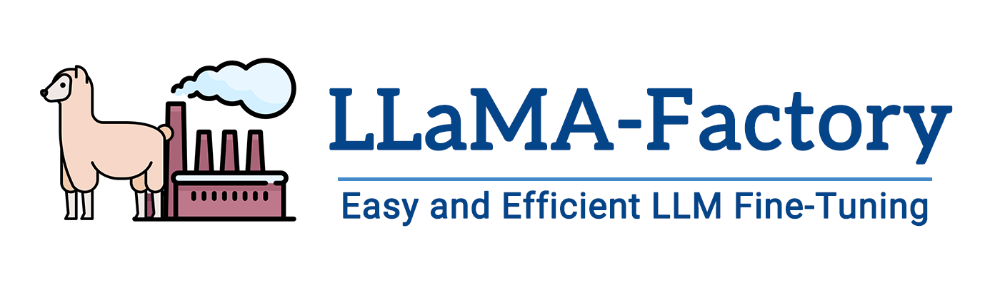
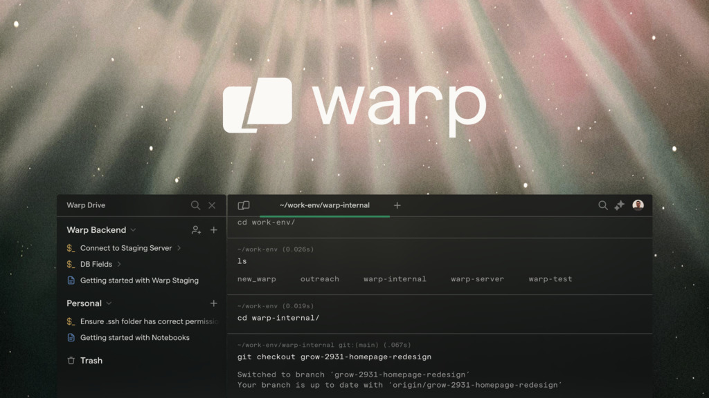

[](https://github.com/hiyouga/LLaMA-Factory/stargazers)
[](https://github.com/hiyouga/LLaMA-Factory/commits/main)
[](https://github.com/hiyouga/LLaMA-Factory/graphs/contributors)
[](https://github.com/hiyouga/LLaMA-Factory/actions/workflows/tests.yml)
[](https://pypi.org/project/llamafactory/)
[](https://scholar.google.com/scholar?cites=12620864006390196564)
[](https://hub.docker.com/r/hiyouga/llamafactory/tags)

[](https://twitter.com/llamafactory_ai)
[](https://discord.gg/rKfvV9r9FK)
[](https://github.com/hiyouga/llamafactory-community)
[](https://blog.llamafactory.net/)

[](https://colab.research.google.com/drive/1d5KQtbemerlSDSxZIfAaWXhKr30QypiK?usp=sharing)
[](https://gallery.pai-ml.com/#/preview/deepLearning/nlp/llama_factory)
[](https://www.lab4ai.cn/course/detail?id=7c13e60f6137474eb40f6fd3983c0f46&utm_source=LLaMA-Factory)
[](https://www.llamafactory.com.cn/?utm_source=LLaMA-Factory)
[](https://huggingface.co/spaces/hiyouga/LLaMA-Board)
[](https://modelscope.cn/studios/hiyouga/LLaMA-Board)
[](https://novita.ai/templates-library/105981?sharer=88115474-394e-4bda-968e-b88e123d0c47)

### 获得[亚马逊](https://aws.amazon.com/cn/blogs/china/a-one-stop-code-free-model-fine-tuning-deployment-platform-based-on-sagemaker-and-llama-factory/)、[英伟达](https://developer.nvidia.cn/rtx/ai-toolkit)、[阿里云](https://help.aliyun.com/zh/pai/use-cases/fine-tune-a-llama-3-model-with-llama-factory)等的应用。

<div align="center" markdown="1">

### 赞助商 ❤️

| <div style="text-align: center;"><a href="https://warp.dev/llama-factory"></a><br><a href="https://warp.dev/llama-factory" style="font-size:larger;">Warp，面向开发者的智能终端</a><br><a href="https://warp.dev/llama-factory">适用于 MacOS、Linux 和 Windows</a> | <a href="https://serpapi.com"> </a> |
| ---- | ---- |

----

### 使用零代码[命令行](#快速开始)与 [Web UI](#llama-board-可视化微调由-gradio-驱动) 轻松微调百余种大模型


</div>

👋 加入我们的[微信群](https://github.com/hiyouga/llamafactory-community/blob/main/wechat/main.jpg)、[NPU 用户群](https://github.com/hiyouga/llamafactory-community/blob/main/wechat/npu.jpg)、[大模型实验室群](https://github.com/hiyouga/llamafactory-community/blob/main/wechat/lab4ai.jpg) 或 [LLaMA Factory Online 用户群](https://github.com/hiyouga/llamafactory-community/blob/main/wechat/online.png)。

\[ [English](README.md) | 中文 \]

**微调大模型可以像这样轻松…**

https://github.com/user-attachments/assets/43b700c6-a178-41db-b1f8-8190a5d3fcfc

开始本地训练：
- 请见[如何使用](#如何使用)

开始云端训练：
- **Colab（免费）**：https://colab.research.google.com/drive/1d5KQtbemerlSDSxZIfAaWXhKr30QypiK?usp=sharing
- **PAI-DSW（免费试用）**：https://gallery.pai-ml.com/#/preview/deepLearning/nlp/llama_factory
- **LLaMA Factory Online（在线微调）**：https://www.llamafactory.com.cn/?utm_source=LLaMA-Factory
- **九章智算云（算力优惠活动）**：https://docs.alayanew.com/docs/documents/useGuide/LLaMAFactory/mutiple/?utm_source=LLaMA-Factory

阅读技术文档：
- **入门教程**：https://zhuanlan.zhihu.com/p/695287607
- **微调视频教程**：https://www.bilibili.com/video/BV1djgRzxEts/
- **框架文档**：https://llamafactory.readthedocs.io/zh-cn/latest/
- **框架文档（昇腾 NPU）**：https://ascend.github.io/docs/sources/llamafactory/
- **官方博客**：https://blog.llamafactory.net/
- **官方课程**：https://www.lab4ai.cn/course/detail?id=7c13e60f6137474eb40f6fd3983c0f46&utm_source=LLaMA-Factory

> [!NOTE]
> 除上述链接以外的其他网站均为未经许可的第三方网站，请小心甄别。

## 目录

- [项目特色](#项目特色)
- [官方博客](#官方博客)
- [更新日志](#更新日志)
- [模型](#模型)
- [训练方法](#训练方法)
- [数据集](#数据集)
- [软硬件依赖](#软硬件依赖)
- [如何使用](#如何使用)
  - [安装 LLaMA Factory](#安装-llama-factory)
  - [数据准备](#数据准备)
  - [快速开始](#快速开始)
  - [LLaMA Board 可视化微调](#llama-board-可视化微调由-gradio-驱动)
  - [LLaMA Factory Online 在线微调](#llama-factory-online-在线微调)
  - [构建 Docker](#构建-docker)
  - [利用 vLLM 部署 OpenAI API](#利用-vllm-部署-openai-api)
  - [从魔搭社区下载](#从魔搭社区下载)
  - [从魔乐社区下载](#从魔乐社区下载)
  - [使用 W&B 面板](#使用-wb-面板)
  - [使用 SwanLab 面板](#使用-swanlab-面板)
- [使用了 LLaMA Factory 的项目](#使用了-llama-factory-的项目)
- [协议](#协议)
- [引用](#引用)
- [致谢](#致谢)

## 项目特色

- **多种模型**：LLaMA、LLaVA、Mistral、Mixtral-MoE、Qwen3、Qwen3-VL、DeepSeek、Gemma、GLM、Phi 等等。
- **集成方法**：（增量）预训练、（多模态）指令监督微调、奖励模型训练、PPO 训练、DPO 训练、KTO 训练、ORPO 训练等等。
- **多种精度**：16 比特全参数微调、冻结微调、LoRA 微调和基于 AQLM/AWQ/GPTQ/LLM.int8/HQQ/EETQ 的 2/3/4/5/6/8 比特 QLoRA 微调。
- **先进算法**：[GaLore](https://github.com/jiaweizzhao/GaLore)、[BAdam](https://github.com/Ledzy/BAdam)、[APOLLO](https://github.com/zhuhanqing/APOLLO)、[Adam-mini](https://github.com/zyushun/Adam-mini)、[Muon](https://github.com/KellerJordan/Muon)、[OFT](https://github.com/huggingface/peft/tree/main/src/peft/tuners/oft)、DoRA、LongLoRA、LLaMA Pro、Mixture-of-Depths、LoRA+、LoftQ 和 PiSSA。
- **实用技巧**：[FlashAttention-2](https://github.com/Dao-AILab/flash-attention)、[Unsloth](https://github.com/unslothai/unsloth)、[Liger Kernel](https://github.com/linkedin/Liger-Kernel)、[KTransformers](https://github.com/kvcache-ai/ktransformers/)、RoPE scaling、NEFTune 和 rsLoRA。
- **广泛任务**：多轮对话、工具调用、图像理解、视觉定位、视频识别和语音理解等等。
- **实验监控**：LlamaBoard、TensorBoard、Wandb、MLflow、[SwanLab](https://github.com/SwanHubX/SwanLab) 等等。
- **极速推理**：基于 [vLLM](https://github.com/vllm-project/vllm) 或 [SGLang](https://github.com/sgl-project/sglang) 的 OpenAI 风格 API、浏览器界面和命令行接口。

### 最新模型的 Day-N 微调适配

| 适配时间      | 模型名称                                                              |
| ------------ | -------------------------------------------------------------------- |
| Day 0        | Qwen3 / Qwen2.5-VL / Gemma 3 / GLM-4.1V / InternLM 3 / MiniCPM-o-2.6 |
| Day 1        | Llama 3 / GLM-4 / Mistral Small / PaliGemma2 / Llama 4               |

## 官方博客

> [!TIP]
> 我们现在拥有了 LLaMA Factory 的专属博客！
>
> 网站地址：https://blog.llamafactory.net/

- 💡 [KTransformers Fine-Tuning × LLaMA Factory: 用2张4090级的GPU+CPU 微调 1000B规模的超大模型](https://swcil84qspu.feishu.cn/wiki/Z1sSwb2poijybxkyPEkcDG6enVc) (中文)
- 💡 [Easy Dataset × LLaMA Factory: 让大模型高效学习领域知识](https://buaa-act.feishu.cn/wiki/KY9xwTGs1iqHrRkjXBwcZP9WnL9)（中文）
- [使用 LLaMA-Factory 微调心理健康大模型](https://www.lab4ai.cn/project/detail?id=25cce32ec131497b9e06a93336a0817f&type=project&utm_source=LLaMA-Factory)（中文）
- [使用 LLaMA-Factory 构建 GPT-OSS 角色扮演模型](https://docs.llamafactory.com.cn/docs/documents/best-practice/gptroleplay/?utm_source=LLaMA-Factory)（中文）
- [基于 LLaMA-Factory 和 EasyR1 打造一站式无代码大模型强化学习和部署平台 LLM Model Hub](https://aws.amazon.com/cn/blogs/china/building-llm-model-hub-based-on-llamafactory-and-easyr1/)（中文）
- [通过亚马逊 SageMaker HyperPod 上的 LLaMA-Factory 增强多模态模型银行文档的视觉信息提取](https://aws.amazon.com/cn/blogs/machine-learning/how-apoidea-group-enhances-visual-information-extraction-from-banking-documents-with-multimodal-models-using-llama-factory-on-amazon-sagemaker-hyperpod/)（英文）

<details><summary>全部博客</summary>

- [使用 LLaMA-Factory 微调 Llama3.1-70B 医学诊断模型](https://docs.alayanew.com/docs/documents/bestPractice/bigModel/llama70B/?utm_source=LLaMA-Factory)（中文）
- [使用 LLaMA-Factory 微调 Qwen2.5-VL 实现自动驾驶场景微调](https://docs.alayanew.com/docs/documents/useGuide/LLaMAFactory/mutiple/?utm_source=LLaMA-Factory)（中文）
- [LLaMA Factory：微调 DeepSeek-R1-Distill-Qwen-7B 模型实现新闻标题分类器](https://gallery.pai-ml.com/#/preview/deepLearning/nlp/llama_factory_deepseek_r1_distill_7b)（中文）
- [基于 Amazon SageMaker 和 LLaMA-Factory 打造一站式无代码模型微调部署平台 Model Hub](https://aws.amazon.com/cn/blogs/china/a-one-stop-code-free-model-fine-tuning-deployment-platform-based-on-sagemaker-and-llama-factory/)（中文）
- [LLaMA Factory 多模态微调实践：微调 Qwen2-VL 构建文旅大模型](https://gallery.pai-ml.com/#/preview/deepLearning/nlp/llama_factory_qwen2vl)（中文）
- [LLaMA Factory：微调 Llama3 模型实现角色扮演](https://gallery.pai-ml.com/#/preview/deepLearning/nlp/llama_factory)（中文）

</details>

## 更新日志

[25/10/26] 我们支持了Megatron-core作为训练后端和适配了[**mcore_adapter**](https://github.com/alibaba/ROLL/tree/main/mcore_adapter)。查看[PR #9237](https://github.com/hiyouga/LLaMA-Factory/pull/9237)以使用。

[25/08/22] 我们支持了 **[OFT](https://arxiv.org/abs/2306.07280)** 和 **[OFTv2](https://arxiv.org/abs/2506.19847)** 模型的微调。查看 [examples](examples/README.md) 以使用。

[25/08/20] 我们支持了 **[Intern-S1-mini](https://huggingface.co/internlm/Intern-S1-mini)** 模型的微调。查看 [PR #8976](https://github.com/hiyouga/LLaMA-Factory/pull/8976) 以使用。

[25/08/06] 我们支持了 **[GPT-OSS](https://github.com/openai/gpt-oss)** 模型的微调。查看 [PR #8826](https://github.com/hiyouga/LLaMA-Factory/pull/8826) 以使用。

<details><summary>展开日志</summary>

[25/07/02] 我们支持了 **[GLM-4.1V-9B-Thinking](https://github.com/THUDM/GLM-4.1V-Thinking)** 模型的微调。

[25/04/28] 我们支持了 **[Qwen3](https://qwenlm.github.io/blog/qwen3/)** 系列模型的微调。

[25/04/21] 我们支持了 **[Muon](https://github.com/KellerJordan/Muon)** 优化器。详细用法请参照 [examples](examples/README_zh.md)。感谢 [@tianshijing](https://github.com/tianshijing) 的 PR。

[25/04/16] 我们支持了 **[InternVL3](https://huggingface.co/OpenGVLab/InternVL3-8B)** 模型的微调。查看 [PR #7258](https://github.com/hiyouga/LLaMA-Factory/pull/7258) 以使用。

[25/04/14] 我们支持了 **[GLM-Z1](https://huggingface.co/THUDM/GLM-Z1-9B-0414)** 和 **[Kimi-VL](https://huggingface.co/moonshotai/Kimi-VL-A3B-Instruct)** 模型的微调。

[25/04/06] 我们支持了 **[Llama 4](https://ai.meta.com/blog/llama-4-multimodal-intelligence/)** 模型的微调。查看 [PR #7611](https://github.com/hiyouga/LLaMA-Factory/pull/7611) 以使用。

[25/03/31] 我们支持了 **[Qwen2.5 Omni](https://qwenlm.github.io/blog/qwen2.5-omni/)** 模型的微调。查看 [PR #7537](https://github.com/hiyouga/LLaMA-Factory/pull/7537) 以使用。

[25/03/15] 我们支持了 **[SGLang](https://github.com/sgl-project/sglang)** 推理后端，请使用 `infer_backend: sglang` 启用。

[25/03/12] 我们支持了 **[Gemma 3](https://huggingface.co/blog/gemma3)** 模型的微调。

[25/02/24] 我们宣布开源 **[EasyR1](https://github.com/hiyouga/EasyR1)**，一个高效可扩展的多模态强化学习框架，支持高效的 GRPO 训练。

[25/02/11] 我们支持了在导出模型时保存 **[Ollama](https://github.com/ollama/ollama)** 配置文件。详细用法请参照 [examples](examples/README_zh.md)。

[25/02/05] 我们支持了在语音理解任务上微调 **[Qwen2-Audio](Qwen/Qwen2-Audio-7B-Instruct)** 和 **[MiniCPM-o-2.6](https://huggingface.co/openbmb/MiniCPM-o-2_6)** 模型。

[25/01/31] 我们支持了 **[DeepSeek-R1](https://huggingface.co/deepseek-ai/DeepSeek-R1)** 和 **[Qwen2.5-VL](https://huggingface.co/Qwen/Qwen2.5-VL-7B-Instruct)** 模型的微调。

[25/01/15] 我们支持了 **[APOLLO](https://arxiv.org/abs/2412.05270)** 优化器。详细用法请参照 [examples](examples/README_zh.md)。

[25/01/14] 我们支持了 **[MiniCPM-o-2.6](https://huggingface.co/openbmb/MiniCPM-o-2_6)** 和 **[MiniCPM-V-2.6](https://huggingface.co/openbmb/MiniCPM-V-2_6)** 模型的微调。 感谢 [@BUAADreamer](https://github.com/BUAADreamer) 的 PR.

[25/01/14] 我们支持了 **[InternLM 3](https://huggingface.co/collections/internlm/)** 模型的微调。感谢 [@hhaAndroid](https://github.com/hhaAndroid) 的 PR。

[25/01/10] 我们支持了 **[Phi-4](https://huggingface.co/microsoft/phi-4)** 模型的微调。

[24/12/21] 我们支持了使用 **[SwanLab](https://github.com/SwanHubX/SwanLab)** 跟踪与可视化实验。详细用法请参考 [此部分](#使用-swanlab-面板)。

[24/11/27] 我们支持了 **[Skywork-o1](https://huggingface.co/Skywork/Skywork-o1-Open-Llama-3.1-8B)** 模型的微调和 **[OpenO1](https://huggingface.co/datasets/O1-OPEN/OpenO1-SFT)** 数据集。

[24/10/09] 我们支持了从 **[魔乐社区](https://modelers.cn/models)** 下载预训练模型和数据集。详细用法请参照 [此教程](#从魔乐社区下载)。

[24/09/19] 我们支持了 **[Qwen2.5](https://qwenlm.github.io/blog/qwen2.5/)** 模型的微调。

[24/08/30] 我们支持了 **[Qwen2-VL](https://qwenlm.github.io/blog/qwen2-vl/)** 模型的微调。感谢 [@simonJJJ](https://github.com/simonJJJ) 的 PR。

[24/08/27] 我们支持了 **[Liger Kernel](https://github.com/linkedin/Liger-Kernel)**。请使用 `enable_liger_kernel: true` 来加速训练。

[24/08/09] 我们支持了 **[Adam-mini](https://github.com/zyushun/Adam-mini)** 优化器。详细用法请参照 [examples](examples/README_zh.md)。感谢 [@relic-yuexi](https://github.com/relic-yuexi) 的 PR。

[24/07/04] 我们支持了[无污染打包训练](https://github.com/MeetKai/functionary/tree/main/functionary/train/packing)。请使用 `neat_packing: true` 参数。感谢 [@chuan298](https://github.com/chuan298) 的 PR。

[24/06/16] 我们支持了 **[PiSSA](https://arxiv.org/abs/2404.02948)** 算法。详细用法请参照 [examples](examples/README_zh.md)。

[24/06/07] 我们支持了 **[Qwen2](https://qwenlm.github.io/blog/qwen2/)** 和 **[GLM-4](https://github.com/THUDM/GLM-4)** 模型的微调。

[24/05/26] 我们支持了 **[SimPO](https://arxiv.org/abs/2405.14734)** 偏好对齐算法。详细用法请参照 [examples](examples/README_zh.md)。

[24/05/20] 我们支持了 **PaliGemma** 系列模型的微调。注意 PaliGemma 是预训练模型，你需要使用 `paligemma` 模板进行微调使其获得对话能力。

[24/05/18] 我们支持了 **[KTO](https://arxiv.org/abs/2402.01306)** 偏好对齐算法。详细用法请参照 [examples](examples/README_zh.md)。

[24/05/14] 我们支持了昇腾 NPU 设备的训练和推理。详情请查阅[安装](#安装-llama-factory)部分。

[24/04/26] 我们支持了多模态模型 **LLaVA-1.5** 的微调。详细用法请参照 [examples](examples/README_zh.md)。

[24/04/22] 我们提供了在免费 T4 GPU 上微调 Llama-3 模型的 **[Colab 笔记本](https://colab.research.google.com/drive/1d5KQtbemerlSDSxZIfAaWXhKr30QypiK?usp=sharing)**。Hugging Face 社区公开了两个利用 LLaMA Factory 微调的 Llama-3 模型，详情请见 [Llama3-8B-Chinese-Chat](https://huggingface.co/shenzhi-wang/Llama3-8B-Chinese-Chat) 和 [Llama3-Chinese](https://huggingface.co/zhichen/Llama3-Chinese)。

[24/04/21] 我们基于 [AstraMindAI 的仓库](https://github.com/astramind-ai/Mixture-of-depths)支持了 **[混合深度训练](https://arxiv.org/abs/2404.02258)**。详细用法请参照 [examples](examples/README_zh.md)。

[24/04/16] 我们支持了 **[BAdam](https://arxiv.org/abs/2404.02827)** 优化器。详细用法请参照 [examples](examples/README_zh.md)。

[24/04/16] 我们支持了 **[unsloth](https://github.com/unslothai/unsloth)** 的长序列训练（24GB 可训练 Llama-2-7B-56k）。该方法相比 FlashAttention-2 提供了 **117%** 的训练速度和 **50%** 的显存节约。更多数据请见[此页面](https://github.com/hiyouga/LLaMA-Factory/wiki/Performance-comparison)。

[24/03/31] 我们支持了 **[ORPO](https://arxiv.org/abs/2403.07691)**。详细用法请参照 [examples](examples/README_zh.md)。

[24/03/21] 我们的论文 "[LlamaFactory: Unified Efficient Fine-Tuning of 100+ Language Models](https://arxiv.org/abs/2403.13372)" 可在 arXiv 上查看！

[24/03/20] 我们支持了能在 2x24GB GPU 上微调 70B 模型的 **FSDP+QLoRA**。详细用法请参照 [examples](examples/README_zh.md)。

[24/03/13] 我们支持了 **[LoRA+](https://arxiv.org/abs/2402.12354)**。详细用法请参照 [examples](examples/README_zh.md)。

[24/03/07] 我们支持了 **[GaLore](https://arxiv.org/abs/2403.03507)** 优化器。详细用法请参照 [examples](examples/README_zh.md)。

[24/03/07] 我们集成了 **[vLLM](https://github.com/vllm-project/vllm)** 以实现极速并发推理。请使用 `infer_backend: vllm` 来获得 **270%** 的推理速度。

[24/02/28] 我们支持了 **[DoRA](https://arxiv.org/abs/2402.09353)** 微调。请使用 `use_dora: true` 参数进行 DoRA 微调。

[24/02/15] 我们支持了 [LLaMA Pro](https://github.com/TencentARC/LLaMA-Pro) 提出的**块扩展**方法。详细用法请参照 [examples](examples/README_zh.md)。

[24/02/05] Qwen1.5（Qwen2 测试版）系列模型已在 LLaMA-Factory 中实现微调支持。详情请查阅该[博客页面](https://qwenlm.github.io/zh/blog/qwen1.5/)。

[24/01/18] 我们针对绝大多数模型实现了 **Agent 微调**，微调时指定 `dataset: glaive_toolcall_zh` 即可使模型获得工具调用能力。

[23/12/23] 我们针对 LLaMA, Mistral 和 Yi 模型支持了 **[unsloth](https://github.com/unslothai/unsloth)** 的 LoRA 训练加速。请使用 `use_unsloth: true` 参数启用 unsloth 优化。该方法可提供 **170%** 的训练速度，详情请查阅[此页面](https://github.com/hiyouga/LLaMA-Factory/wiki/Performance-comparison)。

[23/12/12] 我们支持了微调最新的混合专家模型 **[Mixtral 8x7B](https://huggingface.co/mistralai/Mixtral-8x7B-v0.1)**。硬件需求请查阅[此处](#硬件依赖)。

[23/12/01] 我们支持了从 **[魔搭社区](https://modelscope.cn/models)** 下载预训练模型和数据集。详细用法请参照 [此教程](#从魔搭社区下载)。

[23/10/21] 我们支持了 **[NEFTune](https://arxiv.org/abs/2310.05914)** 训练技巧。请使用 `neftune_noise_alpha: 5` 参数启用 NEFTune。

[23/09/27] 我们针对 LLaMA 模型支持了 [LongLoRA](https://github.com/dvlab-research/LongLoRA) 提出的 **$S^2$-Attn**。请使用 `shift_attn: true` 参数以启用该功能。

[23/09/23] 我们在项目中集成了 MMLU、C-Eval 和 CMMLU 评估集。详细用法请参照 [examples](examples/README_zh.md)。

[23/09/10] 我们支持了 **[FlashAttention-2](https://github.com/Dao-AILab/flash-attention)**。如果您使用的是 RTX4090、A100 或 H100 GPU，请使用 `flash_attn: fa2` 参数以启用 FlashAttention-2。

[23/08/12] 我们支持了 **RoPE 插值**来扩展 LLaMA 模型的上下文长度。请使用 `rope_scaling: linear` 参数训练模型或使用 `rope_scaling: dynamic` 参数评估模型。

[23/08/11] 我们支持了指令模型的 **[DPO 训练](https://arxiv.org/abs/2305.18290)**。详细用法请参照 [examples](examples/README_zh.md)。

[23/07/31] 我们支持了**数据流式加载**。请使用 `streaming: true` 和 `max_steps: 10000` 参数来流式加载数据集。

[23/07/29] 我们在 Hugging Face 发布了两个 13B 指令微调模型。详细内容请查阅我们的 Hugging Face 项目（[LLaMA-2](https://huggingface.co/hiyouga/Llama-2-Chinese-13b-chat) / [Baichuan](https://huggingface.co/hiyouga/Baichuan-13B-sft)）。

[23/07/18] 我们开发了支持训练和测试的**浏览器一体化界面**。请使用 `train_web.py` 在您的浏览器中微调模型。感谢 [@KanadeSiina](https://github.com/KanadeSiina) 和 [@codemayq](https://github.com/codemayq) 在该功能开发中付出的努力。

[23/07/09] 我们开源了 **[FastEdit](https://github.com/hiyouga/FastEdit)** ⚡🩹，一个简单易用的、能迅速编辑大模型事实记忆的工具包。如果您感兴趣请关注我们的 [FastEdit](https://github.com/hiyouga/FastEdit) 项目。

[23/06/29] 我们提供了一个**可复现的**指令模型微调示例，详细内容请查阅 [Baichuan-7B-sft](https://huggingface.co/hiyouga/Baichuan-7B-sft)。

[23/06/22] 我们对齐了[示例 API](src/api_demo.py) 与 [OpenAI API](https://platform.openai.com/docs/api-reference/chat) 的格式，您可以将微调模型接入**任意基于 ChatGPT 的应用**中。

[23/06/03] 我们实现了 4 比特的 LoRA 训练（也称 **[QLoRA](https://github.com/artidoro/qlora)**）。详细用法请参照 [examples](examples/README_zh.md)。

</details>

> [!TIP]
> 如果您无法使用最新的功能，请尝试重新拉取代码并再次安装 LLaMA-Factory。

## 模型

| 模型名                                                             | 参数量                            | Template             |
| ----------------------------------------------------------------- | -------------------------------- | -------------------- |
| [Audio-Flamingo-3](https://huggingface.co/nvidia/audio-flamingo-3-hf) | 8B                               | audio_flamingo_3     |
| [BLOOM/BLOOMZ](https://huggingface.co/bigscience)                 | 560M/1.1B/1.7B/3B/7.1B/176B      | -                    |
| [DeepSeek (LLM/Code/MoE)](https://huggingface.co/deepseek-ai)     | 7B/16B/67B/236B                  | deepseek             |
| [DeepSeek 3-3.2](https://huggingface.co/deepseek-ai)              | 236B/671B                        | deepseek3            |
| [DeepSeek R1 (Distill)](https://huggingface.co/deepseek-ai)       | 1.5B/7B/8B/14B/32B/70B/671B      | deepseekr1           |
| [ERNIE-4.5](https://huggingface.co/baidu)                         | 0.3B/21B/300B                    | ernie_nothink        |
| [Falcon/Falcon H1](https://huggingface.co/tiiuae)                 | 0.5B/1.5B/3B/7B/11B/34B/40B/180B | falcon/falcon_h1     |
| [Gemma/Gemma 2/CodeGemma](https://huggingface.co/google)          | 2B/7B/9B/27B                     | gemma/gemma2         |
| [Gemma 3/Gemma 3n](https://huggingface.co/google)                 | 270M/1B/4B/6B/8B/12B/27B         | gemma3/gemma3n       |
| [GLM-4/GLM-4-0414/GLM-Z1](https://huggingface.co/zai-org)         | 9B/32B                           | glm4/glmz1           |
| [GLM-4.5/GLM-4.5(6)V](https://huggingface.co/zai-org)             | 9B/106B/355B                     | glm4_moe/glm4_5v     |
| [GPT-2](https://huggingface.co/openai-community)                  | 0.1B/0.4B/0.8B/1.5B              | -                    |
| [GPT-OSS](https://huggingface.co/openai)                          | 20B/120B                         | gpt_oss              |
| [Granite 3-4](https://huggingface.co/ibm-granite)                 | 1B/2B/3B/7B/8B                   | granite3/granite4    |
| [Hunyuan (MT)](https://huggingface.co/tencent/)                   | 7B                               | hunyuan              |
| [InternLM 2-3](https://huggingface.co/internlm)                   | 7B/8B/20B                        | intern2              |
| [InternVL 2.5-3.5](https://huggingface.co/OpenGVLab)              | 1B/2B/4B/8B/14B/30B/38B/78B/241B | intern_vl            |
| [Intern-S1-mini](https://huggingface.co/internlm/)                | 8B                               | intern_s1            |
| [Kimi-VL](https://huggingface.co/moonshotai)                      | 16B                              | kimi_vl              |
| [Ling 2.0 (mini/flash)](https://huggingface.co/inclusionAI)       | 16B/100B                         | bailing_v2           |
| [LFM 2.5 (VL)](https://huggingface.co/LiquidAI)                   | 1.2B/1.6B                        | lfm2/lfm2_vl         |
| [Llama](https://github.com/facebookresearch/llama)                | 7B/13B/33B/65B                   | -                    |
| [Llama 2](https://huggingface.co/meta-llama)                      | 7B/13B/70B                       | llama2               |
| [Llama 3-3.3](https://huggingface.co/meta-llama)                  | 1B/3B/8B/70B                     | llama3               |
| [Llama 4](https://huggingface.co/meta-llama)                      | 109B/402B                        | llama4               |
| [Llama 3.2 Vision](https://huggingface.co/meta-llama)             | 11B/90B                          | mllama               |
| [LLaVA-1.5](https://huggingface.co/llava-hf)                      | 7B/13B                           | llava                |
| [LLaVA-NeXT](https://huggingface.co/llava-hf)                     | 7B/8B/13B/34B/72B/110B           | llava_next           |
| [LLaVA-NeXT-Video](https://huggingface.co/llava-hf)               | 7B/34B                           | llava_next_video     |
| [MiMo](https://huggingface.co/XiaomiMiMo)                         | 7B/309B                          | mimo/mimo_v2         |
| [MiniCPM 4](https://huggingface.co/openbmb)                       | 0.5B/8B                          | cpm4                 |
| [MiniCPM-o-2.6/MiniCPM-V-2.6](https://huggingface.co/openbmb)     | 8B                               | minicpm_o/minicpm_v  |
| [MiniMax-M1/MiniMax-M2](https://huggingface.co/MiniMaxAI/models)  | 229B/456B                        | minimax1/minimax2    |
| [Ministral 3](https://huggingface.co/mistralai)                   | 3B/8B/14B                        | ministral3           |
| [Mistral/Mixtral](https://huggingface.co/mistralai)               | 7B/8x7B/8x22B                    | mistral              |
| [PaliGemma/PaliGemma2](https://huggingface.co/google)             | 3B/10B/28B                       | paligemma            |
| [Phi-3/Phi-3.5](https://huggingface.co/microsoft)                 | 4B/14B                           | phi                  |
| [Phi-3-small](https://huggingface.co/microsoft)                   | 7B                               | phi_small            |
| [Phi-4-mini/Phi-4](https://huggingface.co/microsoft)              | 3.8B/14B                         | phi4_mini/phi4       |
| [Pixtral](https://huggingface.co/mistralai)                       | 12B                              | pixtral              |
| [Qwen2 (Code/Math/MoE/QwQ)](https://huggingface.co/Qwen)          | 0.5B/1.5B/3B/7B/14B/32B/72B/110B | qwen                 |
| [Qwen3 (MoE/Instruct/Thinking/Next)](https://huggingface.co/Qwen) | 0.6B/1.7B/4B/8B/14B/32B/80B/235B | qwen3/qwen3_nothink  |
| [Qwen2-Audio](https://huggingface.co/Qwen)                        | 7B                               | qwen2_audio          |
| [Qwen2.5-Omni](https://huggingface.co/Qwen)                       | 3B/7B                            | qwen2_omni           |
| [Qwen3-Omni](https://huggingface.co/Qwen)                         | 30B                              | qwen3_omni           |
| [Qwen2-VL/Qwen2.5-VL/QVQ](https://huggingface.co/Qwen)            | 2B/3B/7B/32B/72B                 | qwen2_vl             |
| [Qwen3-VL](https://huggingface.co/Qwen)                           | 2B/4B/8B/30B/32B/235B            | qwen3_vl             |
| [Seed (OSS/Coder)](https://huggingface.co/ByteDance-Seed)         | 8B/36B                           | seed_oss/seed_coder  |
| [StarCoder 2](https://huggingface.co/bigcode)                     | 3B/7B/15B                        | -                    |
| [Yuan 2](https://huggingface.co/IEITYuan)                         | 2B/51B/102B                      | yuan                 |

> [!NOTE]
> 对于所有“基座”（Base）模型，`template` 参数可以是 `default`, `alpaca`, `vicuna` 等任意值。但“对话”（Instruct/Chat）模型请务必使用**对应的模板**。
>
> 如果模型有推理 / 非推理两个版本，请使用 `_nothink` 后缀来区分不同的模板。例如 `qwen3` 和 `qwen3_nothink`。
>
> 请务必在训练和推理时采用**完全一致**的模板。
>
> \*：您需要从 main 分支安装 `transformers` 并使用 `DISABLE_VERSION_CHECK=1` 来跳过版本检查。
>
> \*\*：您需要安装特定版本的 `transformers` 以使用该模型。

项目所支持模型的完整列表请参阅 [constants.py](src/llamafactory/extras/constants.py)。

您也可以在 [template.py](src/llamafactory/data/template.py) 中添加自己的对话模板。

## 训练方法

| 方法                   |     全参数训练      |    部分参数训练     |       LoRA         |       QLoRA        |
| --------------------- | ------------------ | ------------------ | ------------------ | ------------------ |
| 预训练                 | :white_check_mark: | :white_check_mark: | :white_check_mark: | :white_check_mark: |
| 指令监督微调            | :white_check_mark: | :white_check_mark: | :white_check_mark: | :white_check_mark: |
| 奖励模型训练            | :white_check_mark: | :white_check_mark: | :white_check_mark: | :white_check_mark: |
| PPO 训练               | :white_check_mark: | :white_check_mark: | :white_check_mark: | :white_check_mark: |
| DPO 训练               | :white_check_mark: | :white_check_mark: | :white_check_mark: | :white_check_mark: |
| KTO 训练               | :white_check_mark: | :white_check_mark: | :white_check_mark: | :white_check_mark: |
| ORPO 训练              | :white_check_mark: | :white_check_mark: | :white_check_mark: | :white_check_mark: |
| SimPO 训练             | :white_check_mark: | :white_check_mark: | :white_check_mark: | :white_check_mark: |

> [!TIP]
> 有关 PPO 的实现细节，请参考[此博客](https://newfacade.github.io/notes-on-reinforcement-learning/17-ppo-trl.html)。

## 数据集

<details><summary>预训练数据集</summary>

- [Wiki Demo (en)](data/wiki_demo.txt)
- [RefinedWeb (en)](https://huggingface.co/datasets/tiiuae/falcon-refinedweb)
- [RedPajama V2 (en)](https://huggingface.co/datasets/togethercomputer/RedPajama-Data-V2)
- [Wikipedia (en)](https://huggingface.co/datasets/olm/olm-wikipedia-20221220)
- [Wikipedia (zh)](https://huggingface.co/datasets/pleisto/wikipedia-cn-20230720-filtered)
- [Pile (en)](https://huggingface.co/datasets/EleutherAI/pile)
- [SkyPile (zh)](https://huggingface.co/datasets/Skywork/SkyPile-150B)
- [FineWeb (en)](https://huggingface.co/datasets/HuggingFaceFW/fineweb)
- [FineWeb-Edu (en)](https://huggingface.co/datasets/HuggingFaceFW/fineweb-edu)
- [CCI3-HQ (zh)](https://huggingface.co/datasets/BAAI/CCI3-HQ)
- [CCI3-Data (zh)](https://huggingface.co/datasets/BAAI/CCI3-Data)
- [CCI4.0-M2-Base-v1 (en&zh)](https://huggingface.co/datasets/BAAI/CCI4.0-M2-Base-v1)
- [CCI4.0-M2-CoT-v1 (en&zh)](https://huggingface.co/datasets/BAAI/CCI4.0-M2-CoT-v1)
- [CCI4.0-M2-Extra-v1 (en&zh)](https://huggingface.co/datasets/BAAI/CCI4.0-M2-Extra-v1)
- [The Stack (en)](https://huggingface.co/datasets/bigcode/the-stack)
- [StarCoder (en)](https://huggingface.co/datasets/bigcode/starcoderdata)

</details>

<details><summary>指令微调数据集</summary>

- [Identity (en&zh)](data/identity.json)
- [Stanford Alpaca (en)](https://github.com/tatsu-lab/stanford_alpaca)
- [Stanford Alpaca (zh)](https://github.com/ymcui/Chinese-LLaMA-Alpaca-3)
- [Alpaca GPT4 (en&zh)](https://github.com/Instruction-Tuning-with-GPT-4/GPT-4-LLM)
- [Glaive Function Calling V2 (en&zh)](https://huggingface.co/datasets/glaiveai/glaive-function-calling-v2)
- [LIMA (en)](https://huggingface.co/datasets/GAIR/lima)
- [Guanaco Dataset (multilingual)](https://huggingface.co/datasets/JosephusCheung/GuanacoDataset)
- [BELLE 2M (zh)](https://huggingface.co/datasets/BelleGroup/train_2M_CN)
- [BELLE 1M (zh)](https://huggingface.co/datasets/BelleGroup/train_1M_CN)
- [BELLE 0.5M (zh)](https://huggingface.co/datasets/BelleGroup/train_0.5M_CN)
- [BELLE Dialogue 0.4M (zh)](https://huggingface.co/datasets/BelleGroup/generated_chat_0.4M)
- [BELLE School Math 0.25M (zh)](https://huggingface.co/datasets/BelleGroup/school_math_0.25M)
- [BELLE Multiturn Chat 0.8M (zh)](https://huggingface.co/datasets/BelleGroup/multiturn_chat_0.8M)
- [UltraChat (en)](https://github.com/thunlp/UltraChat)
- [OpenPlatypus (en)](https://huggingface.co/datasets/garage-bAInd/Open-Platypus)
- [CodeAlpaca 20k (en)](https://huggingface.co/datasets/sahil2801/CodeAlpaca-20k)
- [Alpaca CoT (multilingual)](https://huggingface.co/datasets/QingyiSi/Alpaca-CoT)
- [OpenOrca (en)](https://huggingface.co/datasets/Open-Orca/OpenOrca)
- [SlimOrca (en)](https://huggingface.co/datasets/Open-Orca/SlimOrca)
- [MathInstruct (en)](https://huggingface.co/datasets/TIGER-Lab/MathInstruct)
- [Firefly 1.1M (zh)](https://huggingface.co/datasets/YeungNLP/firefly-train-1.1M)
- [Wiki QA (en)](https://huggingface.co/datasets/wiki_qa)
- [Web QA (zh)](https://huggingface.co/datasets/suolyer/webqa)
- [WebNovel (zh)](https://huggingface.co/datasets/zxbsmk/webnovel_cn)
- [Nectar (en)](https://huggingface.co/datasets/berkeley-nest/Nectar)
- [deepctrl (en&zh)](https://www.modelscope.cn/datasets/deepctrl/deepctrl-sft-data)
- [Advertise Generating (zh)](https://huggingface.co/datasets/HasturOfficial/adgen)
- [ShareGPT Hyperfiltered (en)](https://huggingface.co/datasets/totally-not-an-llm/sharegpt-hyperfiltered-3k)
- [ShareGPT4 (en&zh)](https://huggingface.co/datasets/shibing624/sharegpt_gpt4)
- [UltraChat 200k (en)](https://huggingface.co/datasets/HuggingFaceH4/ultrachat_200k)
- [Infinity Instruct (zh)](https://huggingface.co/datasets/BAAI/Infinity-Instruct)
- [AgentInstruct (en)](https://huggingface.co/datasets/THUDM/AgentInstruct)
- [LMSYS Chat 1M (en)](https://huggingface.co/datasets/lmsys/lmsys-chat-1m)
- [Evol Instruct V2 (en)](https://huggingface.co/datasets/WizardLM/WizardLM_evol_instruct_V2_196k)
- [Cosmopedia (en)](https://huggingface.co/datasets/HuggingFaceTB/cosmopedia)
- [STEM (zh)](https://huggingface.co/datasets/hfl/stem_zh_instruction)
- [Ruozhiba (zh)](https://huggingface.co/datasets/hfl/ruozhiba_gpt4_turbo)
- [Neo-sft (zh)](https://huggingface.co/datasets/m-a-p/neo_sft_phase2)
- [Magpie-Pro-300K-Filtered (en)](https://huggingface.co/datasets/Magpie-Align/Magpie-Pro-300K-Filtered)
- [Magpie-ultra-v0.1 (en)](https://huggingface.co/datasets/argilla/magpie-ultra-v0.1)
- [WebInstructSub (en)](https://huggingface.co/datasets/TIGER-Lab/WebInstructSub)
- [OpenO1-SFT (en&zh)](https://huggingface.co/datasets/O1-OPEN/OpenO1-SFT)
- [Open-Thoughts (en)](https://huggingface.co/datasets/open-thoughts/OpenThoughts-114k)
- [Open-R1-Math (en)](https://huggingface.co/datasets/open-r1/OpenR1-Math-220k)
- [Chinese-DeepSeek-R1-Distill (zh)](https://huggingface.co/datasets/Congliu/Chinese-DeepSeek-R1-Distill-data-110k-SFT)
- [LLaVA mixed (en&zh)](https://huggingface.co/datasets/BUAADreamer/llava-en-zh-300k)
- [Pokemon-gpt4o-captions (en&zh)](https://huggingface.co/datasets/jugg1024/pokemon-gpt4o-captions)
- [DLR-Web (en)](https://huggingface.co/datasets/Attention1115/DLR-Web)
- [Open Assistant (de)](https://huggingface.co/datasets/mayflowergmbh/oasst_de)
- [Dolly 15k (de)](https://huggingface.co/datasets/mayflowergmbh/dolly-15k_de)
- [Alpaca GPT4 (de)](https://huggingface.co/datasets/mayflowergmbh/alpaca-gpt4_de)
- [OpenSchnabeltier (de)](https://huggingface.co/datasets/mayflowergmbh/openschnabeltier_de)
- [Evol Instruct (de)](https://huggingface.co/datasets/mayflowergmbh/evol-instruct_de)
- [Dolphin (de)](https://huggingface.co/datasets/mayflowergmbh/dolphin_de)
- [Booksum (de)](https://huggingface.co/datasets/mayflowergmbh/booksum_de)
- [Airoboros (de)](https://huggingface.co/datasets/mayflowergmbh/airoboros-3.0_de)
- [Ultrachat (de)](https://huggingface.co/datasets/mayflowergmbh/ultra-chat_de)

</details>

<details><summary>偏好数据集</summary>

- [DPO mixed (en&zh)](https://huggingface.co/datasets/hiyouga/DPO-En-Zh-20k)
- [UltraFeedback (en)](https://huggingface.co/datasets/HuggingFaceH4/ultrafeedback_binarized)
- [COIG-P (zh)](https://huggingface.co/datasets/m-a-p/COIG-P)
- [RLHF-V (en)](https://huggingface.co/datasets/openbmb/RLHF-V-Dataset)
- [VLFeedback (en)](https://huggingface.co/datasets/Zhihui/VLFeedback)
- [RLAIF-V (en)](https://huggingface.co/datasets/openbmb/RLAIF-V-Dataset)
- [Orca DPO Pairs (en)](https://huggingface.co/datasets/Intel/orca_dpo_pairs)
- [HH-RLHF (en)](https://huggingface.co/datasets/Anthropic/hh-rlhf)
- [Nectar (en)](https://huggingface.co/datasets/berkeley-nest/Nectar)
- [Orca DPO (de)](https://huggingface.co/datasets/mayflowergmbh/intel_orca_dpo_pairs_de)
- [KTO mixed (en)](https://huggingface.co/datasets/argilla/kto-mix-15k)

</details>

部分数据集的使用需要确认，我们推荐使用下述命令登录您的 Hugging Face 账户。

```bash
pip install --upgrade huggingface_hub
huggingface-cli login
```

## 软硬件依赖

| 必需项        | 至少     | 推荐      |
| ------------ | ------- | --------- |
| python       | 3.9     | 3.10      |
| torch        | 2.0.0   | 2.6.0     |
| torchvision  | 0.15.0  | 0.21.0    |
| transformers | 4.49.0  | 4.50.0    |
| datasets     | 2.16.0  | 3.2.0     |
| accelerate   | 0.34.0  | 1.2.1     |
| peft         | 0.14.0  | 0.15.1    |
| trl          | 0.8.6   | 0.9.6     |

| 可选项        | 至少     | 推荐      |
| ------------ | ------- | --------- |
| CUDA         | 11.6    | 12.2      |
| deepspeed    | 0.10.0  | 0.16.4    |
| bitsandbytes | 0.39.0  | 0.43.1    |
| vllm         | 0.4.3   | 0.8.2     |
| flash-attn   | 2.5.6   | 2.7.2     |

### 硬件依赖

\* *估算值*

| 方法                             | 精度 |   7B  |  14B  |  30B  |   70B  |   `x`B  |
| ------------------------------- | ---- | ----- | ----- | ----- | ------ | ------- |
| Full (`bf16` or `fp16`)         |  32  | 120GB | 240GB | 600GB | 1200GB | `18x`GB |
| Full (`pure_bf16`)              |  16  |  60GB | 120GB | 300GB |  600GB |  `8x`GB |
| Freeze/LoRA/GaLore/APOLLO/BAdam |  16  |  16GB |  32GB |  64GB |  160GB |  `2x`GB |
| QLoRA                           |   8  |  10GB |  20GB |  40GB |   80GB |   `x`GB |
| QLoRA                           |   4  |   6GB |  12GB |  24GB |   48GB | `x/2`GB |
| QLoRA                           |   2  |   4GB |   8GB |  16GB |   24GB | `x/4`GB |

## 如何使用

### 安装 LLaMA Factory

> [!IMPORTANT]
> 此步骤为必需。

#### 从源码安装

```bash
git clone --depth 1 https://github.com/hiyouga/LlamaFactory.git
cd LlamaFactory
pip install -e .
pip install -r requirements/metrics.txt
```

可选的额外依赖项：`metrics`、`deepspeed`。使用 `pip install -e . && pip install -r requirements/metrics.txt -r requirements/deepspeed.txt` 安装。

其他可选依赖项请参考 `examples/requirements/` 目录下的文件。

#### 从镜像安装

```bash
docker run -it --rm --gpus=all --ipc=host hiyouga/llamafactory:latest
```

该镜像基于 Ubuntu 22.04（x86\_64）、CUDA 12.4、Python 3.11、PyTorch 2.6.0 和 Flash-attn 2.7.4 构建。

查看全部镜像：https://hub.docker.com/r/hiyouga/llamafactory/tags

请参阅[构建 Docker](#构建-docker) 来重新构建镜像。

<details><summary>使用 <b>uv</b> 构建虚拟环境</summary>

使用 [uv](https://github.com/astral-sh/uv) 创建隔离的 Python 环境：

```bash
uv run llamafactory-cli webui
```

</details>

<details><summary>Windows 用户指南</summary>

#### 安装 PyTorch

Windows 平台需要额外手动安装 GPU 版本的 PyTorch 依赖包，您可以参考[官方网站](https://pytorch.org/get-started/locally/)和以下命令安装并测试 PyTorch 是否正确安装。

```bash
pip uninstall torch torchvision torchaudio
pip install torch torchvision torchaudio --index-url https://download.pytorch.org/whl/cu126
python -c "import torch; print(torch.cuda.is_available())"
```

如果看到 `True` 则说明安装成功。

若遇到类似 `Can't pickle local object` 的报错，请设置 `dataloader_num_workers: 0`。

#### 安装 BitsAndBytes

如果要在 Windows 平台上开启量化 LoRA（QLoRA），需要安装预编译的 `bitsandbytes` 库, 支持 CUDA 11.1 到 12.2, 请根据您的 CUDA 版本情况选择适合的[发布版本](https://github.com/jllllll/bitsandbytes-windows-webui/releases/tag/wheels)。

```bash
pip install https://github.com/jllllll/bitsandbytes-windows-webui/releases/download/wheels/bitsandbytes-0.41.2.post2-py3-none-win_amd64.whl
```

#### 安装 Flash Attention-2

如果要在 Windows 平台上开启 FlashAttention-2，请使用 [flash-attention-windows-wheel](https://huggingface.co/lldacing/flash-attention-windows-wheel) 中的脚本自行编译与安装。

</details>

<details><summary>昇腾 NPU 用户指南</summary>

在昇腾 NPU 设备上安装 LLaMA Factory 时，请升级 Python 到 3.10 及以上，并需要指定额外依赖项，使用 `pip install -r requirements/npu.txt` 命令安装。此外，还需要安装 **Ascend CANN Toolkit 与 Kernels**，安装方法请参考[安装教程](https://llamafactory.readthedocs.io/zh-cn/latest/advanced/npu_installation.html)。

您可以直接下载预安装的最新docker镜像：

```bash
# Docker Hub
docker pull hiyouga/llamafactory:latest-npu-a2
docker pull hiyouga/llamafactory:latest-npu-a3

# quay.io
docker pull quay.io/ascend/llamafactory:latest-npu-a2
docker pull quay.io/ascend/llamafactory:latest-npu-a3
```

#### 安装 BitsAndBytes

如果要在 Ascend NPU 上进行基于 bitsandbytes 的 QLoRA 量化微调，请执行如下步骤：

1. 手动编译 bitsandbytes：请参考[安装文档](https://huggingface.co/docs/bitsandbytes/installation?backend=Ascend+NPU&platform=Ascend+NPU)完成 NPU 版的 bitsandbytes 安装，编译要求环境 cmake 版本不低于 3.22.1，g++ 版本不低于 12.x。

```bash
# 从源码安装 bitsandbytes
# 克隆 bitsandbytes 仓库, Ascend NPU 目前在 multi-backend-refactor 中支持
git clone -b multi-backend-refactor https://github.com/bitsandbytes-foundation/bitsandbytes.git
cd bitsandbytes/

# 安装依赖
pip install -r requirements-dev.txt

# 安装编译工具依赖，该步骤在不同系统上命令有所不同，供参考
apt-get install -y build-essential cmake

# 编译 & 安装
cmake -DCOMPUTE_BACKEND=npu -S .
make
pip install .
```

2. 安装 transformers 的 main 分支版本。

```bash
git clone -b main https://github.com/huggingface/transformers.git
cd transformers
pip install .
```

3. 在训练参数中设置 `double_quantization: false`，可参考[示例](examples/train_qlora/qwen3_lora_sft_bnb_npu.yaml)。

</details>

### 数据准备

关于数据集文件的格式，请参考 [data/README_zh.md](data/README_zh.md) 的内容。你可以使用 HuggingFace / ModelScope / Modelers 上的数据集或加载本地数据集。

> [!NOTE]
> 使用自定义数据集时，请更新 `data/dataset_info.json` 文件。

您也可以使用 **[Easy Dataset](https://github.com/ConardLi/easy-dataset)**、**[DataFlow](https://github.com/OpenDCAI/DataFlow)** 和 **[GraphGen](https://github.com/open-sciencelab/GraphGen)** 构建用于微调的合成数据。

### 快速开始

下面三行命令分别对 Qwen3-4B-Instruct 模型进行 LoRA **微调**、**推理**和**合并**。

```bash
llamafactory-cli train examples/train_lora/qwen3_lora_sft.yaml
llamafactory-cli chat examples/inference/qwen3_lora_sft.yaml
llamafactory-cli export examples/merge_lora/qwen3_lora_sft.yaml
```

高级用法请参考 [examples/README_zh.md](examples/README_zh.md)（包括多 GPU 微调）。

> [!TIP]
> 使用 `llamafactory-cli help` 显示帮助信息。
>
> 遇到报错请先看[常见问题](https://github.com/hiyouga/LLaMA-Factory/issues/4614)。

### LLaMA Board 可视化微调（由 [Gradio](https://github.com/gradio-app/gradio) 驱动）

```bash
llamafactory-cli webui
```

### LLaMA Factory Online 在线微调

详情阅读该[文档](https://docs.llamafactory.com.cn/docs/documents/quickstart/getstarted/?utm_source=LLaMA-Factory)。

### 构建 Docker

CUDA 用户：

```bash
cd docker/docker-cuda/
docker compose up -d
docker compose exec llamafactory bash
```

昇腾 NPU 用户：

```bash
cd docker/docker-npu/
docker compose up -d
docker compose exec llamafactory bash
```

AMD ROCm 用户：

```bash
cd docker/docker-rocm/
docker compose up -d
docker compose exec llamafactory bash
```

<details><summary>不使用 Docker Compose 构建</summary>

CUDA 用户：

```bash
docker build -f ./docker/docker-cuda/Dockerfile \
    --build-arg PIP_INDEX=https://pypi.org/simple \
    --build-arg EXTRAS=metrics \
    -t llamafactory:latest .

docker run -dit --ipc=host --gpus=all \
    -p 7860:7860 \
    -p 8000:8000 \
    --name llamafactory \
    llamafactory:latest

docker exec -it llamafactory bash
```

昇腾 NPU 用户：

```bash
docker build -f ./docker/docker-npu/Dockerfile \
    --build-arg PIP_INDEX=https://pypi.org/simple \
    --build-arg EXTRAS=torch-npu,metrics \
    -t llamafactory:latest .

docker run -dit --ipc=host \
    -v /usr/local/dcmi:/usr/local/dcmi \
    -v /usr/local/bin/npu-smi:/usr/local/bin/npu-smi \
    -v /usr/local/Ascend/driver:/usr/local/Ascend/driver \
    -v /etc/ascend_install.info:/etc/ascend_install.info \
    -p 7860:7860 \
    -p 8000:8000 \
    --device /dev/davinci0 \
    --device /dev/davinci_manager \
    --device /dev/devmm_svm \
    --device /dev/hisi_hdc \
    --name llamafactory \
    llamafactory:latest

docker exec -it llamafactory bash
```

AMD ROCm 用户：

```bash
docker build -f ./docker/docker-rocm/Dockerfile \
    --build-arg PIP_INDEX=https://pypi.org/simple \
    --build-arg EXTRAS=metrics \
    -t llamafactory:latest .

docker run -dit --ipc=host \
    -p 7860:7860 \
    -p 8000:8000 \
    --device /dev/kfd \
    --device /dev/dri \
    --name llamafactory \
    llamafactory:latest

docker exec -it llamafactory bash
```

</details>

<details><summary>使用数据卷</summary>

您可以通过移除 Dockerfile 中 `VOLUME [ "/root/.cache/huggingface", "/app/shared_data", "/app/output" ]` 的注释来使用数据卷。

在构建 Docker 时使用参数 `-v ./hf_cache:/root/.cache/huggingface` 来挂载数据卷。各个数据卷的含义表示如下。

- `hf_cache`：使用宿主机的 Hugging Face 缓存文件夹。
- `shared_data`：宿主机中存放数据集的文件夹路径。
- `output`：将导出目录设置为该路径后，即可在宿主机中访问导出后的模型。

</details>

### 利用 vLLM 部署 OpenAI API

```bash
API_PORT=8000 llamafactory-cli api examples/inference/qwen3.yaml infer_backend=vllm vllm_enforce_eager=true
```

> [!TIP]
> API 文档请查阅[这里](https://platform.openai.com/docs/api-reference/chat/create)。
>
> 示例：[图像理解](scripts/api_example/test_image.py) | [工具调用](scripts/api_example/test_toolcall.py)

### 从魔搭社区下载

如果您在 Hugging Face 模型和数据集的下载中遇到了问题，可以通过下述方法使用魔搭社区。

```bash
export USE_MODELSCOPE_HUB=1 # Windows 使用 `set USE_MODELSCOPE_HUB=1`
```

将 `model_name_or_path` 设置为模型 ID 来加载对应的模型。在[魔搭社区](https://modelscope.cn/models)查看所有可用的模型，例如 `LLM-Research/Meta-Llama-3-8B-Instruct`。

### 从魔乐社区下载

您也可以通过下述方法，使用魔乐社区下载数据集和模型。

```bash
export USE_OPENMIND_HUB=1 # Windows 使用 `set USE_OPENMIND_HUB=1`
```

将 `model_name_or_path` 设置为模型 ID 来加载对应的模型。在[魔乐社区](https://modelers.cn/models)查看所有可用的模型，例如 `TeleAI/TeleChat-7B-pt`。

### 使用 W&B 面板

若要使用 [Weights & Biases](https://wandb.ai) 记录实验数据，请在 yaml 文件中添加下面的参数。

```yaml
report_to: wandb
run_name: test_run # 可选
```

在启动训练任务时，将 `WANDB_API_KEY` 设置为[密钥](https://wandb.ai/authorize)来登录 W&B 账户。

### 使用 SwanLab 面板

若要使用 [SwanLab](https://github.com/SwanHubX/SwanLab) 记录实验数据，请在 yaml 文件中添加下面的参数。

```yaml
use_swanlab: true
swanlab_run_name: test_run # 可选
```

在启动训练任务时，登录SwanLab账户有以下三种方式：

方式一：在 yaml 文件中添加 `swanlab_api_key=<your_api_key>` ，并设置为你的 [API 密钥](https://swanlab.cn/settings)。
方式二：将环境变量 `SWANLAB_API_KEY` 设置为你的 [API 密钥](https://swanlab.cn/settings)。
方式三：启动前使用 `swanlab login` 命令完成登录。

## 使用了 LLaMA Factory 的项目

如果您有项目希望添加至下述列表，请通过邮件联系或者创建一个 PR。

<details><summary>点击显示</summary>

1. Wang et al. ESRL: Efficient Sampling-based Reinforcement Learning for Sequence Generation. 2023. [[arxiv]](https://arxiv.org/abs/2308.02223)
1. Yu et al. Open, Closed, or Small Language Models for Text Classification? 2023. [[arxiv]](https://arxiv.org/abs/2308.10092)
1. Wang et al. UbiPhysio: Support Daily Functioning, Fitness, and Rehabilitation with Action Understanding and Feedback in Natural Language. 2023. [[arxiv]](https://arxiv.org/abs/2308.10526)
1. Luceri et al. Leveraging Large Language Models to Detect Influence Campaigns in Social Media. 2023. [[arxiv]](https://arxiv.org/abs/2311.07816)
1. Zhang et al. Alleviating Hallucinations of Large Language Models through Induced Hallucinations. 2023. [[arxiv]](https://arxiv.org/abs/2312.15710)
1. Wang et al. Know Your Needs Better: Towards Structured Understanding of Marketer Demands with Analogical Reasoning Augmented LLMs. KDD 2024. [[arxiv]](https://arxiv.org/abs/2401.04319)
1. Wang et al. CANDLE: Iterative Conceptualization and Instantiation Distillation from Large Language Models for Commonsense Reasoning. ACL 2024. [[arxiv]](https://arxiv.org/abs/2401.07286)
1. Choi et al. FACT-GPT: Fact-Checking Augmentation via Claim Matching with LLMs. 2024. [[arxiv]](https://arxiv.org/abs/2402.05904)
1. Zhang et al. AutoMathText: Autonomous Data Selection with Language Models for Mathematical Texts. 2024. [[arxiv]](https://arxiv.org/abs/2402.07625)
1. Lyu et al. KnowTuning: Knowledge-aware Fine-tuning for Large Language Models. 2024. [[arxiv]](https://arxiv.org/abs/2402.11176)
1. Yang et al. LaCo: Large Language Model Pruning via Layer Collaps. 2024. [[arxiv]](https://arxiv.org/abs/2402.11187)
1. Bhardwaj et al. Language Models are Homer Simpson! Safety Re-Alignment of Fine-tuned Language Models through Task Arithmetic. 2024. [[arxiv]](https://arxiv.org/abs/2402.11746)
1. Yang et al. Enhancing Empathetic Response Generation by Augmenting LLMs with Small-scale Empathetic Models. 2024. [[arxiv]](https://arxiv.org/abs/2402.11801)
1. Yi et al. Generation Meets Verification: Accelerating Large Language Model Inference with Smart Parallel Auto-Correct Decoding. ACL 2024 Findings. [[arxiv]](https://arxiv.org/abs/2402.11809)
1. Cao et al. Head-wise Shareable Attention for Large Language Models. 2024. [[arxiv]](https://arxiv.org/abs/2402.11819)
1. Zhang et al. Enhancing Multilingual Capabilities of Large Language Models through Self-Distillation from Resource-Rich Languages. 2024. [[arxiv]](https://arxiv.org/abs/2402.12204)
1. Kim et al. Efficient and Effective Vocabulary Expansion Towards Multilingual Large Language Models. 2024. [[arxiv]](https://arxiv.org/abs/2402.14714)
1. Yu et al. KIEval: A Knowledge-grounded Interactive Evaluation Framework for Large Language Models. ACL 2024. [[arxiv]](https://arxiv.org/abs/2402.15043)
1. Huang et al. Key-Point-Driven Data Synthesis with its Enhancement on Mathematical Reasoning. 2024. [[arxiv]](https://arxiv.org/abs/2403.02333)
1. Duan et al. Negating Negatives: Alignment without Human Positive Samples via Distributional Dispreference Optimization. 2024. [[arxiv]](https://arxiv.org/abs/2403.03419)
1. Xie and Schwertfeger. Empowering Robotics with Large Language Models: osmAG Map Comprehension with LLMs. 2024. [[arxiv]](https://arxiv.org/abs/2403.08228)
1. Wu et al. Large Language Models are Parallel Multilingual Learners. 2024. [[arxiv]](https://arxiv.org/abs/2403.09073)
1. Zhang et al. EDT: Improving Large Language Models' Generation by Entropy-based Dynamic Temperature Sampling. 2024. [[arxiv]](https://arxiv.org/abs/2403.14541)
1. Weller et al. FollowIR: Evaluating and Teaching Information Retrieval Models to Follow Instructions. 2024. [[arxiv]](https://arxiv.org/abs/2403.15246)
1. Hongbin Na. CBT-LLM: A Chinese Large Language Model for Cognitive Behavioral Therapy-based Mental Health Question Answering. COLING 2024. [[arxiv]](https://arxiv.org/abs/2403.16008)
1. Zan et al. CodeS: Natural Language to Code Repository via Multi-Layer Sketch. 2024. [[arxiv]](https://arxiv.org/abs/2403.16443)
1. Liu et al. Extensive Self-Contrast Enables Feedback-Free Language Model Alignment. 2024. [[arxiv]](https://arxiv.org/abs/2404.00604)
1. Luo et al. BAdam: A Memory Efficient Full Parameter Training Method for Large Language Models. 2024. [[arxiv]](https://arxiv.org/abs/2404.02827)
1. Du et al. Chinese Tiny LLM: Pretraining a Chinese-Centric Large Language Model. 2024. [[arxiv]](https://arxiv.org/abs/2404.04167)
1. Ma et al. Parameter Efficient Quasi-Orthogonal Fine-Tuning via Givens Rotation. ICML 2024. [[arxiv]](https://arxiv.org/abs/2404.04316)
1. Liu et al. Dynamic Generation of Personalities with Large Language Models. 2024. [[arxiv]](https://arxiv.org/abs/2404.07084)
1. Shang et al. How Far Have We Gone in Stripped Binary Code Understanding Using Large Language Models. 2024. [[arxiv]](https://arxiv.org/abs/2404.09836)
1. Huang et al. LLMTune: Accelerate Database Knob Tuning with Large Language Models. 2024. [[arxiv]](https://arxiv.org/abs/2404.11581)
1. Deng et al. Text-Tuple-Table: Towards Information Integration in Text-to-Table Generation via Global Tuple Extraction. 2024. [[arxiv]](https://arxiv.org/abs/2404.14215)
1. Acikgoz et al. Hippocrates: An Open-Source Framework for Advancing Large Language Models in Healthcare. 2024. [[arxiv]](https://arxiv.org/abs/2404.16621)
1. Zhang et al. Small Language Models Need Strong Verifiers to Self-Correct Reasoning. ACL 2024 Findings. [[arxiv]](https://arxiv.org/abs/2404.17140)
1. Zhou et al. FREB-TQA: A Fine-Grained Robustness Evaluation Benchmark for Table Question Answering. NAACL 2024. [[arxiv]](https://arxiv.org/abs/2404.18585)
1. Xu et al. Large Language Models for Cyber Security: A Systematic Literature Review. 2024. [[arxiv]](https://arxiv.org/abs/2405.04760)
1. Dammu et al. "They are uncultured": Unveiling Covert Harms and Social Threats in LLM Generated Conversations. 2024. [[arxiv]](https://arxiv.org/abs/2405.05378)
1. Yi et al. A safety realignment framework via subspace-oriented model fusion for large language models. 2024. [[arxiv]](https://arxiv.org/abs/2405.09055)
1. Lou et al. SPO: Multi-Dimensional Preference Sequential Alignment With Implicit Reward Modeling. 2024. [[arxiv]](https://arxiv.org/abs/2405.12739)
1. Zhang et al. Getting More from Less: Large Language Models are Good Spontaneous Multilingual Learners. 2024. [[arxiv]](https://arxiv.org/abs/2405.13816)
1. Zhang et al. TS-Align: A Teacher-Student Collaborative Framework for Scalable Iterative Finetuning of Large Language Models. 2024. [[arxiv]](https://arxiv.org/abs/2405.20215)
1. Zihong Chen. Sentence Segmentation and Sentence Punctuation Based on XunziALLM. 2024. [[paper]](https://aclanthology.org/2024.lt4hala-1.30)
1. Gao et al. The Best of Both Worlds: Toward an Honest and Helpful Large Language Model. 2024. [[arxiv]](https://arxiv.org/abs/2406.00380)
1. Wang and Song. MARS: Benchmarking the Metaphysical Reasoning Abilities of Language Models with a Multi-task Evaluation Dataset. 2024. [[arxiv]](https://arxiv.org/abs/2406.02106)
1. Hu et al. Computational Limits of Low-Rank Adaptation (LoRA) for Transformer-Based Models. 2024. [[arxiv]](https://arxiv.org/abs/2406.03136)
1. Ge et al. Time Sensitive Knowledge Editing through Efficient Finetuning. ACL 2024. [[arxiv]](https://arxiv.org/abs/2406.04496)
1. Tan et al. Peer Review as A Multi-Turn and Long-Context Dialogue with Role-Based Interactions. 2024. [[arxiv]](https://arxiv.org/abs/2406.05688)
1. Song et al. Turbo Sparse: Achieving LLM SOTA Performance with Minimal Activated Parameters. 2024. [[arxiv]](https://arxiv.org/abs/2406.05955)
1. Gu et al. RWKV-CLIP: A Robust Vision-Language Representation Learner. 2024. [[arxiv]](https://arxiv.org/abs/2406.06973)
1. Chen et al. Advancing Tool-Augmented Large Language Models: Integrating Insights from Errors in Inference Trees. 2024. [[arxiv]](https://arxiv.org/abs/2406.07115)
1. Zhu et al. Are Large Language Models Good Statisticians?. 2024. [[arxiv]](https://arxiv.org/abs/2406.07815)
1. Li et al. Know the Unknown: An Uncertainty-Sensitive Method for LLM Instruction Tuning. 2024. [[arxiv]](https://arxiv.org/abs/2406.10099)
1. Ding et al. IntentionQA: A Benchmark for Evaluating Purchase Intention Comprehension Abilities of Language Models in E-commerce. 2024. [[arxiv]](https://arxiv.org/abs/2406.10173)
1. He et al. COMMUNITY-CROSS-INSTRUCT: Unsupervised Instruction Generation for Aligning Large Language Models to Online Communities. 2024. [[arxiv]](https://arxiv.org/abs/2406.12074)
1. Lin et al. FVEL: Interactive Formal Verification Environment with Large Language Models via Theorem Proving. 2024. [[arxiv]](https://arxiv.org/abs/2406.14408)
1. Treutlein et al. Connecting the Dots: LLMs can Infer and Verbalize Latent Structure from Disparate Training Data. 2024. [[arxiv]](https://arxiv.org/abs/2406.14546)
1. Feng et al. SS-Bench: A Benchmark for Social Story Generation and Evaluation. 2024. [[arxiv]](https://arxiv.org/abs/2406.15695)
1. Feng et al. Self-Constructed Context Decompilation with Fined-grained Alignment Enhancement. 2024. [[arxiv]](https://arxiv.org/abs/2406.17233)
1. Liu et al. Large Language Models for Cuffless Blood Pressure Measurement From Wearable Biosignals. 2024. [[arxiv]](https://arxiv.org/abs/2406.18069)
1. Iyer et al. Exploring Very Low-Resource Translation with LLMs: The University of Edinburgh's Submission to AmericasNLP 2024 Translation Task. AmericasNLP 2024. [[paper]](https://aclanthology.org/2024.americasnlp-1.25)
1. Li et al. Calibrating LLMs with Preference Optimization on Thought Trees for Generating Rationale in Science Question Scoring. 2024. [[arxiv]](https://arxiv.org/abs/2406.19949)
1. Yang et al. Financial Knowledge Large Language Model. 2024. [[arxiv]](https://arxiv.org/abs/2407.00365)
1. Lin et al. DogeRM: Equipping Reward Models with Domain Knowledge through Model Merging. 2024. [[arxiv]](https://arxiv.org/abs/2407.01470)
1. Bako et al. Evaluating the Semantic Profiling Abilities of LLMs for Natural Language Utterances in Data Visualization. 2024. [[arxiv]](https://arxiv.org/abs/2407.06129)
1. Huang et al. RoLoRA: Fine-tuning Rotated Outlier-free LLMs for Effective Weight-Activation Quantization. 2024. [[arxiv]](https://arxiv.org/abs/2407.08044)
1. Jiang et al. LLM-Collaboration on Automatic Science Journalism for the General Audience. 2024. [[arxiv]](https://arxiv.org/abs/2407.09756)
1. Inouye et al. Applied Auto-tuning on LoRA Hyperparameters. 2024. [[paper]](https://scholarcommons.scu.edu/cseng_senior/272/)
1. Qi et al. Research on Tibetan Tourism Viewpoints information generation system based on LLM. 2024. [[arxiv]](https://arxiv.org/abs/2407.13561)
1. Xu et al. Course-Correction: Safety Alignment Using Synthetic Preferences. 2024. [[arxiv]](https://arxiv.org/abs/2407.16637)
1. Sun et al. LAMBDA: A Large Model Based Data Agent. 2024. [[arxiv]](https://arxiv.org/abs/2407.17535)
1. Zhu et al. CollectiveSFT: Scaling Large Language Models for Chinese Medical Benchmark with Collective Instructions in Healthcare. 2024. [[arxiv]](https://arxiv.org/abs/2407.19705)
1. Yu et al. Correcting Negative Bias in Large Language Models through Negative Attention Score Alignment. 2024. [[arxiv]](https://arxiv.org/abs/2408.00137)
1. Xie et al. The Power of Personalized Datasets: Advancing Chinese Composition Writing for Elementary School through Targeted Model Fine-Tuning. IALP 2024. [[paper]](https://www.asianlp.sg/conferences/ialp2024/proceedings/papers/IALP2024_P055.pdf)
1. Liu et al. Instruct-Code-Llama: Improving Capabilities of Language Model in Competition Level Code Generation by Online Judge Feedback. ICIC 2024. [[paper]](https://link.springer.com/chapter/10.1007/978-981-97-5669-8_11)
1. Wang et al. Cybernetic Sentinels: Unveiling the Impact of Safety Data Selection on Model Security in Supervised Fine-Tuning. ICIC 2024. [[paper]](https://link.springer.com/chapter/10.1007/978-981-97-5669-8_23)
1. Xia et al. Understanding the Performance and Estimating the Cost of LLM Fine-Tuning. 2024. [[arxiv]](https://arxiv.org/abs/2408.04693)
1. Zeng et al. Perceive, Reflect, and Plan: Designing LLM Agent for Goal-Directed City Navigation without Instructions. 2024. [[arxiv]](https://arxiv.org/abs/2408.04168)
1. Xia et al. Using Pre-trained Language Model for Accurate ESG Prediction. FinNLP 2024. [[paper]](https://aclanthology.org/2024.finnlp-2.1/)
1. Liang et al. I-SHEEP: Self-Alignment of LLM from Scratch through an Iterative Self-Enhancement Paradigm. 2024. [[arxiv]](https://arxiv.org/abs/2408.08072)
1. Bai et al. Aligning Large Language Model with Direct Multi-Preference Optimization for Recommendation. CIKM 2024. [[paper]](https://dl.acm.org/doi/10.1145/3627673.3679611)
1. **[StarWhisper](https://github.com/Yu-Yang-Li/StarWhisper)**: 天文大模型 StarWhisper，基于 ChatGLM2-6B 和 Qwen-14B 在天文数据上微调而得。
1. **[DISC-LawLLM](https://github.com/FudanDISC/DISC-LawLLM)**: 中文法律领域大模型 DISC-LawLLM，基于 Baichuan-13B 微调而得，具有法律推理和知识检索能力。
1. **[Sunsimiao](https://github.com/X-D-Lab/Sunsimiao)**: 孙思邈中文医疗大模型 Sumsimiao，基于 Baichuan-7B 和 ChatGLM-6B 在中文医疗数据上微调而得。
1. **[CareGPT](https://github.com/WangRongsheng/CareGPT)**: 医疗大模型项目 CareGPT，基于 LLaMA2-7B 和 Baichuan-13B 在中文医疗数据上微调而得。
1. **[MachineMindset](https://github.com/PKU-YuanGroup/Machine-Mindset/)**：MBTI性格大模型项目，根据数据集与训练方式让任意 LLM 拥有 16 个不同的性格类型。
1. **[Luminia-13B-v3](https://huggingface.co/Nekochu/Luminia-13B-v3)**：一个用于生成 Stable Diffusion 提示词的大型语言模型。[[demo]](https://huggingface.co/spaces/Nekochu/Luminia-13B_SD_Prompt)
1. **[Chinese-LLaVA-Med](https://github.com/BUAADreamer/Chinese-LLaVA-Med)**：中文多模态医学大模型，基于 LLaVA-1.5-7B 在中文多模态医疗数据上微调而得。
1. **[AutoRE](https://github.com/THUDM/AutoRE)**：基于大语言模型的文档级关系抽取系统。
1. **[NVIDIA RTX AI Toolkit](https://github.com/NVIDIA/RTX-AI-Toolkit)**：在 Windows 主机上利用英伟达 RTX 设备进行大型语言模型微调的开发包。
1. **[LazyLLM](https://github.com/LazyAGI/LazyLLM)**：一个低代码构建多 Agent 大模型应用的开发工具，支持基于 LLaMA Factory 的模型微调.
1. **[RAG-Retrieval](https://github.com/NLPJCL/RAG-Retrieval)**：一个全链路 RAG 检索模型微调、推理和蒸馏代码库。[[blog]](https://zhuanlan.zhihu.com/p/987727357)
1. **[360-LLaMA-Factory](https://github.com/Qihoo360/360-LLaMA-Factory)**：一个魔改后的代码库，通过 Ring Attention 支持长序列的 SFT 和 DPO 训练。
1. **[Sky-T1](https://novasky-ai.github.io/posts/sky-t1/)**：由 NovaSky AI 微调的低成本类 o1 长推理模型。
1. **[WeClone](https://github.com/xming521/WeClone)**：从聊天记录创造数字分身的一站式解决方案。

</details>

## 协议

本仓库的代码依照 [Apache-2.0](LICENSE) 协议开源。

使用模型权重时，请遵循对应的模型协议：[Baichuan 2](https://huggingface.co/baichuan-inc/Baichuan2-7B-Base/blob/main/Community%20License%20for%20Baichuan%202%20Model.pdf) / [BLOOM](https://huggingface.co/spaces/bigscience/license) / [ChatGLM3](https://github.com/THUDM/ChatGLM3/blob/main/MODEL_LICENSE) / [Command R](https://cohere.com/c4ai-cc-by-nc-license) / [DeepSeek](https://github.com/deepseek-ai/DeepSeek-LLM/blob/main/LICENSE-MODEL) / [Falcon](https://huggingface.co/tiiuae/falcon-180B/blob/main/LICENSE.txt) / [Gemma](https://ai.google.dev/gemma/terms) / [GLM-4](https://huggingface.co/THUDM/glm-4-9b/blob/main/LICENSE) / [GPT-2](https://github.com/openai/gpt-2/blob/master/LICENSE) / [Granite](LICENSE) / [Index](https://huggingface.co/IndexTeam/Index-1.9B/blob/main/LICENSE) / [InternLM](https://github.com/InternLM/InternLM#license) / [Llama](https://github.com/facebookresearch/llama/blob/main/MODEL_CARD.md) / [Llama 2](https://ai.meta.com/llama/license/) / [Llama 3](https://llama.meta.com/llama3/license/) / [Llama 4](https://github.com/meta-llama/llama-models/blob/main/models/llama4/LICENSE) / [MiniCPM](https://github.com/OpenBMB/MiniCPM/blob/main/MiniCPM%20Model%20License.md) / [Mistral/Mixtral/Pixtral](LICENSE) / [OLMo](LICENSE) / [Phi-1.5/Phi-2](https://huggingface.co/microsoft/phi-1_5/resolve/main/Research%20License.docx) / [Phi-3/Phi-4](https://huggingface.co/microsoft/Phi-3-mini-4k-instruct/blob/main/LICENSE) / [Qwen](https://github.com/QwenLM/Qwen/blob/main/Tongyi%20Qianwen%20LICENSE%20AGREEMENT) / [Skywork](https://huggingface.co/Skywork/Skywork-13B-base/blob/main/Skywork%20Community%20License.pdf) / [StarCoder 2](https://huggingface.co/spaces/bigcode/bigcode-model-license-agreement) / [TeleChat2](https://huggingface.co/Tele-AI/telechat-7B/blob/main/TeleChat%E6%A8%A1%E5%9E%8B%E7%A4%BE%E5%8C%BA%E8%AE%B8%E5%8F%AF%E5%8D%8F%E8%AE%AE.pdf) / [XVERSE](https://github.com/xverse-ai/XVERSE-13B/blob/main/MODEL_LICENSE.pdf) / [Yi](https://huggingface.co/01-ai/Yi-6B/blob/main/LICENSE) / [Yi-1.5](LICENSE) / [Yuan 2](https://github.com/IEIT-Yuan/Yuan-2.0/blob/main/LICENSE-Yuan)

## 引用

如果您觉得此项目有帮助，请考虑以下列格式引用

```bibtex
@inproceedings{zheng2024llamafactory,
  title={LlamaFactory: Unified Efficient Fine-Tuning of 100+ Language Models},
  author={Yaowei Zheng and Richong Zhang and Junhao Zhang and Yanhan Ye and Zheyan Luo and Zhangchi Feng and Yongqiang Ma},
  booktitle={Proceedings of the 62nd Annual Meeting of the Association for Computational Linguistics (Volume 3: System Demonstrations)},
  address={Bangkok, Thailand},
  publisher={Association for Computational Linguistics},
  year={2024},
  url={http://arxiv.org/abs/2403.13372}
}
```

## 致谢

本项目受益于 [PEFT](https://github.com/huggingface/peft)、[TRL](https://github.com/huggingface/trl)、[QLoRA](https://github.com/artidoro/qlora) 和 [FastChat](https://github.com/lm-sys/FastChat)，感谢以上诸位作者的付出。

## Star History


