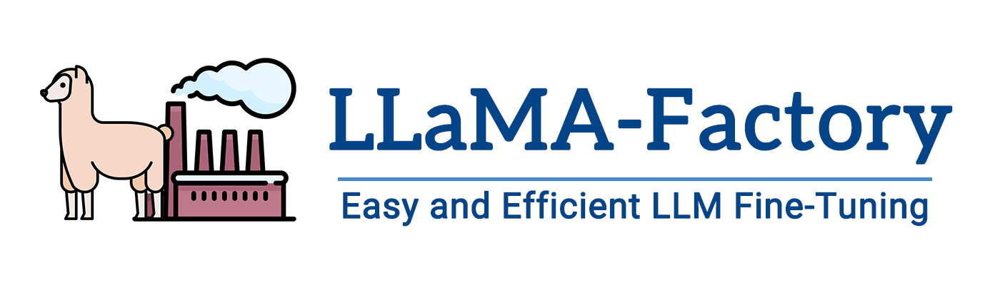

[](https://github.com/hiyouga/LLaMA-Factory/stargazers)
[](LICENSE)
[](https://github.com/hiyouga/LLaMA-Factory/commits/main)
[](https://pypi.org/project/llmtuner/)
[](https://pypi.org/project/llmtuner/)
[](https://github.com/hiyouga/LLaMA-Factory/pulls)
[](https://discord.gg/rKfvV9r9FK)
[](https://huggingface.co/spaces/hiyouga/LLaMA-Board)
[](https://modelscope.cn/studios/hiyouga/LLaMA-Board)

👋 加入我们的[微信群](assets/wechat.jpg)。

\[ [English](README.md) | 中文 \]

## LLaMA Board: 通过一站式网页界面快速上手 LLaMA Factory

通过 **[🤗 Spaces](https://huggingface.co/spaces/hiyouga/LLaMA-Board)** 或 **[ModelScope](https://modelscope.cn/studios/hiyouga/LLaMA-Board)** 预览 LLaMA Board。

使用 `CUDA_VISIBLE_DEVICES=0 python src/train_web.py` 启动 LLaMA Board。（该模式目前仅支持单卡训练）

下面是使用单张 GPU 在 10 分钟内更改对话式大型语言模型自我认知的示例。

https://github.com/hiyouga/LLaMA-Factory/assets/16256802/6ba60acc-e2e2-4bec-b846-2d88920d5ba1

## 目录

- [性能指标](#性能指标)
- [更新日志](#更新日志)
- [模型](#模型)
- [训练方法](#训练方法)
- [数据集](#数据集)
- [软硬件依赖](#软硬件依赖)
- [如何使用](#如何使用)
- [使用了 LLaMA Factory 的项目](#使用了-llama-factory-的项目)
- [协议](#协议)
- [引用](#引用)
- [致谢](#致谢)

## 性能指标

与 ChatGLM 官方的 [P-Tuning](https://github.com/THUDM/ChatGLM2-6B/tree/main/ptuning) 微调相比，LLaMA-Factory 的 LoRA 微调提供了 **3.7 倍**的加速比，同时在广告文案生成任务上取得了更高的 Rouge 分数。结合 4 比特量化技术，LLaMA-Factory 的 QLoRA 微调进一步降低了 GPU 显存消耗。


<details><summary>变量定义</summary>

- **Training Speed**: 训练阶段每秒处理的样本数量。（批处理大小=4，截断长度=1024）
- **Rouge Score**: [广告文案生成](https://aclanthology.org/D19-1321.pdf)任务验证集上的 Rouge-2 分数。（批处理大小=4，截断长度=1024）
- **GPU Memory**: 4 比特量化训练的 GPU 显存峰值。（批处理大小=1，截断长度=1024）
- 我们在 ChatGLM 的 P-Tuning 中采用 `pre_seq_len=128`，在 LLaMA-Factory 的 LoRA 微调中采用 `lora_rank=32`。

</details>

## 更新日志

[24/01/18] 我们针对绝大多数模型实现了 **Agent 微调**，微调时指定 `--dataset glaive_toolcall` 即可使模型获得工具调用能力。

[23/12/23] 我们针对 LLaMA, Mistral 和 Yi 模型支持了 **[unsloth](https://github.com/unslothai/unsloth)** 的 LoRA 训练加速。请使用 `--use_unsloth` 参数启用 unsloth 优化。该方法可提供 1.7 倍的训练速度，详情请查阅[此页面](https://github.com/hiyouga/LLaMA-Factory/wiki/Performance-comparison)。

[23/12/12] 我们支持了微调最新的混合专家模型 **[Mixtral 8x7B](https://huggingface.co/mistralai/Mixtral-8x7B-v0.1)**。硬件需求请查阅[此处](#硬件依赖)。

<details><summary>展开日志</summary>

[23/12/01] 我们支持了从 **[魔搭社区](https://modelscope.cn/models)** 下载预训练模型和数据集。详细用法请参照 [此教程](#使用魔搭社区可跳过)。

[23/10/21] 我们支持了 **[NEFTune](https://arxiv.org/abs/2310.05914)** 训练技巧。请使用 `--neftune_noise_alpha` 参数启用 NEFTune，例如 `--neftune_noise_alpha 5`。

[23/09/27] 我们针对 LLaMA 模型支持了 [LongLoRA](https://github.com/dvlab-research/LongLoRA) 提出的 **$S^2$-Attn**。请使用 `--shift_attn` 参数以启用该功能。

[23/09/23] 我们在项目中集成了 MMLU、C-Eval 和 CMMLU 评估集。使用方法请参阅[此示例](#模型评估)。

[23/09/10] 我们支持了 **[FlashAttention-2](https://github.com/Dao-AILab/flash-attention)**。如果您使用的是 RTX4090、A100 或 H100 GPU，请使用 `--flash_attn` 参数以启用 FlashAttention-2。

[23/08/12] 我们支持了 **RoPE 插值**来扩展 LLaMA 模型的上下文长度。请使用 `--rope_scaling linear` 参数训练模型或使用 `--rope_scaling dynamic` 参数评估模型。

[23/08/11] 我们支持了指令模型的 **[DPO 训练](https://arxiv.org/abs/2305.18290)**。使用方法请参阅[此示例](#dpo-训练)。

[23/07/31] 我们支持了**数据流式加载**。请使用 `--streaming` 和 `--max_steps 10000` 参数来流式加载数据集。

[23/07/29] 我们在 Hugging Face 发布了两个 13B 指令微调模型。详细内容请查阅我们的 Hugging Face 项目（[LLaMA-2](https://huggingface.co/hiyouga/Llama-2-Chinese-13b-chat) / [Baichuan](https://huggingface.co/hiyouga/Baichuan-13B-sft)）。

[23/07/18] 我们开发了支持训练和测试的**浏览器一体化界面**。请使用 `train_web.py` 在您的浏览器中微调模型。感谢 [@KanadeSiina](https://github.com/KanadeSiina) 和 [@codemayq](https://github.com/codemayq) 在该功能开发中付出的努力。

[23/07/09] 我们开源了 **[FastEdit](https://github.com/hiyouga/FastEdit)** ⚡🩹，一个简单易用的、能迅速编辑大模型事实记忆的工具包。如果您感兴趣请关注我们的 [FastEdit](https://github.com/hiyouga/FastEdit) 项目。

[23/06/29] 我们提供了一个**可复现的**指令模型微调示例，详细内容请查阅 [Baichuan-7B-sft](https://huggingface.co/hiyouga/Baichuan-7B-sft)。

[23/06/22] 我们对齐了[示例 API](src/api_demo.py) 与 [OpenAI API](https://platform.openai.com/docs/api-reference/chat) 的格式，您可以将微调模型接入**任意基于 ChatGPT 的应用**中。

[23/06/03] 我们实现了 4 比特的 LoRA 训练（也称 **[QLoRA](https://github.com/artidoro/qlora)**）。请使用 `--quantization_bit 4` 参数进行 4 比特量化微调。

</details>

## 模型

| 模型名                                                   | 模型大小                     | 默认模块           | Template  |
| -------------------------------------------------------- | --------------------------- | ----------------- | --------- |
| [Baichuan2](https://huggingface.co/baichuan-inc)         | 7B/13B                      | W_pack            | baichuan2 |
| [BLOOM](https://huggingface.co/bigscience/bloom)         | 560M/1.1B/1.7B/3B/7.1B/176B | query_key_value   | -         |
| [BLOOMZ](https://huggingface.co/bigscience/bloomz)       | 560M/1.1B/1.7B/3B/7.1B/176B | query_key_value   | -         |
| [ChatGLM3](https://huggingface.co/THUDM/chatglm3-6b)     | 6B                          | query_key_value   | chatglm3  |
| [DeepSeek (MoE)](https://huggingface.co/deepseek-ai)     | 7B/16B/67B                  | q_proj,v_proj     | deepseek  |
| [Falcon](https://huggingface.co/tiiuae)                  | 7B/40B/180B                 | query_key_value   | falcon    |
| [InternLM2](https://huggingface.co/internlm)             | 7B/20B                      | wqkv              | intern2   |
| [LLaMA](https://github.com/facebookresearch/llama)       | 7B/13B/33B/65B              | q_proj,v_proj     | -         |
| [LLaMA-2](https://huggingface.co/meta-llama)             | 7B/13B/70B                  | q_proj,v_proj     | llama2    |
| [Mistral](https://huggingface.co/mistralai)              | 7B                          | q_proj,v_proj     | mistral   |
| [Mixtral](https://huggingface.co/mistralai)              | 8x7B                        | q_proj,v_proj     | mistral   |
| [Phi-1.5/2](https://huggingface.co/microsoft)            | 1.3B/2.7B                   | q_proj,v_proj     | -         |
| [Qwen](https://huggingface.co/Qwen)                      | 1.8B/7B/14B/72B             | c_attn            | qwen      |
| [XVERSE](https://huggingface.co/xverse)                  | 7B/13B/65B                  | q_proj,v_proj     | xverse    |
| [Yi](https://huggingface.co/01-ai)                       | 6B/34B                      | q_proj,v_proj     | yi        |
| [Yuan](https://huggingface.co/IEITYuan)                  | 2B/51B/102B                 | q_proj,v_proj     | yuan      |

> [!NOTE]
> **默认模块**应作为 `--lora_target` 参数的默认值，可使用 `--lora_target all` 参数指定全部模块。
>
> 对于所有“基座”（Base）模型，`--template` 参数可以是 `default`, `alpaca`, `vicuna` 等任意值。但“对话”（Chat）模型请务必使用**对应的模板**。

项目所支持模型的完整列表请参阅 [constants.py](src/llmtuner/extras/constants.py)。

## 训练方法

| 方法                   |     全参数训练      |    部分参数训练     |       LoRA         |       QLoRA        |
| ---------------------- | ------------------ | ------------------ | ------------------ | ------------------ |
| 预训练                 | :white_check_mark: | :white_check_mark: | :white_check_mark: | :white_check_mark: |
| 指令监督微调            | :white_check_mark: | :white_check_mark: | :white_check_mark: | :white_check_mark: |
| 奖励模型训练            | :white_check_mark: | :white_check_mark: | :white_check_mark: | :white_check_mark: |
| PPO 训练               | :white_check_mark: | :white_check_mark: | :white_check_mark: | :white_check_mark: |
| DPO 训练               | :white_check_mark: | :white_check_mark: | :white_check_mark: | :white_check_mark: |

> [!NOTE]
> 请使用 `--quantization_bit 4` 参数来启用 QLoRA 训练。

## 数据集

<details><summary>预训练数据集</summary>

- [Wiki Demo (en)](data/wiki_demo.txt)
- [RefinedWeb (en)](https://huggingface.co/datasets/tiiuae/falcon-refinedweb)
- [RedPajama V2 (en)](https://huggingface.co/datasets/togethercomputer/RedPajama-Data-V2)
- [Wikipedia (en)](https://huggingface.co/datasets/olm/olm-wikipedia-20221220)
- [Wikipedia (zh)](https://huggingface.co/datasets/pleisto/wikipedia-cn-20230720-filtered)
- [Pile (en)](https://huggingface.co/datasets/EleutherAI/pile)
- [SkyPile (zh)](https://huggingface.co/datasets/Skywork/SkyPile-150B)
- [The Stack (en)](https://huggingface.co/datasets/bigcode/the-stack)
- [StarCoder (en)](https://huggingface.co/datasets/bigcode/starcoderdata)

</details>

<details><summary>指令微调数据集</summary>

- [Stanford Alpaca (en)](https://github.com/tatsu-lab/stanford_alpaca)
- [Stanford Alpaca (zh)](https://github.com/ymcui/Chinese-LLaMA-Alpaca)
- [GPT-4 Generated Data (en&zh)](https://github.com/Instruction-Tuning-with-GPT-4/GPT-4-LLM)
- [Self-cognition (zh)](data/self_cognition.json)
- [Open Assistant (multilingual)](https://huggingface.co/datasets/OpenAssistant/oasst1)
- [ShareGPT (zh)](https://huggingface.co/datasets/QingyiSi/Alpaca-CoT/tree/main/Chinese-instruction-collection)
- [Guanaco Dataset (multilingual)](https://huggingface.co/datasets/JosephusCheung/GuanacoDataset)
- [BELLE 2M (zh)](https://huggingface.co/datasets/BelleGroup/train_2M_CN)
- [BELLE 1M (zh)](https://huggingface.co/datasets/BelleGroup/train_1M_CN)
- [BELLE 0.5M (zh)](https://huggingface.co/datasets/BelleGroup/train_0.5M_CN)
- [BELLE Dialogue 0.4M (zh)](https://huggingface.co/datasets/BelleGroup/generated_chat_0.4M)
- [BELLE School Math 0.25M (zh)](https://huggingface.co/datasets/BelleGroup/school_math_0.25M)
- [BELLE Multiturn Chat 0.8M (zh)](https://huggingface.co/datasets/BelleGroup/multiturn_chat_0.8M)
- [UltraChat (en)](https://github.com/thunlp/UltraChat)
- [LIMA (en)](https://huggingface.co/datasets/GAIR/lima)
- [OpenPlatypus (en)](https://huggingface.co/datasets/garage-bAInd/Open-Platypus)
- [CodeAlpaca 20k (en)](https://huggingface.co/datasets/sahil2801/CodeAlpaca-20k)
- [Alpaca CoT (multilingual)](https://huggingface.co/datasets/QingyiSi/Alpaca-CoT)
- [OpenOrca (en)](https://huggingface.co/datasets/Open-Orca/OpenOrca)
- [MathInstruct (en)](https://huggingface.co/datasets/TIGER-Lab/MathInstruct)
- [Firefly 1.1M (zh)](https://huggingface.co/datasets/YeungNLP/firefly-train-1.1M)
- [Web QA (zh)](https://huggingface.co/datasets/suolyer/webqa)
- [WebNovel (zh)](https://huggingface.co/datasets/zxbsmk/webnovel_cn)
- [Nectar (en)](https://huggingface.co/datasets/berkeley-nest/Nectar)
- [deepctrl (en&zh)](https://www.modelscope.cn/datasets/deepctrl/deepctrl-sft-data)
- [Ad Gen (zh)](https://huggingface.co/datasets/HasturOfficial/adgen)
- [ShareGPT Hyperfiltered (en)](https://huggingface.co/datasets/totally-not-an-llm/sharegpt-hyperfiltered-3k)
- [ShareGPT4 (en&zh)](https://huggingface.co/datasets/shibing624/sharegpt_gpt4)
- [UltraChat 200k (en)](https://huggingface.co/datasets/HuggingFaceH4/ultrachat_200k)
- [AgentInstruct (en)](https://huggingface.co/datasets/THUDM/AgentInstruct)
- [LMSYS Chat 1M (en)](https://huggingface.co/datasets/lmsys/lmsys-chat-1m)
- [Evol Instruct V2 (en)](https://huggingface.co/datasets/WizardLM/WizardLM_evol_instruct_V2_196k)
- [Glaive Function Calling V2 (en)](https://huggingface.co/datasets/glaiveai/glaive-function-calling-v2)

</details>

<details><summary>偏好数据集</summary>

- [HH-RLHF (en)](https://huggingface.co/datasets/Anthropic/hh-rlhf)
- [Open Assistant (multilingual)](https://huggingface.co/datasets/OpenAssistant/oasst1)
- [GPT-4 Generated Data (en&zh)](https://github.com/Instruction-Tuning-with-GPT-4/GPT-4-LLM)
- [Nectar (en)](https://huggingface.co/datasets/berkeley-nest/Nectar)

</details>

使用方法请参考 [data/README_zh.md](data/README_zh.md) 文件。

部分数据集的使用需要确认，我们推荐使用下述命令登录您的 Hugging Face 账户。

```bash
pip install --upgrade huggingface_hub
huggingface-cli login
```

## 软硬件依赖

- Python 3.8+ 和 PyTorch 1.13.1+
- 🤗Transformers, Datasets, Accelerate, PEFT 和 TRL
- sentencepiece, protobuf 和 tiktoken
- jieba, rouge-chinese 和 nltk (用于评估及预测)
- gradio 和 matplotlib (用于网页端交互)
- uvicorn, fastapi 和 sse-starlette (用于 API)

### 硬件依赖

| 训练方法 | 精度 |   7B  |  13B  |  30B  |   65B  |   8x7B |
| ------- | ---- | ----- | ----- | ----- | ------ | ------ |
| 全参数   |  16  | 160GB | 320GB | 600GB | 1200GB |  900GB |
| 部分参数 |  16  |  20GB |  40GB | 120GB |  240GB |  200GB |
| LoRA    |  16  |  16GB |  32GB |  80GB |  160GB |  120GB |
| QLoRA   |   8  |  10GB |  16GB |  40GB |   80GB |   80GB |
| QLoRA   |   4  |   6GB |  12GB |  24GB |   48GB |   32GB |

## 如何使用

### 数据准备（可跳过）

关于数据集文件的格式，请参考 [data/README_zh.md](data/README_zh.md) 的内容。构建自定义数据集时，既可以使用单个 `.json` 文件，也可以使用一个[数据加载脚本](https://huggingface.co/docs/datasets/dataset_script)和多个文件。

> [!NOTE]
> 使用自定义数据集时，请更新 `data/dataset_info.json` 文件，该文件的格式请参考 `data/README_zh.md`。

### 环境搭建（可跳过）

```bash
git clone https://github.com/hiyouga/LLaMA-Factory.git
conda create -n llama_factory python=3.10
conda activate llama_factory
cd LLaMA-Factory
pip install -r requirements.txt
```

如果要在 Windows 平台上开启量化 LoRA（QLoRA），需要安装预编译的 `bitsandbytes` 库, 支持 CUDA 11.1 到 12.1.

```bash
pip install https://github.com/jllllll/bitsandbytes-windows-webui/releases/download/wheels/bitsandbytes-0.39.1-py3-none-win_amd64.whl
```

### 使用魔搭社区（可跳过）

如果您在 Hugging Face 模型和数据集的下载中遇到了问题，可以通过下述方法使用魔搭社区。

```bash
export USE_MODELSCOPE_HUB=1 # Windows 使用 `set USE_MODELSCOPE_HUB=1`
```

接着即可通过指定模型名称来训练对应的模型。（在[魔搭社区](https://modelscope.cn/models)查看所有可用的模型）

```bash
CUDA_VISIBLE_DEVICES=0 python src/train_bash.py \
    --model_name_or_path modelscope/Llama-2-7b-ms \
    ... # 参数同上
```

LLaMA Board 同样支持魔搭社区的模型和数据集下载。

```bash
CUDA_VISIBLE_DEVICES=0 USE_MODELSCOPE_HUB=1 python src/train_web.py
```

### 单 GPU 训练

> [!IMPORTANT]
> 如果您使用多张 GPU 训练模型，请移步[多 GPU 分布式训练](#多-gpu-分布式训练)部分。

#### 预训练

```bash
CUDA_VISIBLE_DEVICES=0 python src/train_bash.py \
    --stage pt \
    --do_train \
    --model_name_or_path path_to_llama_model \
    --dataset wiki_demo \
    --finetuning_type lora \
    --lora_target q_proj,v_proj \
    --output_dir path_to_pt_checkpoint \
    --overwrite_cache \
    --per_device_train_batch_size 4 \
    --gradient_accumulation_steps 4 \
    --lr_scheduler_type cosine \
    --logging_steps 10 \
    --save_steps 1000 \
    --learning_rate 5e-5 \
    --num_train_epochs 3.0 \
    --plot_loss \
    --fp16
```

#### 指令监督微调

```bash
CUDA_VISIBLE_DEVICES=0 python src/train_bash.py \
    --stage sft \
    --do_train \
    --model_name_or_path path_to_llama_model \
    --dataset alpaca_gpt4_zh \
    --template default \
    --finetuning_type lora \
    --lora_target q_proj,v_proj \
    --output_dir path_to_sft_checkpoint \
    --overwrite_cache \
    --per_device_train_batch_size 4 \
    --gradient_accumulation_steps 4 \
    --lr_scheduler_type cosine \
    --logging_steps 10 \
    --save_steps 1000 \
    --learning_rate 5e-5 \
    --num_train_epochs 3.0 \
    --plot_loss \
    --fp16
```

#### 奖励模型训练

```bash
CUDA_VISIBLE_DEVICES=0 python src/train_bash.py \
    --stage rm \
    --do_train \
    --model_name_or_path path_to_llama_model \
    --adapter_name_or_path path_to_sft_checkpoint \
    --create_new_adapter \
    --dataset comparison_gpt4_zh \
    --template default \
    --finetuning_type lora \
    --lora_target q_proj,v_proj \
    --output_dir path_to_rm_checkpoint \
    --per_device_train_batch_size 2 \
    --gradient_accumulation_steps 4 \
    --lr_scheduler_type cosine \
    --logging_steps 10 \
    --save_steps 1000 \
    --learning_rate 1e-6 \
    --num_train_epochs 1.0 \
    --plot_loss \
    --fp16
```

#### PPO 训练

```bash
CUDA_VISIBLE_DEVICES=0 python src/train_bash.py \
    --stage ppo \
    --do_train \
    --model_name_or_path path_to_llama_model \
    --adapter_name_or_path path_to_sft_checkpoint \
    --create_new_adapter \
    --dataset alpaca_gpt4_zh \
    --template default \
    --finetuning_type lora \
    --lora_target q_proj,v_proj \
    --reward_model path_to_rm_checkpoint \
    --output_dir path_to_ppo_checkpoint \
    --per_device_train_batch_size 2 \
    --gradient_accumulation_steps 4 \
    --lr_scheduler_type cosine \
    --top_k 0 \
    --top_p 0.9 \
    --logging_steps 10 \
    --save_steps 1000 \
    --learning_rate 1e-5 \
    --num_train_epochs 1.0 \
    --plot_loss \
    --fp16
```

> [!WARNING]
> 如果使用 fp16 精度进行 LLaMA-2 模型的 PPO 训练，请使用 `--per_device_train_batch_size=1`。

#### DPO 训练

```bash
CUDA_VISIBLE_DEVICES=0 python src/train_bash.py \
    --stage dpo \
    --do_train \
    --model_name_or_path path_to_llama_model \
    --adapter_name_or_path path_to_sft_checkpoint \
    --create_new_adapter \
    --dataset comparison_gpt4_zh \
    --template default \
    --finetuning_type lora \
    --lora_target q_proj,v_proj \
    --output_dir path_to_dpo_checkpoint \
    --per_device_train_batch_size 2 \
    --gradient_accumulation_steps 4 \
    --lr_scheduler_type cosine \
    --logging_steps 10 \
    --save_steps 1000 \
    --learning_rate 1e-5 \
    --num_train_epochs 1.0 \
    --plot_loss \
    --fp16
```

### 多 GPU 分布式训练

#### 使用 Huggingface Accelerate

```bash
accelerate config # 首先配置分布式环境
accelerate launch src/train_bash.py # 参数同上
```

<details><summary>LoRA 训练的 Accelerate 配置示例</summary>

```yaml
compute_environment: LOCAL_MACHINE
distributed_type: MULTI_GPU
downcast_bf16: 'no'
gpu_ids: all
machine_rank: 0
main_training_function: main
mixed_precision: fp16
num_machines: 1
num_processes: 4
rdzv_backend: static
same_network: true
tpu_env: []
tpu_use_cluster: false
tpu_use_sudo: false
use_cpu: false
```

</details>

#### 使用 DeepSpeed

```bash
deepspeed --num_gpus 8 --master_port=9901 src/train_bash.py \
    --deepspeed ds_config.json \
    ... # 参数同上
```

<details><summary>使用 DeepSpeed ZeRO-2 进行全参数训练的 DeepSpeed 配置示例</summary>

```json
{
  "train_batch_size": "auto",
  "train_micro_batch_size_per_gpu": "auto",
  "gradient_accumulation_steps": "auto",
  "gradient_clipping": "auto",
  "zero_allow_untested_optimizer": true,
  "fp16": {
    "enabled": "auto",
    "loss_scale": 0,
    "initial_scale_power": 16,
    "loss_scale_window": 1000,
    "hysteresis": 2,
    "min_loss_scale": 1
  },
  "zero_optimization": {
    "stage": 2,
    "allgather_partitions": true,
    "allgather_bucket_size": 5e8,
    "reduce_scatter": true,
    "reduce_bucket_size": 5e8,
    "overlap_comm": false,
    "contiguous_gradients": true
  }
}
```

</details>

### 合并 LoRA 权重并导出模型

```bash
python src/export_model.py \
    --model_name_or_path path_to_llama_model \
    --adapter_name_or_path path_to_checkpoint \
    --template default \
    --finetuning_type lora \
    --export_dir path_to_export \
    --export_size 2 \
    --export_legacy_format False
```

> [!WARNING]
> 尚不支持量化模型的 LoRA 权重合并及导出。

> [!TIP]
> 合并 LoRA 权重之后可再次使用 `--export_quantization_bit 4` 和 `--export_quantization_dataset data/c4_demo.json` 量化模型。

### API 服务

```bash
python src/api_demo.py \
    --model_name_or_path path_to_llama_model \
    --adapter_name_or_path path_to_checkpoint \
    --template default \
    --finetuning_type lora
```

> [!TIP]
> 关于 API 文档请见 `http://localhost:8000/docs`。

### 命令行测试

```bash
python src/cli_demo.py \
    --model_name_or_path path_to_llama_model \
    --adapter_name_or_path path_to_checkpoint \
    --template default \
    --finetuning_type lora
```

### 浏览器测试

```bash
python src/web_demo.py \
    --model_name_or_path path_to_llama_model \
    --adapter_name_or_path path_to_checkpoint \
    --template default \
    --finetuning_type lora
```

### 模型评估

```bash
CUDA_VISIBLE_DEVICES=0 python src/evaluate.py \
    --model_name_or_path path_to_llama_model \
    --adapter_name_or_path path_to_checkpoint \
    --template vanilla \
    --finetuning_type lora \
    --task ceval \
    --split validation \
    --lang zh \
    --n_shot 5 \
    --batch_size 4
```

### 模型预测

```bash
CUDA_VISIBLE_DEVICES=0 python src/train_bash.py \
    --stage sft \
    --do_predict \
    --model_name_or_path path_to_llama_model \
    --adapter_name_or_path path_to_checkpoint \
    --dataset alpaca_gpt4_zh \
    --template default \
    --finetuning_type lora \
    --output_dir path_to_predict_result \
    --per_device_eval_batch_size 8 \
    --max_samples 100 \
    --predict_with_generate \
    --fp16
```

> [!WARNING]
> 如果使用 fp16 精度进行 LLaMA-2 模型的预测，请使用 `--per_device_eval_batch_size=1`。

> [!TIP]
> 我们建议在量化模型的预测中使用 `--per_device_eval_batch_size=1` 和 `--max_target_length 128`。

## 使用了 LLaMA Factory 的项目

- **[StarWhisper](https://github.com/Yu-Yang-Li/StarWhisper)**: 天文大模型 StarWhisper，基于 ChatGLM2-6B 和 Qwen-14B 在天文数据上微调而得。
- **[DISC-LawLLM](https://github.com/FudanDISC/DISC-LawLLM)**: 中文法律领域大模型 DISC-LawLLM，基于 Baichuan-13B 微调而得，具有法律推理和知识检索能力。
- **[Sunsimiao](https://github.com/thomas-yanxin/Sunsimiao)**: 孙思邈中文医疗大模型 Sumsimiao，基于 Baichuan-7B 和 ChatGLM-6B 在中文医疗数据上微调而得。
- **[CareGPT](https://github.com/WangRongsheng/CareGPT)**: 医疗大模型项目 CareGPT，基于 LLaMA2-7B 和 Baichuan-13B 在中文医疗数据上微调而得。
- **[MachineMindset](https://github.com/PKU-YuanGroup/Machine-Mindset/)**：MBTI性格大模型项目，根据数据集与训练方式让任意 LLM 拥有 16 个不同的性格类型。

> [!TIP]
> 如果您有项目希望添加至上述列表，请通过邮件联系或者创建一个 PR。

## 协议

本仓库的代码依照 [Apache-2.0](LICENSE) 协议开源。

使用模型权重时，请遵循对应的模型协议：[Baichuan2](https://huggingface.co/baichuan-inc/Baichuan2-7B-Base/blob/main/Community%20License%20for%20Baichuan%202%20Model.pdf) / [BLOOM](https://huggingface.co/spaces/bigscience/license) / [ChatGLM3](https://github.com/THUDM/ChatGLM3/blob/main/MODEL_LICENSE) / [DeepSeek](https://github.com/deepseek-ai/DeepSeek-LLM/blob/main/LICENSE-MODEL) / [Falcon](https://huggingface.co/tiiuae/falcon-180B/blob/main/LICENSE.txt) / [InternLM2](https://github.com/InternLM/InternLM#license) / [LLaMA](https://github.com/facebookresearch/llama/blob/main/MODEL_CARD.md) / [LLaMA-2](https://ai.meta.com/llama/license/) / [Mistral](LICENSE) / [Phi-1.5/2](https://huggingface.co/microsoft/phi-1_5/resolve/main/Research%20License.docx) / [Qwen](https://github.com/QwenLM/Qwen/blob/main/Tongyi%20Qianwen%20LICENSE%20AGREEMENT) / [XVERSE](https://github.com/xverse-ai/XVERSE-13B/blob/main/MODEL_LICENSE.pdf) / [Yi](https://huggingface.co/01-ai/Yi-6B/blob/main/LICENSE) / [Yuan](https://github.com/IEIT-Yuan/Yuan-2.0/blob/main/LICENSE-Yuan)

## 引用

如果您觉得此项目有帮助，请考虑以下列格式引用

```bibtex
@Misc{llama-factory,
  title = {LLaMA Factory},
  author = {hiyouga},
  howpublished = {\url{https://github.com/hiyouga/LLaMA-Factory}},
  year = {2023}
}
```

## 致谢

本项目受益于 [PEFT](https://github.com/huggingface/peft)、[QLoRA](https://github.com/artidoro/qlora) 和 [FastChat](https://github.com/lm-sys/FastChat)，感谢以上诸位作者的付出。

## Star History


